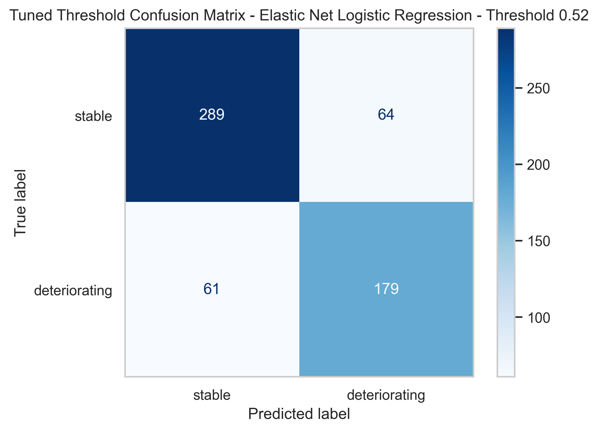

---
format:
  html:
    theme: none
    toc: false
    self-contained: true
page-layout: full
---

```{=html}
<head>
<meta charset="UTF-8">
<meta name="viewport" content="width=device-width,initial-scale=1">
<title>Streamlining the Surge — ENGG2112</title>
<link href="https://fonts.googleapis.com/css2?family=EB+Garamond:ital,wght@0,400;0,500;1,400;1,500&family=Inter:wght@300;400;500;600&family=JetBrains+Mono:wght@400;500&display=swap" rel="stylesheet">
<style>
*,*::before,*::after{box-sizing:border-box;margin:0;padding:0}
:root{
  --navy:#1a2e4a;--blue:#2563eb;--blue-l:#dbeafe;--blue-m:#93c5fd;
  --white:#fff;--bg:#f8f9fb;--off:#f0f4f8;--border:#d1dce9;
  --text:#1a2e4a;--muted:#4a5d75;--dim:#7a90a8;
  --red:#c0392b;--green:#166534;--nav:56px;--pad:44px;
}
html,body{height:100%;background:var(--bg);color:var(--text);
  font-family:'Inter',sans-serif;overflow:hidden}
.deck{width:1920px;height:1080px;position:fixed;top:0;left:0;transform-origin:top left;overflow:hidden}

/* SLIDES */
.slide{position:absolute;top:0;left:0;right:0;bottom:var(--nav);
  display:flex;flex-direction:column;justify-content:center;gap:16px;
  padding:var(--pad) calc(var(--pad)*1.3);
  opacity:0;pointer-events:none;overflow:hidden;
  transition:opacity .35s ease,transform .35s ease;
  transform:translateX(28px)}
.slide.active{opacity:1;pointer-events:all;transform:translateX(0)}
.slide.out{opacity:0;transform:translateX(-20px)}
.nv{background:var(--navy)}
.nv .ey{color:var(--blue-m)}
.nv h2{color:var(--white)}
.nv h2 em{color:var(--blue-m)}
.nv .rule{background:var(--blue-m)}
.nv p{color:rgba(255,255,255,.65)}
.nv strong{color:var(--white)}

/* NAV */
.snav{position:absolute;bottom:0;left:0;right:0;height:var(--nav);
  background:var(--white);border-top:1px solid var(--border);
  display:flex;align-items:center;justify-content:center;
  gap:5px;z-index:200;padding:0 20px}
.sp{display:inline-flex;align-items:center;gap:5px;padding:5px 12px;
  border-radius:40px;border:1px solid var(--border);background:transparent;
  cursor:pointer;font-size:11.5px;font-weight:500;color:var(--muted);
  font-family:'Inter',sans-serif;transition:all .18s;white-space:nowrap}
.sp:hover{background:var(--off);color:var(--navy)}
.sp.on{background:var(--navy);color:var(--white);border-color:var(--navy)}
.sp .sn{font-family:'JetBrains Mono',monospace;font-size:8.5px;opacity:.6}
.narr{display:flex;gap:4px;margin-left:10px;padding-left:10px;border-left:1px solid var(--border)}
.nb{width:28px;height:28px;border-radius:50%;border:1px solid var(--border);
  background:var(--white);cursor:pointer;font-size:14px;color:var(--muted);
  display:flex;align-items:center;justify-content:center;transition:all .18s}
.nb:hover{background:var(--navy);color:var(--white);border-color:var(--navy)}
.pbar{position:absolute;top:0;left:0;height:3px;background:var(--blue);transition:width .35s;z-index:300}

/* HEADER (row 1 of grid) */
.hd{padding-bottom:10px;flex-shrink:0}
.ey{font-family:'JetBrains Mono',monospace;font-size:9.5px;letter-spacing:.18em;
  text-transform:uppercase;color:var(--blue);margin-bottom:8px}
h2{font-family:'EB Garamond',serif;font-size:3.6rem;
  font-weight:400;line-height:1.08;color:var(--navy);margin-bottom:0}
h2 em{font-style:italic;color:var(--blue)}
h2.xl{font-size:5.4rem}
.rule{width:36px;height:3px;background:var(--blue);margin-top:10px}
h3{font-size:11px;font-weight:600;text-transform:uppercase;
  letter-spacing:.07em;color:var(--navy);margin-bottom:5px}
p,li{color:var(--muted);font-size:13.5px;line-height:1.65}
li{margin-left:14px}
strong{font-weight:600;color:var(--navy)}

/* BODY (row 2 — fills remaining space) */
.body{display:flex;flex-direction:column;gap:12px;flex-shrink:0}
#s2,#s3,#s3b,#s4,#s5,#s5d,#s6,#s7{justify-content:flex-start}
#s2 .body,#s3 .body,#s3b .body,#s4 .body,#s5 .body,#s5d .body,#s6 .body,#s7 .body{flex:1;min-height:0}
.row{display:flex;gap:12px;flex:1;min-height:0}
.col{flex:1;min-width:0;display:flex;flex-direction:column;gap:10px}
.col-r{flex:0 0 44%;min-width:0;display:flex;flex-direction:column;gap:10px}
/* CARDS */
.card{background:var(--white);border:1px solid var(--border);border-radius:7px;padding:16px 18px}
.bt{border-top:3px solid var(--blue)}.nt{border-top:3px solid var(--navy)}
.rt{border-top:3px solid var(--red)}.gt{border-top:3px solid var(--green)}
.bl{border-left:3px solid var(--blue);border-radius:0 7px 7px 0}
.rl{border-left:3px solid var(--red);border-radius:0 7px 7px 0}
.gl{border-left:3px solid var(--green);border-radius:0 7px 7px 0}

/* STAT CARDS */
.sg{display:grid;grid-template-columns:repeat(3,1fr);gap:12px}
.sc{background:var(--white);border:1px solid var(--border);border-radius:7px;
  padding:24px 22px}
.sc-big{font-family:'EB Garamond',serif;font-size:5rem;
  font-weight:400;line-height:1;margin-bottom:10px}
.sc-lbl{font-size:13px;color:var(--muted);line-height:1.55}

/* MODEL CARDS */
.mg{display:grid;grid-template-columns:repeat(3,1fr);gap:12px;flex:1;min-height:0}
.mc{background:var(--white);border:1px solid var(--border);border-radius:7px;
  padding:16px 18px;cursor:pointer;
  transition:border-color .18s,box-shadow .18s,transform .15s}
.mc:hover{border-color:var(--navy);box-shadow:0 3px 16px rgba(26,46,74,.09);transform:translateY(-2px)}
.mbadge{display:inline-flex;font-family:'JetBrains Mono',monospace;font-size:8.5px;
  letter-spacing:.1em;text-transform:uppercase;padding:3px 9px;border-radius:20px;
  margin-bottom:9px;background:var(--navy);color:var(--white)}
.mc-title{font-family:'EB Garamond',serif;font-size:1.4rem;font-weight:400;
  color:var(--navy);margin-bottom:3px;line-height:1.15}
.mc-sub{font-size:11px;color:var(--muted);margin-bottom:9px;line-height:1.5}
.mtags{display:flex;flex-wrap:wrap;gap:3px;margin-bottom:12px}
.mtag{font-family:'JetBrains Mono',monospace;font-size:8px;letter-spacing:.05em;
  text-transform:uppercase;padding:2px 6px;border-radius:20px;
  border:1px solid var(--border);color:var(--dim)}
.mst{display:grid;grid-template-columns:1fr 1fr;gap:5px}
.ms{background:var(--off);border-radius:5px;padding:7px 9px}
.ms-k{font-size:8.5px;color:var(--dim);font-family:'JetBrains Mono',monospace;margin-bottom:2px}
.ms-v{font-size:1.1rem;font-weight:600;color:var(--navy)}
.ms-v.hi{color:var(--blue)}
.see{display:flex;align-items:center;gap:4px;margin-top:12px;padding-top:10px;
  border-top:1px solid var(--border);font-size:10.5px;color:var(--blue);
  font-weight:600;font-family:'JetBrains Mono',monospace;transition:gap .18s}
.mc:hover .see{gap:7px}

/* METRIC STRIP */
.met4{display:grid;grid-template-columns:repeat(4,1fr);gap:8px;flex-shrink:0}
.met{background:var(--white);border:1px solid var(--border);border-radius:7px;
  padding:12px 14px;text-align:center}
.met.hi{border-top:3px solid var(--blue)}
.met-k{font-family:'JetBrains Mono',monospace;font-size:8px;color:var(--dim);margin-bottom:4px}
.met-v{font-family:'EB Garamond',serif;font-size:1.9rem;color:var(--navy);line-height:1}
.met-v.blue{color:var(--blue)}
.met-ok{font-size:8.5px;color:var(--blue);margin-top:2px}

/* BARS */
.bars-wrap{flex:1;min-height:0;overflow:hidden;display:flex;flex-direction:column;gap:0}
.bars-section{display:flex;flex-direction:column;gap:9px}
.bars-title{font-family:'JetBrains Mono',monospace;font-size:8.5px;letter-spacing:.1em;
  text-transform:uppercase;color:var(--dim);margin-bottom:4px}
.br{display:flex;align-items:center;gap:8px}
.bl2{font-size:9.5px;color:var(--muted);width:96px;text-align:right;
  flex-shrink:0;font-family:'JetBrains Mono',monospace}
.bt2{flex:1;height:35px;background:var(--off);border-radius:3px;overflow:hidden}
.bf{height:100%;border-radius:3px;transition:width 1.1s cubic-bezier(.16,1,.3,1)}
.bv{font-size:9.5px;font-family:'JetBrains Mono',monospace;color:var(--muted);width:34px;flex-shrink:0}
.bars-sep{height:20px;flex-shrink:0}

/* CONFUSION MATRIX */
.cm-wrap{flex:1;min-height:0;background:var(--white);border:1px solid var(--border);
  border-radius:7px;padding:10px;display:flex;flex-direction:column;gap:5px;overflow:hidden}
.cm-lbl{font-family:'JetBrains Mono',monospace;font-size:8.5px;
  letter-spacing:.09em;text-transform:uppercase;color:var(--dim);flex-shrink:0}
.cm-img{width:100%;flex:1;min-height:0;object-fit:contain}

/* TABBAR */
.cm-tabbar{display:flex;gap:5px;flex-shrink:0}
.cm-tab{font-family:'JetBrains Mono',monospace;font-size:9px;padding:5px 9px;
  border:1px solid var(--border);background:var(--white);cursor:pointer;border-radius:5px;
  color:var(--muted);transition:all .15s}
.cm-tab.active{background:var(--navy);color:var(--white);border-color:var(--navy)}
.cm-panel{display:none;flex:1;min-height:0;flex-direction:column}
.cm-panel.active{display:flex;flex:1}

/* ARCH */
.arch{display:flex;align-items:stretch;height:60px;flex-shrink:0}
.an{flex:1;background:var(--white);border:1px solid var(--border);border-radius:6px;
  padding:8px 6px;text-align:center;display:flex;flex-direction:column;justify-content:center;gap:3px}
.an.hl{border-color:var(--blue);border-top:3px solid var(--blue)}
.an h3{color:var(--dim);font-size:8.5px}.an.hl h3{color:var(--blue)}
.an p{font-size:9.5px;color:var(--dim)}
.arr2{color:var(--border);font-size:16px;display:flex;align-items:center;padding:0 2px;flex-shrink:0}

/* DISCUSSION */
.dg{display:grid;grid-template-columns:1fr 1fr;grid-template-rows:1fr 1fr;gap:10px;flex:1;min-height:0}
.dc{background:var(--white);border:1px solid var(--border);border-radius:7px;
  padding:14px 16px;display:flex;flex-direction:column;gap:7px}
.dc.gd{border-left:3px solid var(--green);border-radius:0 7px 7px 0}
.dc.wn{border-left:3px solid var(--red);border-radius:0 7px 7px 0}
.dc.gd h3{color:var(--green)}.dc.wn h3{color:var(--red)}

/* MVP */
.mvp-g{display:grid;grid-template-columns:1fr 1fr;grid-template-rows:1fr 1fr;gap:10px;flex:1;min-height:0}
.mvp-s{background:rgba(255,255,255,.07);border:1px solid rgba(255,255,255,.13);
  border-radius:7px;padding:18px 20px;display:flex;flex-direction:column;gap:8px}
.mvp-n{font-family:'EB Garamond',serif;font-size:2rem;color:var(--blue-m);line-height:1}
.mvp-s h3{color:var(--white);font-size:11.5px}
.mvp-s p{color:rgba(255,255,255,.6);font-size:12px}
.mvp-out{background:rgba(255,255,255,.06);border:1px solid rgba(255,255,255,.12);
  border-radius:7px;padding:14px 16px;display:flex;flex-direction:column;gap:6px}
.mvp-row{background:rgba(255,255,255,.07);border-radius:5px;
  padding:7px 11px;display:flex;justify-content:space-between;align-items:center}
.mvp-k{font-size:11.5px;color:rgba(255,255,255,.5)}
.mvp-v{font-family:'JetBrains Mono',monospace;font-size:11px;font-weight:500}

/* MODAL */
.mo{position:absolute;inset:0;background:rgba(248,249,251,.94);z-index:500;
  display:flex;align-items:center;justify-content:center;
  opacity:0;pointer-events:none;transition:opacity .22s}
.mo.open{opacity:1;pointer-events:all}
.modal{background:var(--white);border:1px solid var(--border);border-radius:10px;
  width:min(700px,90vw);max-height:82vh;overflow-y:auto;
  box-shadow:0 8px 48px rgba(26,46,74,.14);padding:28px 32px;position:relative}
.mx{position:absolute;top:12px;right:14px;background:none;border:none;
  font-size:20px;color:var(--dim);cursor:pointer}
.mx:hover{color:var(--navy)}
.m-ey{font-family:'JetBrains Mono',monospace;font-size:8.5px;letter-spacing:.13em;
  text-transform:uppercase;color:var(--blue);margin-bottom:5px}
.modal h3{font-family:'EB Garamond',serif;font-size:1.45rem;font-weight:400;
  color:var(--navy);margin-bottom:3px;text-transform:none;letter-spacing:0}
.m-sub{font-size:11.5px;color:var(--muted);margin-bottom:16px}
.mstep{display:flex;gap:12px;padding:11px 0;border-bottom:1px solid var(--border)}
.mstep:last-child{border-bottom:none}
.mstep-n{font-family:'JetBrains Mono',monospace;font-size:9px;color:var(--blue);
  font-weight:500;min-width:20px;padding-top:1px}
.mstep-t{font-size:11.5px;font-weight:600;color:var(--navy);margin-bottom:3px}
.mstep-b{font-size:11.5px;color:var(--muted);line-height:1.6}
.mstep-b strong{color:var(--navy);font-weight:600}
.m-sel{margin-top:12px;background:var(--blue-l);border:1px solid var(--blue-m);
  border-radius:7px;padding:11px 13px;font-size:11.5px;color:var(--muted)}
.m-sel strong{color:var(--navy)}
/* PIPELINE REDESIGN */
.pip2-wrap{display:flex;flex-direction:column;gap:8px;flex:1;min-height:0}
.pip2-top{display:flex;gap:8px;flex-shrink:0}
.pip2-col{flex:1;display:flex;flex-direction:column;gap:0}
.pip2-header{font-family:'JetBrains Mono',monospace;font-size:8.5px;letter-spacing:.12em;
  text-transform:uppercase;margin-bottom:8px;text-align:center;padding:6px 10px;border-radius:5px}
.pip2-header.full{color:var(--muted);background:var(--off)}
.pip2-header.rapid{color:var(--blue);background:var(--blue-l)}
.pip2-node{border:1px solid var(--border);border-radius:6px;padding:9px 11px;
  display:flex;align-items:center;gap:9px;flex-shrink:0;background:var(--white);
  opacity:0;transform:translateY(8px);
  transition:opacity .35s ease,transform .35s ease,border-color .2s,box-shadow .2s,background .2s;
  cursor:pointer}
.pip2-node:hover{border-color:var(--navy);box-shadow:0 2px 8px rgba(26,46,74,.08)}
.pip2-node.full-only{border-left:3px solid var(--navy)}
.pip2-node.rapid-only{border-left:3px solid var(--blue);background:#fafcff}
.pip2-node.shared{border-left:3px solid var(--border);background:var(--off)}
.pip2-node.active-node{border-color:var(--navy)!important;box-shadow:0 0 0 2px rgba(37,99,235,.15);background:#f0f6ff!important}
.pip2-num{font-family:'JetBrains Mono',monospace;font-weight:600;
  width:20px;height:20px;border-radius:50%;display:flex;align-items:center;
  justify-content:center;flex-shrink:0;font-size:8px}
.pip2-num.full{background:var(--navy);color:var(--white)}
.pip2-num.rapid{background:var(--blue);color:var(--white)}
.pip2-num.shared{background:var(--border);color:var(--muted)}
.pip2-t{font-size:11px;font-weight:600;color:var(--navy);line-height:1.2}
.pip2-s{font-size:9.5px;color:var(--muted);line-height:1.4;margin-top:1px}
.pip2-arr{text-align:center;color:var(--border);font-size:14px;line-height:1.1;flex-shrink:0;padding:1px 0}
.pip2-shared-band{display:flex;flex-direction:column;gap:0;flex-shrink:0}
.pip2-shared-label{font-family:'JetBrains Mono',monospace;font-size:8px;letter-spacing:.1em;
  text-transform:uppercase;color:var(--dim);text-align:center;margin-bottom:6px;
  display:flex;align-items:center;gap:8px}
.pip2-shared-label::before,.pip2-shared-label::after{content:'';flex:1;height:1px;background:var(--border)}
.pip2-detail{flex:1;min-height:0;background:var(--white);border:1px solid var(--blue-m);
  border-radius:7px;padding:14px 16px;display:flex;flex-direction:column;gap:8px;
  transition:opacity .25s ease,transform .25s ease}
.pip2-detail.fade{opacity:0;transform:translateY(4px)}
.pip2-detail-ey{font-family:'JetBrains Mono',monospace;font-size:8px;letter-spacing:.1em;
  text-transform:uppercase;color:var(--blue);flex-shrink:0}
.pip2-detail-title{font-family:'EB Garamond',serif;font-size:1.3rem;color:var(--navy);
  line-height:1.2;flex-shrink:0}
.pip2-detail-body{font-size:12px;color:var(--muted);line-height:1.65;flex:1}
.pip2-detail-body strong{color:var(--navy)}
.pip2-detail-diff{display:grid;grid-template-columns:1fr 1fr;gap:8px;flex-shrink:0}
.pip2-diff-box{border-radius:5px;padding:8px 10px}
.pip2-diff-box.full{background:var(--off);border:1px solid var(--border)}
.pip2-diff-box.rapid{background:var(--blue-l);border:1px solid var(--blue-m)}
.pip2-diff-lbl{font-family:'JetBrains Mono',monospace;font-size:7.5px;letter-spacing:.08em;
  text-transform:uppercase;color:var(--dim);margin-bottom:3px}
.pip2-diff-lbl.rapid{color:var(--blue)}
.pip2-diff-val{font-size:11.5px;font-weight:600;color:var(--navy)}
#s2,#s3,#s3b,#s4,#s5,#s5d,#s6,#s7{justify-content:flex-start}
#s2 .body,#s3 .body,#s3b .body,#s4 .body,#s5 .body,#s5d .body,#s6 .body,#s7 .body{flex:1;min-height:0}

/* MISC */
.tag{display:inline-block;font-family:'JetBrains Mono',monospace;font-size:8px;
  letter-spacing:.06em;text-transform:uppercase;padding:2px 6px;border-radius:20px;
  border:1px solid var(--border);color:var(--dim);margin:0 3px 3px 0}
.anno{font-size:14px;color:var(--muted);line-height:1.65}
.anno strong{color:var(--navy)}

/* ANIMATIONS */
@keyframes fu{from{opacity:0;transform:translateY(12px)}to{opacity:1;transform:none}}
.slide.active .a1{animation:fu .4s .04s both}
.slide.active .a2{animation:fu .4s .13s both}
.slide.active .a3{animation:fu .4s .22s both}
.slide.active .a4{animation:fu .4s .31s both}
/* PREPROCESSING STEPPER */
.pp-dot{width:28px;height:4px;border-radius:2px;background:var(--border);cursor:pointer;transition:background .2s}
.pp-dot.active{background:var(--navy)}
.pp-step{position:absolute;inset:0;background:var(--white);border:1px solid var(--border);
  border-radius:8px;padding:22px 24px;display:flex;flex-direction:column;gap:10px;
  opacity:0;pointer-events:none;transform:translateX(16px);
  transition:opacity .3s ease,transform .3s ease}
.pp-step.active{opacity:1;pointer-events:all;transform:translateX(0)}
.pp-num{font-family:'JetBrains Mono',monospace;font-size:9px;color:var(--dim)}
.pp-title{font-family:'EB Garamond',serif;font-size:1.5rem;color:var(--navy);line-height:1.2}
.pp-body{font-size:13px;color:var(--muted);line-height:1.65;flex:1}
.pp-body strong{color:var(--navy)}
.pp-body em{font-style:italic}
.pp-body code{font-family:'JetBrains Mono',monospace;font-size:11px;background:var(--off);padding:1px 5px;border-radius:3px}
.pp-badge{display:inline-flex;align-self:flex-start;font-family:'JetBrains Mono',monospace;font-size:8.5px;
  letter-spacing:.06em;text-transform:uppercase;padding:3px 9px;border-radius:20px;
  border:1px solid var(--border);color:var(--dim);background:var(--off)}
/* RAPID-TEST TOGGLE */
.rt-toggle{display:flex;gap:6px;background:var(--off);border-radius:30px;padding:4px;flex-shrink:0;align-self:flex-start}
.rt-btn{font-family:'JetBrains Mono',monospace;font-size:9px;letter-spacing:.06em;text-transform:uppercase;
  padding:5px 14px;border-radius:24px;border:none;background:transparent;color:var(--muted);cursor:pointer;transition:all .18s}
.rt-btn.on{background:var(--navy);color:var(--white)}
.rt-panel{display:none}.rt-panel.on{display:flex;flex-direction:column;gap:10px;flex:1;min-height:0}
.cmp-row{display:flex;align-items:center;gap:8px;padding:7px 0;border-bottom:1px solid var(--border)}
.cmp-row:last-child{border-bottom:none}
.cmp-lbl{font-family:'JetBrains Mono',monospace;font-size:9px;color:var(--muted);width:80px;flex-shrink:0}
.cmp-bar-wrap{flex:1;height:14px;background:var(--off);border-radius:3px;overflow:hidden;position:relative}
.cmp-bar{height:100%;border-radius:3px;transition:width 1s cubic-bezier(.16,1,.3,1)}
.cmp-val{font-family:'JetBrains Mono',monospace;font-size:9px;color:var(--navy);width:36px;flex-shrink:0;text-align:right}
.cmp-delta{font-family:'JetBrains Mono',monospace;font-size:8px;width:40px;flex-shrink:0;text-align:right}


/* INTRO SLIDE */
.intro-grid{display:grid;grid-template-columns:1fr 1fr;gap:20px;flex:1;min-height:0}
.intro-left,.intro-right{display:flex;flex-direction:column;gap:12px;min-height:0}
.intro-problem{background:var(--navy);border-radius:7px;padding:18px 20px;flex-shrink:0}
.intro-problem .ey{color:var(--blue-m);margin-bottom:5px}
.intro-problem p{color:rgba(255,255,255,.75);font-size:13px;line-height:1.6}
.intro-problem strong{color:var(--white)}
.intro-stats{display:grid;grid-template-columns:repeat(3,1fr);gap:8px;flex-shrink:0}
.intro-stat{background:var(--white);border:1px solid var(--border);border-radius:7px;padding:14px 16px;text-align:center}
.intro-stat-n{font-family:'EB Garamond',serif;font-size:3rem;color:var(--navy);line-height:1}
.intro-stat-n.blue{color:var(--blue)}
.intro-stat-l{font-size:10px;color:var(--muted);line-height:1.4;margin-top:4px}
.intro-outcome{background:var(--blue-l);border:1px solid var(--blue-m);border-radius:6px;padding:14px 18px;flex-shrink:0}
.intro-outcome p{font-size:13px;color:var(--navy);line-height:1.55;margin:0}
.intro-outcome strong{color:var(--blue)}
.intro-steps{display:flex;flex-direction:column;gap:8px;flex:1;min-height:0}
.intro-step{display:flex;align-items:flex-start;gap:12px;background:var(--white);
  border:1px solid var(--border);border-radius:7px;padding:14px 16px;flex:1}
.intro-step-n{font-family:'JetBrains Mono',monospace;font-size:9px;font-weight:600;
  color:var(--white);background:var(--navy);width:28px;height:28px;border-radius:50%;
  display:flex;align-items:center;justify-content:center;flex-shrink:0;margin-top:1px}
.intro-step-body{display:flex;flex-direction:column;gap:3px;flex:1}
.intro-step-t{font-size:13px;font-weight:600;color:var(--navy);line-height:1.2}
.intro-step-s{font-size:11.5px;color:var(--muted);line-height:1.45}
.ts-section-lbl{font-family:'JetBrains Mono',monospace;font-size:8.5px;letter-spacing:.16em;
  text-transform:uppercase;color:var(--dim);flex-shrink:0;margin-bottom:6px}

/* TRIAGE + SIMULATION SLIDE */
#s1,#s1 .body{justify-content:flex-start}
#s1 .body{flex:1;min-height:0}
#s3c .body{gap:8px}
.ts-cols{display:grid;grid-template-columns:1fr 1px 1fr;gap:22px;flex:1;min-height:0;align-items:stretch}
.ts-divider{background:var(--border)}
.ts-panel{display:flex;flex-direction:column;gap:10px;min-height:0;overflow:hidden}
.ts-flow{display:flex;align-items:center;gap:6px;flex-shrink:0;height:42px}
.ts-flow-box{flex:1;background:var(--white);border:1px solid var(--border);border-radius:5px;
  display:flex;flex-direction:column;align-items:center;justify-content:center;gap:1px;height:100%;padding:3px 5px}
.ts-flow-box.ts-hl{border-color:var(--blue);border-top:2px solid var(--blue)}
.ts-flow-box.ts-nv{border-color:var(--navy);border-top:2px solid var(--navy)}
.ts-flow-h{font-size:8px;font-weight:600;text-transform:uppercase;letter-spacing:.05em;color:var(--dim)}
.ts-flow-box.ts-hl .ts-flow-h{color:var(--blue)}
.ts-flow-box.ts-nv .ts-flow-h{color:var(--navy)}
.ts-flow-p{font-size:9.5px;color:var(--muted)}
.ts-flow-op{color:var(--border);font-size:14px;flex-shrink:0;line-height:1}
.ts-matrix{display:grid;grid-template-columns:1fr 1fr;grid-template-rows:1fr 1fr;gap:7px;flex:1;min-height:0}
.ts-cell{background:var(--white);border:1px solid var(--border);border-radius:6px;
  padding:13px 15px;display:flex;flex-direction:column;align-items:flex-start;justify-content:center;gap:4px;overflow:hidden}
.ts-p1{border-left:3px solid #166534;border-radius:0 6px 6px 0}
.ts-p2{border-left:3px solid var(--blue);border-radius:0 6px 6px 0}
.ts-p3{border-left:3px solid #d97706;border-radius:0 6px 6px 0}
.ts-p4{border-left:3px solid var(--red);border-radius:0 6px 6px 0}
.ts-badge{font-family:'JetBrains Mono',monospace;font-size:10px;font-weight:700;letter-spacing:.05em;text-transform:uppercase}
.ts-cell-title{font-family:'EB Garamond',serif;font-size:15px;color:var(--navy);line-height:1.15}
.ts-cell-body{font-size:11.5px;color:var(--muted);line-height:1.35}
.ts-purpose{background:var(--off);border-radius:6px;padding:12px 14px;flex-shrink:0}
.ts-purpose p{font-size:13px;color:var(--muted);line-height:1.55;margin:0}
.ts-purpose strong{color:var(--navy)}
.ts-strats{display:flex;flex-direction:column;gap:10px;flex:1;min-height:0}
.ts-strat{flex:1;background:var(--white);border:1px solid var(--border);border-radius:6px;
  padding:16px;display:flex;flex-direction:column;justify-content:center;gap:5px;overflow:hidden}
.ts-strat-a{border-top:3px solid var(--navy)}
.ts-strat-b{border-top:3px solid var(--blue)}
.ts-strat-tag{font-family:'JetBrains Mono',monospace;font-size:8.5px;letter-spacing:.1em;text-transform:uppercase}
.ts-strat-a .ts-strat-tag{color:var(--navy)}
.ts-strat-b .ts-strat-tag{color:var(--blue)}
.ts-strat-name{font-family:'EB Garamond',serif;font-size:18px;color:var(--navy);line-height:1.1}
.ts-strat-order{font-family:'JetBrains Mono',monospace;font-size:11px;color:var(--muted);letter-spacing:.04em}
.ts-strat-note{font-size:11.5px;color:var(--dim)}
.ts-output{background:var(--white);border:1px solid var(--border);border-left:3px solid var(--blue);
  border-radius:0 6px 6px 0;padding:12px 14px;flex-shrink:0}
.ts-output p{font-size:12px;color:var(--muted);line-height:1.5;margin:0}
.ts-output strong{color:var(--navy)}

/* LIMITATIONS */
.lim-rows{display:flex;flex-direction:column;gap:10px;flex:1;min-height:0;overflow:hidden}
.lim-row{display:flex;align-items:stretch;gap:0;flex:1;min-height:0;border-radius:6px;overflow:hidden}
.lim-left{background:var(--navy);padding:14px 22px 14px 18px;flex:0 0 42%;
  display:flex;flex-direction:column;justify-content:center;gap:3px;
  clip-path:polygon(0 0,calc(100% - 16px) 0,100% 50%,calc(100% - 16px) 100%,0 100%)}
.lim-right{background:var(--blue-l);padding:14px 22px 14px 28px;flex:1;display:flex;align-items:center}
.lim-lbl{font-size:13px;font-weight:600;color:var(--white);line-height:1.3}
.lim-sub{font-size:10px;color:rgba(255,255,255,.6);line-height:1.4;margin-top:2px}
.lim-fix{font-size:13px;color:var(--navy);line-height:1.4}


.mvp-body{
  height:100%;
  display:flex;
}

.mvp-grid{
  display:flex;
  gap:18px;
  width:100%;
  height:100%;
}

/* LEFT */
.mvp-left{
  flex:2;
  display:flex;
  flex-direction:column;
  justify-content:space-between;
  gap:12px;
}

.mvp-step{
  flex:1;
  display:flex;
  gap:12px;
  align-items:center;
  padding:16px;
  background:var(--white);
  border:1px solid var(--border);
  border-radius:10px;
}

.mvp-step h3{
  font-size:1.4rem;
  margin-bottom:4px;
}

.mvp-step p{
  font-size:14.5px;
  line-height:1.6;
}

.mvp-n{
  width:56px;
  height:56px;
  border-radius:50%;
  display:flex;
  align-items:center;
  justify-content:center;

  background:rgba(255,255,255,0.6);

  color:#111827;

  font-family:'EB Garamond', serif;
  font-size:20;
  font-weight:700;


  flex-shrink:0;
}

/* RIGHT */
.mvp-right{
  flex:1;
  display:flex;
  flex-direction:column;
  gap:12px;
}

/* launch card */
.mvp-launch-title{
  font-size:22px;
  font-weight:800;
}

.mvp-launch-sub{
  font-size:13px;
  opacity:.85;
}

/* panel */
.mvp-panel{
  flex:1;
  display:flex;
  flex-direction:column;
  gap:10px;
  background:rgba(255,255,255,.04);
  border:1px solid rgba(255,255,255,.12);
  border-radius:12px;
  padding:14px;
}

/* tabs */
.mvp-tabs{
  display:flex;
  gap:6px;
}

.mvp-tab{
  flex:1;
  font-size:10px;
  padding:8px;
  border:none;
  border-radius:8px;
  cursor:pointer;
}

.mvp-tab.active{
  background:var(--navy);
  color:white;
}

/* content */
.mvp-content{
  display:none;
  flex:1;
  flex-direction:column;
  gap:10px;
}

.mvp-content.active{
  display:flex;
}

.mvp-title{
  font-size:12px;
  text-transform:uppercase;
  letter-spacing:.1em;
  color:rgba(255,255,255,.5);
}

.mvp-table .row{
  display:flex;
  justify-content:space-between;
  padding:6px 0;
  border-bottom:1px solid rgba(255,255,255,.08);
  font-size:13px;
}

.mvp-note{
  font-size:13px;
  line-height:1.6;
  color:rgba(255,255,255,.75);
}

.mvp-note .good{
  color:#86efac;
}
</style>
</head>

<div class="pbar" id="pbar"></div>
<div class="deck">


<!-- ================================================================ SLIDE 1 · TITLE ================================================================ -->
<section class="slide nv active" id="s0">
  <div class="hd" style="flex:1;display:flex;flex-direction:column;justify-content:center;gap:18px">

    <div class="a1">
      <div class="ey" style="font-size:15px">ENGG2112 · Multi-disciplinary Engineering · The University of Sydney · 2026</div>
      <h2 class="xl" style="color:var(--white);font-size:80px;margin-top:300px">Streamlining<br><em>the Surge.</em></h2>
      <p style="max-width:700px;font-size:20px;margin-top:12px;margin-bottom:200px;pxcolor:rgba(255,255,255,.7)">
        A machine learning pipeline converting metabolomic biomarkers into actionable ICU triage decisions under infectious disease surge conditions.
      </p>
    </div>
    <div class="a2" style="border-top:1px solid rgba(255,255,255,.15);padding-top:20px; padding-top:20px;display:flex;justify-content:space-between;align-items:flex-end">
      <div>
        <div style="font-family:'JetBrains Mono',monospace;font-size:8.5px;letter-spacing:.15em;color:rgba(255,255,255,.4);text-transform:uppercase;margin-bottom:7px">Team</div>
        <div style="font-family:'EB Garamond',serif;font-size:20px;color:rgba(255,255,255,.8);letter-spacing:.02em">
          Alysha Whitehouse &nbsp;·&nbsp; Manna Berry &nbsp;·&nbsp; Theo Johns &nbsp;·&nbsp; Aayan Shukla
        </div>
      </div>
      <div style="text-align:right;font-family:'EB Garamond',serif;font-size:.95rem;color:rgba(255,255,255,.4);font-style:italic">
        ENGG2112 · 2026<br>The University of Sydney
      </div>
    </div>
  </div>
</section>
<!-- ================================================================
SLIDE 2 · INTRODUCTION
Consistent with minimalist editorial theme
================================================================ -->

<section class="slide" id="s1">

  <div class="hd a1">
    <div class="ey" style="color:var(--dim)">
      Introduction · Problem &amp; motivation
    </div>

    <h2 style="
      font-size:4.4rem;
      line-height:.95;
      margin-bottom:10px;
      max-width:900px;
      color:var(--navy);
    ">
      Why <em style="color:var(--blue)">metabolomics?</em>
    </h2>

    <div class="rule"></div>
  </div>

  <div class="body a2" style="display:flex;flex-direction:column;gap:16px;">

    <div style="display:grid;grid-template-columns:2fr 1fr;gap:0;flex:1;">

      <!-- LEFT -->
      <div style="display:flex;flex-direction:column;gap:16px;padding-right:16px;">

        <div class="card" style="padding:30px 34px;border-top:3px solid var(--red);">
          <div class="ey" style="font-family:'EB Garamond',serif;font-weight:600;color:var(--red);margin-bottom:10px;letter-spacing:.1em;font-size:1.5rem;">THE PROBLEM</div>
          <p style="margin:0 0 8px;font-size:15px;line-height:1.55;color:var(--navy);max-width:95%;">
            During infectious disease surges, clinicians must decide
            <strong style="color:var(--red)">who needs ICU care now</strong>
            — but standard severity scores such as NEWS2 and SOFA miss patients who appear stable yet deteriorate rapidly.
          </p>
          <div style="display:flex;flex-direction:column;gap:6px;">
            <div style="border-left:3px solid var(--red);padding:7px 10px;background:#fff8f8;border-radius:0 5px 5px 0;">
              <div style="font-family:'JetBrains Mono',monospace;font-size:18px;color:var(--red);letter-spacing:.06em;margin-bottom:2px;">NEWS2</div>
              <div style="font-size:15px;color:var(--muted);line-height:1.4;">Moderate 3-day accuracy; poor-to-moderate at 14 days. Deteriorating patients can show unchanged scores.</div>
            </div>
            <div style="border-left:3px solid var(--red);padding:7px 10px;background:#fff8f8;border-radius:0 5px 5px 0;">
              <div style="font-family:'JetBrains Mono',monospace;font-size:18px;color:var(--red);letter-spacing:.06em;margin-bottom:2px;">SOFA (NYC guidelines)</div>
              <div style="font-size:15-x;color:var(--muted);line-height:1.4;">57% denied ventilators — 24% would have survived with treatment.</div>
            </div>
            <div style="border-left:3px solid var(--red);padding:7px 10px;background:#fff8f8;border-radius:0 5px 5px 0;">
              <div style="font-family:'JetBrains Mono',monospace;font-size:18px;color:var(--red);line-height:1;flex-shrink:0;">61%</div>
              <div style="font-size:15px;color:var(--muted);line-height:1.5;">increase in mortality odds from delayed ICU admission</div>
            </div>
          </div>
        </div>

        <div style="background:var(--navy);border-radius:7px;padding:12px 18px;">
          <div style="font-family:'JetBrains Mono',monospace;font-size:8.5px;letter-spacing:.14em;color:var(--blue-m);text-transform:uppercase;font-weight:600;margin-bottom:9px;">The delay we target</div>
          <div style="display:flex;align-items:center;gap:6px;flex-wrap:wrap;">
            <div style="background:#1a3a6b;border-radius:5px;padding:6px 12px;font-size:15px;font-weight:600;color:#fff;white-space:nowrap;">Biochemical disruption</div>
            <span style="color:var(--blue-m);font-size:13px;">→</span>
            <div style="background:#1a3a6b;border-radius:5px;padding:6px 12px;font-size:15px;font-weight:600;color:#fff;white-space:nowrap;">Vital signs change</div>
            <span style="color:var(--blue-m);font-size:13px;">→</span>
            <div style="background:#1a3a6b;border-radius:5px;padding:6px 12px;font-size:15px;font-weight:600;color:#fff;white-space:nowrap;">Visible deterioration</div>
            <span style="color:var(--blue-m);font-size:13px;">→</span>
            <div style="background:#c4620a;border-radius:5px;padding:6px 12px;font-size:15px;font-weight:600;color:#fff;white-space:nowrap;">ICU escalation</div>
            <div style="flex:1;min-width:160px;font-size:10.5px;color:var(--blue-m);font-style:italic;text-align:right;">Metabolomic biomarkers detect disruption at stage one — before physiology changes</div>
          </div>
        </div>

        <!-- GOAL -->
        <div class="card" style="padding:30px 34px;border-top:3px solid var(--blue);background:linear-gradient(135deg,rgba(37,99,235,.03),var(--white));">
          <div class="ey" style="font-family:'EB Garamond',serif;font-weight:600;color:var(--blue);margin-bottom:10px;letter-spacing:.1em;font-size:1.5rem;">GOAL</div>
          <p style="margin:0 0 8px;font-size:15px;line-height:1.55;color:var(--navy);max-width:95%;">
            Build a metabolomic ML pipeline that converts blood biomarkers into a
            <strong style="color:var(--blue)">triage priority score</strong>
            — enabling earlier, evidence-based ICU allocation decisions during surge conditions.
          </p>
          <div style="display:flex;flex-direction:column;gap:6px;">
            <div style="border-left:3px solid var(--blue);padding:7px 10px;background:#eff6ff;border-radius:0 5px 5px 0;">
              <div style="font-family:'JetBrains Mono',monospace;font-size:18px;color:var(--blue);letter-spacing:.06em;margin-bottom:2px;">MODEL 1 · SEVERITY</div>
              <div style="font-size:15px;color:var(--muted);line-height:1.4;">Classify severity at admission — 43 patients · 587 features</div>
            </div>
            <div style="border-left:3px solid var(--blue);padding:7px 10px;background:#eff6ff;border-radius:0 5px 5px 0;">
              <div style="font-family:'JetBrains Mono',monospace;font-size:18px;color:var(--blue);letter-spacing:.06em;margin-bottom:2px;">MODEL 2 · DETERIORATION</div>
              <div style="font-size:15px;color:var(--muted);line-height:1.4;">Predict deterioration trajectory — 339 patients · 6 timepoints</div>
            </div>
            <div style="border-left:3px solid var(--blue);padding:7px 10px;background:#eff6ff;border-radius:0 5px 5px 0;">
              <div style="font-family:'JetBrains Mono',monospace;font-size:18px;color:var(--blue);letter-spacing:.06em;margin-bottom:2px;">TRIAGE MATRIX + SURGE SIMULATION</div>
              <div style="font-size:15px;color:var(--muted);line-height:1.4;">Recommend the mortality-minimising ICU allocation strategy</div>
            </div>
          </div>
        </div>

      </div>
     <!-- RIGHT -->
      <div style="display:flex;gap:0;padding-left:0;">

        <!-- VERTICAL LABEL -->
        <div style="display:flex;flex-direction:column;align-items:center;gap:0;padding:0 14px;">
          <div style="flex:1;width:1px;background:var(--border);"></div>
          <div style="font-family:'JetBrains Mono',monospace;font-size:15px;letter-spacing:.14em;text-transform:uppercase;color:var(--dim);writing-mode:vertical-rl;transform:rotate(180deg);padding:10px 0;">Our approach</div>
          <div style="flex:1;width:1px;background:var(--border);"></div>
        </div>

        <!-- CARDS -->
        <div style="display:flex;flex-direction:column;gap:8px;flex:1;padding-left:14px;">

          <div class="card" style="flex:1;padding:18px 20px;border-top:3px solid var(--blue);">
            <div style="font-size:40px;font-weight:600;color:var(--blue);margin-bottom:8px;">01</div>
            <div style="font-size:30px;font-weight:600;color:var(--navy);margin-bottom:6px;">Predict severity</div>
            <div style="font-size:11.5px;line-height:1.6;color:var(--muted);">Model 1 classifies patients as non-severe or severe using metabolomic biomarkers.</div>
          </div>

          <div class="card" style="flex:1;padding:18px 20px;border-top:3px solid var(--blue);">
            <div style="font-size:40px;font-weight:600;color:var(--blue);margin-bottom:8px;">02</div>
            <div style="font-size:30px;font-weight:600;color:var(--navy);margin-bottom:6px;">Predict deterioration</div>
            <div style="font-size:11.5px;line-height:1.6;color:var(--muted);">Model 2 flags patients at high risk of rapid deterioration using longitudinal trajectories.</div>
          </div>

          <div class="card" style="flex:1;padding:18px 20px;border-top:3px solid var(--blue);">
            <div style="font-size:40px;font-weight:600;color:var(--blue);margin-bottom:8px;">03</div>
            <div style="font-size:30px;font-weight:600;color:var(--navy);margin-bottom:6px;">Assign priority</div>
            <div style="font-size:11.5px;line-height:1.6;color:var(--muted);">Both outputs combine into a 2×2 framework generating P1–P4 triage recommendations.</div>
          </div>

          <div class="card" style="flex:1;padding:18px 20px;border-top:3px solid var(--blue);">
            <div style="font-size:40px;font-weight:600;color:var(--blue);margin-bottom:8px;">04</div>
            <div style="font-size:30px;font-weight:600;color:var(--navy);margin-bottom:6px;">Simulate allocation</div>
            <div style="font-size:11.5px;line-height:1.6;color:var(--muted);">Surge simulations evaluate ICU allocation strategies under constrained capacity.</div>
          </div>

        </div>

      </div>
      
 

    </div>

  </div>

</section>
<!-- ================================================================ SLIDE 3 · METHODS — DATASETS =================================== -->
<!-- ================================================================ SLIDE 3 · METHODS — DATASETS =================================== -->
<section class="slide" id="s2">

  <div class="hd a1">
    <div class="ey">Methods · Datasets &amp; preprocessing</div>
    <h2>Datasets and <em>data preprocessing.</em></h2>
    <div class="rule"></div>
  </div>

  <div class="body a2">
    <div class="row">

      <!-- ================================================= LEFT COLUMN ================================================= -->
      <div class="col" style="justify-content:space-between;gap:6px">

<!-- CBD CARD -->
        <div class="card nt" style="flex:1;display:flex;flex-direction:column;padding:10px 12px">
<div style="display:flex;justify-content:space-between;align-items:center;margin-bottom:6px">
  <div class="ey" style="color:var(--navy);margin-bottom:0;font-size:11px">Dataset 1 · CBD · Severity model · Mendeley Data · Mexico</div>
  <div class="see" style="font-size:12px" onclick="openModal('ds1')">See pipeline →</div>
</div>          
<div style="font-family:'EB Garamond',serif;font-size:40px;color:var(--navy);margin-bottom:10px;line-height:1.1">COVID Biomarker Dataset</div>
 
          <div style="display:grid;grid-template-columns:repeat(3,1fr);gap:8px;margin-bottom:15px">
            <div style="background:var(--off);border-radius:6px;padding:10px;text-align:center">
              <div style="font-family:'EB Garamond',serif;font-size:40px;color:var(--navy);line-height:1">43</div>
              <div style="font-family:'JetBrains Mono',monospace;font-size:15px;color:var(--dim);margin-top:4px">patients</div>
            </div>
            <div style="background:var(--off);border-radius:6px;padding:10px;text-align:center">
              <div style="font-family:'EB Garamond',serif;font-size:40px;color:var(--navy);line-height:1">529</div>
              <div style="font-family:'JetBrains Mono',monospace;font-size:15px;color:var(--dim);margin-top:4px">metabolites</div>
            </div>
            <div style="background:var(--off);border-radius:6px;padding:10px;text-align:center">
              <div style="font-family:'EB Garamond',serif;font-size:40px;color:var(--navy);line-height:1">587</div>
              <div style="font-family:'JetBrains Mono',monospace;font-size:15px;color:var(--dim);margin-top:4px">total features</div>
            </div>
          </div>
          <div style="display:grid;grid-template-columns:1fr 1fr;gap:8px;margin-bottom:10px">
            <div style="background:#eff6ff;border:1px solid #bfdbfe;border-radius:6px;padding:10px;text-align:center">
              <div style="font-family:'EB Garamond',serif;font-size:40px;color:var(--blue);line-height:1">14</div>
              <div style="font-family:'JetBrains Mono',monospace;font-size:15px;color:var(--blue);margin-top:4px;opacity:.8">non-severe</div>
            </div>
            <div style="background:#fef2f2;border:1px solid #fecaca;border-radius:6px;padding:10px;text-align:center">
              <div style="font-family:'EB Garamond',serif;font-size:40px;color:var(--red);line-height:1">25</div>
              <div style="font-family:'JetBrains Mono',monospace;font-size:15px;color:var(--red);margin-top:4px;opacity:.8">severe+critical</div>
            </div>
          </div>
          <div style="padding:20px 20px;background:var(--off);border-radius:6px;font-size:15px;color:var(--muted);margin-bottom:8px">
  <strong style="color:var(--navy)">Binarised:</strong> 3-class → binary - small sample made multi-class unreliable. Severe+critical collapsed to retain clinical differentiation.
</div>
         
        </div>

        <!-- CLD CARD -->
        <div class="card bt" style="flex:1;display:flex;flex-direction:column;padding:10px 12px">
<div style="display:flex;justify-content:space-between;align-items:center;margin-bottom:6px">
  <div class="ey" style="color:var(--blue);margin-bottom:0;font-size:11px">Dataset 2 · CLD · Deterioration model · Metabolomics Workbench · ST001849</div>
  <div class="see" style="font-size:12;color:var(--blue)" onclick="openModal('ds2')">See pipeline →</div>
</div>           
<div style="font-family:'EB Garamond',serif;font-size:40px;color:var(--navy);margin-bottom:10px;line-height:1.1">COVID Longitudinal Dataset</div>
          <div style="display:flex;flex-wrap:wrap;gap:4px;margin-bottom:10px">
          </div>
          <div style="display:grid;grid-template-columns:repeat(3,1fr);gap:8px;margin-bottom:15px">
            <div style="background:var(--off);border-radius:6px;padding:10px;text-align:center">
              <div style="font-family:'EB Garamond',serif;font-size:40px;color:var(--navy);line-height:1">339</div>
              <div style="font-family:'JetBrains Mono',monospace;font-size:15px;color:var(--dim);margin-top:4px">patients</div>
            </div>
            <div style="background:var(--off);border-radius:6px;padding:10px;text-align:center">
              <div style="font-family:'EB Garamond',serif;font-size:40px;color:var(--navy);line-height:1">6</div>
              <div style="font-family:'JetBrains Mono',monospace;font-size:15px;color:var(--dim);margin-top:4px">timepoints</div>
            </div>
            <div style="background:var(--off);border-radius:6px;padding:10px;text-align:center">
              <div style="font-family:'EB Garamond',serif;font-size:40px;color:var(--navy);line-height:1">593</div>
              <div style="font-family:'JetBrains Mono',monospace;font-size:15px;color:var(--dim);margin-top:4px">observations</div>
            </div>
          </div>
          <div style="display:grid;grid-template-columns:1fr 1fr;gap:8px;margin-bottom:10px">
            <div style="background:#eff6ff;border:1px solid #bfdbfe;border-radius:6px;padding:10px;text-align:center">
              <div style="font-family:'EB Garamond',serif;font-size:40px;color:var(--blue);line-height:1">369</div>
              <div style="font-family:'JetBrains Mono',monospace;font-size:15px;color:var(--blue);margin-top:4px;opacity:.8">stable</div>
            </div>
            <div style="background:#fef2f2;border:1px solid #fecaca;border-radius:6px;padding:10px;text-align:center">
              <div style="font-family:'EB Garamond',serif;font-size:40px;color:var(--red);line-height:1">192</div>
              <div style="font-family:'JetBrains Mono',monospace;font-size:15px;color:var(--red);margin-top:4px;opacity:.8">deteriorating</div>
            </div>
          </div>
         <div style="padding:20px 20px;background:var(--off);border-radius:6px;font-size:15px;color:var(--muted);margin-bottom:8px">
  <strong style="color:var(--navy)">Binarised:</strong> 3-class → binary - overlapping biological signals in middle class. Stable vs deteriorating (ICU admission or death ≤30 days).
</div>
          
        </div>
      </div>

      <!-- ================================================= RIGHT COLUMN ================================================= -->
      <div class="col">

        <div style="font-family:'JetBrains Mono',monospace;font-size:10px;letter-spacing:.12em;text-transform:uppercase;color:var(--dim);margin-bottom:10px">
          Preprocessing pipeline
        </div>

        <div style="flex:1;display:flex;flex-direction:column;gap:10px">

          <!-- TABS -->
          <div style="flex:1;display:flex;flex-direction:column;gap:5px">

            <div id="ppl-0" onclick="ppGo(0)" style="flex:1;padding:10px 14px;border-radius:6px;cursor:pointer;background:var(--navy);border:1px solid var(--navy);display:flex;flex-direction:column;justify-content:center;gap:3px">
              <div style="font-family:'JetBrains Mono',monospace;font-size:8px;color:var(--blue-m);letter-spacing:.08em">01 / 05</div>
              <div style="font-size:20px;font-weight:600;color:var(--white);line-height:1.3">Missing value standardisation</div>
            </div>

            <div id="ppl-1" onclick="ppGo(1)" style="flex:1;padding:10px 14px;border-radius:6px;cursor:pointer;background:var(--white);border:1px solid var(--border);display:flex;flex-direction:column;justify-content:center;gap:3px">
              <div style="font-family:'JetBrains Mono',monospace;font-size:8px;color:var(--dim);letter-spacing:.08em">02 / 05</div>
              <div style="font-size:20px;font-weight:600;color:var(--navy);line-height:1.3">Feature filtering</div>
            </div>

            <div id="ppl-2" onclick="ppGo(2)" style="flex:1;padding:10px 14px;border-radius:6px;cursor:pointer;background:var(--white);border:1px solid var(--border);display:flex;flex-direction:column;justify-content:center;gap:3px">
              <div style="font-family:'JetBrains Mono',monospace;font-size:8px;color:var(--dim);letter-spacing:.08em">03 / 05</div>
              <div style="font-size:20px;font-weight:600;color:var(--navy);line-height:1.3">Imputation &amp; normalisation</div>
            </div>

            <div id="ppl-3" onclick="ppGo(3)" style="flex:1;padding:10px 14px;border-radius:6px;cursor:pointer;background:var(--white);border:1px solid var(--border);display:flex;flex-direction:column;justify-content:center;gap:3px">
              <div style="font-family:'JetBrains Mono',monospace;font-size:8px;color:var(--dim);letter-spacing:.08em">04 / 05</div>
              <div style="font-size:20px;font-weight:600;color:var(--navy);line-height:1.3">ExtraTrees feature selection</div>
            </div>

            <div id="ppl-4" onclick="ppGo(4)" style="flex:1;padding:10px 14px;border-radius:6px;cursor:pointer;background:var(--white);border:1px solid var(--border);display:flex;flex-direction:column;justify-content:center;gap:3px">
              <div style="font-family:'JetBrains Mono',monospace;font-size:8px;color:var(--dim);letter-spacing:.08em">05 / 05</div>
              <div style="font-size:20px;font-weight:600;color:var(--navy);line-height:1.3">5-fold cross-validation</div>
            </div>

          </div>

          <!-- DETAIL PANEL -->
          <div style="flex:1;min-height:0;position:relative">

            <!-- ALL PANELS (UNCHANGED CONTENT) -->
<!-- PANEL 0 -->
<div id="pp0" class="pp-panel" style="position:absolute;inset:0;display:flex;flex-direction:column;gap:14px;padding:18px;background:var(--white);border:1px solid var(--border);border-radius:7px;opacity:1;pointer-events:all;transform:translateX(0);transition:opacity .3s ease,transform .3s ease">
  <div style="display:flex;align-items:flex-start;justify-content:space-between;flex-shrink:0;gap:10px">
    <div style="font-size:30px;font-family:'JetBrains Mono',monospace;font-weight:600;color:var(--navy);line-height:1.2">Missing value standardisation</div>
    <div class="pp-badge" style="font-size:10px;flex-shrink:0">CBD + CLD</div>
  </div>
  <div style="font-size:20px;color:var(--muted);line-height:1.65;flex-shrink:0">Placeholder entries converted to <code style="font-size:18px;background:var(--off);padding:2px 6px;border-radius:4px">NaN</code> before any processing begins. Ensures consistent handling of missing clinical and metabolomic data across both datasets.</div>
  <div style="background:var(--navy);border-radius:6px;padding:14px 16px;font-family:'JetBrains Mono',monospace;font-size:15px;color:#93c5fd;line-height:1.8;flex-shrink:0">
    <span style="color:#64748b"># standardise missing markers</span><br>
    df.replace(<span style="color:#fca5a5">["NA","None","-",""]</span>, np.nan, inplace=<span style="color:#86efac">True</span>)
  </div>
</div>

<!-- PANEL 1 -->
<div id="pp1" class="pp-panel" style="position:absolute;inset:0;display:flex;flex-direction:column;gap:14px;padding:18px;background:var(--white);border:1px solid var(--border);border-radius:7px;opacity:0;pointer-events:none;transform:translateX(16px);transition:opacity .3s ease,transform .3s ease">

  <div style="display:flex;align-items:flex-start;justify-content:space-between;flex-shrink:0;gap:10px">
    <div style="font-size:30px;font-family:'JetBrains Mono',monospace;font-weight:600;color:var(--navy);line-height:1.2">
      Feature filtering
    </div>
    <div class="pp-badge" style="font-size:10px;flex-shrink:0">CBD + CLD</div>
  </div>

  <div style="font-size:20px;color:var(--muted);line-height:1.65;flex-shrink:0">
    Predictors exceeding missingness thresholds were removed — <strong style="color:var(--navy)">&gt;30%</strong> for CBD, <strong style="color:var(--navy)">&gt;50%</strong> for CLD. Constant features were also eliminated.
  </div>

  <div style="background:var(--navy);border-radius:6px;padding:14px 16px;font-family:'JetBrains Mono',monospace;font-size:15px;color:#93c5fd;line-height:1.8;flex-shrink:0">
    <span style="color:#64748b"># drop high-missingness features</span><br>
    thresh = <span style="color:#fca5a5">0.30</span> <span style="color:#64748b"># 0.50 for CLD</span><br>
    df = df.loc[:, df.isnull().mean() &lt; thresh]
  </div>

</div>


<!-- PANEL 2 -->
<div id="pp2" class="pp-panel" style="position:absolute;inset:0;display:flex;flex-direction:column;gap:14px;padding:18px;background:var(--white);border:1px solid var(--border);border-radius:7px;opacity:0;pointer-events:none;transform:translateX(16px);transition:opacity .3s ease,transform .3s ease">

  <div style="display:flex;align-items:flex-start;justify-content:space-between;flex-shrink:0;gap:10px">
    <div style="font-size:30px;font-family:'JetBrains Mono',monospace;font-weight:600;color:var(--navy);line-height:1.2">
      Imputation &amp; normalisation
    </div>
    <div class="pp-badge" style="font-size:10px;flex-shrink:0">CBD + CLD</div>
  </div>

  <div style="font-size:20px;color:var(--muted);line-height:1.65;flex-shrink:0">
    Training-fold medians imputed — no test leakage. Features then z-score standardised.
  </div>

  <div style="background:var(--navy);border-radius:6px;padding:14px 16px;font-family:'JetBrains Mono',monospace;font-size:15px;color:#93c5fd;line-height:1.8;flex-shrink:0">
    <span style="color:#64748b"># inside CV fold — fit on train only</span><br>
    imputer = SimpleImputer(strategy=<span style="color:#fca5a5">"median"</span>)<br>
    scaler  = StandardScaler()<br>
    X_train = scaler.fit_transform(imputer.fit_transform(X_train))<br>
    X_test  = scaler.transform(imputer.transform(X_test))
  </div>

</div>


<!-- PANEL 3 -->
<div id="pp3" class="pp-panel" style="position:absolute;inset:0;display:flex;flex-direction:column;gap:14px;padding:18px;background:var(--white);border:1px solid var(--border);border-radius:7px;opacity:0;pointer-events:none;transform:translateX(16px);transition:opacity .3s ease,transform .3s ease">

  <div style="display:flex;align-items:flex-start;justify-content:space-between;flex-shrink:0;gap:10px">
    <div style="font-size:30px;font-family:'JetBrains Mono',monospace;font-weight:600; color:var(--navy);line-height:1.2">
      ExtraTrees feature selection
    </div>
    <div class="pp-badge" style="background:var(--blue-l);color:var(--blue);border-color:var(--blue-m);font-size:10px;flex-shrink:0">
      both · key step
    </div>
  </div>

  <div style="font-size:20px;color:var(--muted);line-height:1.65;flex-shrink:0">
    ExtraTreesClassifier ranks feature importance inside training folds.
  </div>

  <div style="background:var(--navy);border-radius:6px;padding:14px 16px;font-family:'JetBrains Mono',monospace;font-size:15px;color:#93c5fd;line-height:1.8;flex-shrink:0">
    <span style="color:#64748b"># feature selection inside fold</span><br>
    et  = ExtraTreesClassifier(n_estimators=<span style="color:#fca5a5">250</span>)<br>
    sel = SelectFromModel(et, max_features=<span style="color:#fca5a5">30</span>)<br>
    X_train = sel.fit_transform(X_train, y_train)<br>
    X_test  = sel.transform(X_test)
  </div>

</div>


<!-- PANEL 4 -->
<div id="pp4" class="pp-panel" style="position:absolute;inset:0;display:flex;flex-direction:column;gap:14px;padding:18px;background:var(--white);border:1px solid var(--border);border-radius:7px;opacity:0;pointer-events:none;transform:translateX(16px);transition:opacity .3s ease,transform .3s ease">

  <div style="display:flex;align-items:flex-start;justify-content:space-between;flex-shrink:0;gap:10px">
    <div style="font-size:30px;font-family:'JetBrains Mono',monospace;font-weight:600;color:var(--navy);line-height:1.2">
      5-fold cross-validation
    </div>
    <div class="pp-badge" style="background:#e8f0f8;color:var(--navy);border-color:var(--navy);font-size:10px;flex-shrink:0">
      Both
    </div>
  </div>

  <div style="font-size:20px;color:var(--muted);line-height:1.65;flex-shrink:0">
    Models evaluated using 5-fold CV — each fold trains on 4/5 data.
  </div>

  <div style="background:var(--navy);border-radius:6px;padding:14px 16px;font-family:'JetBrains Mono',monospace;font-size:15px;color:#93c5fd;line-height:1.8;flex-shrink:0">
    cv = KFold(n_splits=<span style="color:#fca5a5">5</span>, shuffle=<span style="color:#86efac">True</span>, random_state=<span style="color:#fcd34d">42</span>)<br><br>
    for train, test in cv.split(X):<br>
    &nbsp;&nbsp;model.fit(X[train], y[train])
  </div>

</div>

          </div>

          <!-- ARROWS BELOW PANEL -->
          <div style="display:flex;justify-content:space-between;align-items:center;flex-shrink:0;padding-top:8px">
            <button onclick="ppGo(ppCur-1)" style="font-family:'JetBrains Mono',monospace;font-size:11px;padding:6px 14px;border-radius:20px;border:1px solid var(--border);background:var(--white);color:var(--muted);cursor:pointer">← prev</button>
            <div style="font-family:'JetBrains Mono',monospace;font-size:10px;color:var(--dim)">click to advance</div>
            <button onclick="ppGo(ppCur+1)" style="font-family:'JetBrains Mono',monospace;font-size:11px;padding:6px 14px;border-radius:20px;border:1px solid var(--border);background:var(--navy);color:white;cursor:pointer">next →</button>
          </div>

        </div>
      </div>

    </div>
  </div>
</section>


<style>
.mstep{
  display:flex;
  gap:16px;
  align-items:flex-start;
  margin-bottom:20px;
}
.mstep-n{
  width:40px;
  height:40px;
  min-width:40px;
  border-radius:50%;
  background:#1e3a8a;
  border:1px solid rgba(255,255,255,0.15);
  display:flex;
  align-items:center;
  justify-content:center;
  font-weight:700;
  font-size:13px;
  color:#ffffff;
}
</style>

<div class="mo" id="modal-ds1" onclick="coOut(event,'modal-ds1')">
  <div class="modal">
    <button class="mx" onclick="closeModal('modal-ds1')">×</button>
    <div class="m-ey">Dataset 1 · CBD · Severity model · Mendeley Data · Mexico</div>
    <h3 style="font-size:25px;margin-bottom: 10px">From raw metabolomics to severity classification.</h3>
             <div style="display:flex;flex-wrap:wrap;gap:4px;margin-bottom:10px">
            <div style="font-family:'JetBrains Mono',monospace;font-size:8px;margin-bottom:10px ;letter-spacing:.05em;text-transform:uppercase;padding:2px 7px;border-radius:20px;background:#fef2f2;border:1px solid #fecaca;color:var(--red)">Small sample · n=43</div>
            <div style="font-family:'JetBrains Mono',monospace;font-size:8px;margin-bottom:10px ;letter-spacing:.05em;text-transform:uppercase;padding:2px 7px;border-radius:20px;background:#fef2f2;border:1px solid #fecaca;color:var(--red)">Class imbalance</div>
            <div style="font-family:'JetBrains Mono',monospace;font-size:8px;margin-bottom:10px ;letter-spacing:.05em;text-transform:uppercase;padding:2px 7px;border-radius:20px;background:#fef2f2;border:1px solid #fecaca;color:var(--red)">Mexican cohort only</div>
            <div style="font-family:'JetBrains Mono',monospace;font-size:8px;margin-bottom:10px ;letter-spacing:.05em;text-transform:uppercase;padding:2px 7px;border-radius:20px;background:#fef2f2;border:1px solid #fecaca;color:var(--red)">Delta &amp; Omicron specific</div>
          </div>
          
    <div>
      <div class="mstep">
        <div class="mstep-n">01</div>
        <div>
          <div class="mstep-t">Raw data · 587 features</div>
          <div class="mstep-b">43 COVID-19 patients · 529 metabolites + 58 clinical variables. Severity grouped into <strong>non-severe vs severe/critical</strong>.</div>
        </div>
      </div>
      <div class="mstep">
        <div class="mstep-n">02</div>
        <div>
          <div class="mstep-t">Missing value handling</div>
          <div class="mstep-b">Features with <strong>>30% missingness</strong> removed. Remaining values median-imputed and z-score normalised.</div>
        </div>
      </div>
      <div class="mstep">
        <div class="mstep-n">03</div>
        <div>
          <div class="mstep-t">Feature selection · 568 → 30</div>
          <div class="mstep-b">ExtraTreesClassifier ranked importance. Final model retained <strong>30 features</strong>.</div>
        </div>
      </div>
      <div class="mstep">
        <div class="mstep-n">04</div>
        <div>
          <div class="mstep-t">Model training · 5-fold CV</div>
          <div class="mstep-b">Six models evaluated using GridSearchCV. <strong>Macro F1</strong> used to address class imbalance.</div>
        </div>
      </div>
      <div class="mstep">
        <div class="mstep-n">05</div>
        <div>
          <div class="mstep-t">Threshold tuning · 0.05 → 0.95</div>
          <div class="mstep-b">Thresholds tested in 0.01 increments. <strong>0.50</strong> achieved the best macro F1.</div>
        </div>
      </div>
      <div class="mstep">
        <div class="mstep-n">06</div>
        <div>
          <div class="mstep-t">Output · severity prediction</div>
          <div class="mstep-b">Gaussian NB achieved the best performance: <strong>macro F1 = 0.810</strong>. Correctly identified <strong>24/25</strong> severe patients.</div>
        </div>
      </div>
    </div>
  </div>
</div>

<div class="mo" id="modal-ds2" onclick="coOut(event,'modal-ds2')">
  <div class="modal">
    <button class="mx" onclick="closeModal('modal-ds2')">×</button>
    <div class="m-ey">Dataset 2 · CLD · Deterioration model · Metabolomics Workbench · ST001849</div>
    <h3 style="font-size:25px;margin-bottom: 10px">From longitudinal metabolomics to deterioration prediction.</h3>
    <div style="display:flex;flex-wrap:wrap;gap:6px;margin-bottom:16px;">
      <div style="font-family:'JetBrains Mono',monospace;font-size:8px;letter-spacing:.05em;text-transform:uppercase;padding:2px 7px;border-radius:20px;background:#fef2f2;border:1px solid #fecaca;color:var(--red)">Timepoint imbalance</div>
      <div style="font-family:'JetBrains Mono',monospace;font-size:8px;letter-spacing:.05em;text-transform:uppercase;padding:2px 7px;border-radius:20px;background:#fef2f2;border:1px solid #fecaca;color:var(--red)">Data leakage risk</div>
      <div style="font-family:'JetBrains Mono',monospace;font-size:8px;letter-spacing:.05em;text-transform:uppercase;padding:2px 7px;border-radius:20px;background:#fef2f2;border:1px solid #fecaca;color:var(--red)">Independent obs. assumption</div>
      <div style="font-family:'JetBrains Mono',monospace;font-size:8px;letter-spacing:.05em;text-transform:uppercase;padding:2px 7px;border-radius:20px;background:#fef2f2;border:1px solid #fecaca;color:var(--red)">No temporal modelling</div>
    </div>
    <div>
      <div class="mstep">
        <div class="mstep-n">01</div>
        <div>
          <div class="mstep-t">Raw data</div>
          <div class="mstep-b">339 patients · 593 metabolomic observations across 6 timepoints.</div>
        </div>
      </div>
      <div class="mstep">
        <div class="mstep-n">02</div>
        <div>
          <div class="mstep-t">Label construction</div>
          <div class="mstep-b">Deterioration defined as ICU admission or death within 30 days.</div>
        </div>
      </div>
      <div class="mstep">
        <div class="mstep-n">03</div>
        <div>
          <div class="mstep-t">Cross-validation</div>
          <div class="mstep-b">5-fold CV with shuffled splits to reduce overfitting.</div>
        </div>
      </div>
      <div class="mstep">
        <div class="mstep-n">04</div>
        <div>
          <div class="mstep-t">Preprocessing</div>
          <div class="mstep-b">>50% missing features removed · median imputation within CV folds.</div>
        </div>
      </div>
      <div class="mstep">
        <div class="mstep-n">05</div>
        <div>
          <div class="mstep-t">Feature selection</div>
          <div class="mstep-b">ExtraTrees → SelectFromModel · final model retained 100 features.</div>
        </div>
      </div>
      <div class="mstep">
        <div class="mstep-n">06</div>
        <div>
          <div class="mstep-t">Best model</div>
          <div class="mstep-b">Elastic Net · AUROC 0.863 · F1 0.778 · balanced accuracy 0.784.</div>
        </div>
      </div>
      <div class="mstep">
        <div class="mstep-n">07</div>
        <div>
          <div class="mstep-t">Output</div>
          <div class="mstep-b">Binary deterioration risk integrated into surge simulation.</div>
        </div>
      </div>
    </div>
  </div>
</div>

<!-- ================================================================ SLIDE 3b · RAPID-TEST MODELS ================================================================ -->
<section class="slide" id="s3b">
  <div class="hd a1">
    <div class="ey">Methods · Rapid-test variants</div>
    <h2>Models 1.2 &amp; 2.2 — <em>rapid-test.</em></h2>
    <div class="rule"></div>
  </div>
  <div class="body a2">
    <div class="row">

      <!-- LEFT: pipeline comparison + info cards -->
      <div class="col" style="display:flex;flex-direction:column;gap:10px">

        <div style="display:flex;gap:10px;flex:1;min-height:0">

          <!-- Full model column -->
          <div style="flex:1;display:flex;flex-direction:column;gap:0">
            <div style="font-family:'JetBrains Mono',monospace;font-size:15px;letter-spacing:.12em;text-transform:uppercase;color:var(--muted);background:var(--off);border-radius:5px;padding:6px 10px;text-align:center;margin-bottom:8px">Full model</div>
            <div class="pip2-node full-only" style="opacity:1;transform:none;flex:1">
<div class="pip2-num full" style="width:28px;height:28px;font-size:11px;margin-right:8px">01</div>
<div><div class="pip2-t" style="font-size:20px">All features</div><div class="pip2-s" style="font-size:15px">568 variables · CBD<br>593 · CLD</div></div>
            </div>
            <div class="pip2-arr" style="color:var(--black)">↓</div>
            <div class="pip2-node full-only" style="opacity:1;transform:none;flex:1">
<div class="pip2-num full" style="width:28px;height:28px;font-size:11px;margin-right:8px">02</div>
              <div><div class="pip2-t" style="font-size:20px">Any lab turnaround</div><div class="pip2-s" style="font-size:15px">Full metabolomic profiling — specialist equipment</div></div>
            </div>
            <div class="pip2-arr" style="color:var(--black)">↓</div>
            <div class="pip2-node shared" style="opacity:1;transform:none;flex:1">
<div class="pip2-num shared" style="width:28px;height:28px;font-size:11px;margin-right:8px;background:var(--dim);color:var(--white)">03</div>
              <div><div class="pip2-t" style="font-size:20px">ExtraTrees selection</div><div class="pip2-s" style="font-size:15px">k tuned via GridSearchCV</div></div>
            </div>
            <div class="pip2-arr">↓</div>
            <div class="pip2-node shared" style="opacity:1;transform:none;flex:1">
<div class="pip2-num shared" style="width:28px;height:28px;font-size:11px;margin-right:8px;background:var(--dim);color:var(--white)">04</div>
              <div><div class="pip2-t" style="font-size:20px">5-fold CV + GridSearch</div><div class="pip2-s" style="font-size:15px">6 candidate models evaluated</div></div>
            </div>
            <div class="pip2-arr">↓</div>
            <div class="pip2-node shared" style="opacity:1;transform:none;flex:1">
<div class="pip2-num shared" style="width:28px;height:28px;font-size:11px;margin-right:8px;background:var(--dim);color:var(--white)">05</div>
              <div><div class="pip2-t" style="font-size:20px">Selected model</div><div class="pip2-s" style="font-size:15px">M1: Gaussian NB · M2: Elastic Net</div></div>
            </div>
          </div>

          <!-- VS divider -->
          <div style="display:flex;flex-direction:column;align-items:center;justify-content:center;gap:6px;padding:0 4px">
            <div style="width:1px;flex:1;background:var(--border)"></div>
            <div style="font-family:'JetBrains Mono',monospace;font-size:8px;color:var(--dim);writing-mode:vertical-rl;letter-spacing:.1em;text-transform:uppercase;padding:8px 0">vs</div>
            <div style="width:1px;flex:1;background:var(--border)"></div>
          </div>

          <!-- Rapid-test column -->
          <div style="flex:1;display:flex;flex-direction:column;gap:0">
            <div style="font-family:'JetBrains Mono',monospace;font-size:15px;letter-spacing:.12em;text-transform:uppercase;color:var(--blue);background:var(--blue-l);border-radius:5px;padding:6px 10px;text-align:center;margin-bottom:8px">Rapid-test variant</div>
            <div class="pip2-node rapid-only" style="opacity:1;transform:none;flex:1">
<div class="pip2-num rapid" style="width:28px;height:28px;font-size:11px;margin-right:8px">01</div>
              <div><div class="pip2-t" style="font-size:20px">Restricted panel</div><div class="pip2-s" style="font-size:15px">57 features · M1.2<br>42 features · M2.2</div></div>
            </div>
            <div class="pip2-arr" style="color:var(--blue)">↓</div>
            <div class="pip2-node rapid-only" style="opacity:1;transform:none;flex:1">
<div class="pip2-num rapid" style="width:28px;height:28px;font-size:11px;margin-right:8px">02</div>
              <div><div class="pip2-t" style="font-size:20px">&lt;24h turnaround only</div><div class="pip2-s" style="font-size:15px">CBD ∩ CLD + no-lab clinical variables</div></div>
            </div>
            <div class="pip2-arr" style="color:var(--blue)">↓</div>
            <div class="pip2-node shared" style="opacity:1;transform:none;flex:1">
<div class="pip2-num shared" style="width:28px;height:28px;font-size:11px;margin-right:8px;background:var(--dim);color:var(--white)">03</div>
              <div><div class="pip2-t" style="font-size:20px">ExtraTrees selection</div><div class="pip2-s" style="font-size:15px">Same process — different input pool</div></div>
            </div>
            <div class="pip2-arr">↓</div>
            <div class="pip2-node shared" style="opacity:1;transform:none;flex:1">
<div class="pip2-num shared" style="width:28px;height:28px;font-size:11px;margin-right:8px;background:var(--dim);color:var(--white)">04</div>
              <div><div class="pip2-t" style="font-size:20px">5-fold CV + GridSearch</div><div class="pip2-s" style="font-size:15px">Same 6 candidates — identical process</div></div>
            </div>
            <div class="pip2-arr">↓</div>
            <div class="pip2-node shared" style="opacity:1;transform:none;flex:1">
<div class="pip2-num shared" style="width:28px;height:28px;font-size:11px;margin-right:8px;background:var(--dim);color:var(--white)">05</div>
              <div><div class="pip2-t" style="font-size:20px">Selected model</div><div class="pip2-s" style="font-size:15px">M1.2: Elastic Net · M2.2: MLP</div></div>
            </div>
          </div>
        </div>

<!-- Bottom info cards -->
        <div class="card" style="padding:12px 16px;flex-shrink:0;border-radius:7px;border-left:3px solid var(--navy);">
          <h3 style="color:var(--black);margin-bottom:5px;font-size:12px">What's included</h3>
          <p style="font-size:13px">Variables requiring <strong>no laboratory testing</strong>, obtainable directly from patient history and clinical assessment — plus metabolites common to both datasets with turnaround <strong>under 24 hours</strong>.</p>
        </div>
<div class="card" style="padding:12px 16px;flex-shrink:0;border-left:3px solid var(--blue);border-radius:7px;">
          <h3 style="margin-bottom:5px;font-size:12px">Same methodology, smaller input</h3>
          <p style="font-size:13px">Steps 03–05 (ExtraTrees → 5-fold CV → GridSearch) run identically. Only the feature pool entering step 03 differs.</p>
        </div>
      </div>

  <!-- RIGHT: static flow diagram -->
      <div class="col-r" style="display:flex;flex-direction:column;gap:8px">

        <div style="font-family:'JetBrains Mono',monospace;font-size:10px;letter-spacing:.12em;text-transform:uppercase;color:var(--dim);flex-shrink:0">Rapid-test feature panel — how it was built</div>

        <div style="flex:1;min-height:0;background:var(--white);border:1px solid var(--border);border-radius:8px;padding:16px 18px;display:flex;flex-direction:column;justify-content:space-between;gap:0">

          <!-- Step 1 -->
          <div style="display:flex;gap:8px;flex:1;min-height:0">
            <div style="display:flex;flex-direction:column;align-items:center;gap:3px;flex-shrink:0;padding-top:2px">
              <div style="width:32px;height:32px;border-radius:50%;background:var(--blue);color:var(--white);font-family:'JetBrains Mono',monospace;font-size:15px;font-weight:600;display:flex;align-items:center;justify-content:center;flex-shrink:0">1</div>
              <div style="width:1px;flex:1;background:var(--border)"></div>
            </div>
            <div style="flex:1;padding-bottom:10px;display:flex;flex-direction:column;gap:6px">
              <div style="font-size:20px;font-weight:600;color:var(--navy)">Two metabolomic datasets</div>
              <div style="display:flex;gap:6px;flex:1;min-height:0">
                <div style="flex:1;background:var(--blue-l);border:1px solid var(--blue-m);border-radius:6px;padding:10px;text-align:center;display:flex;flex-direction:column;justify-content:center">
                  <div style="font-family:'EB Garamond',serif;font-size:2.1rem;color:var(--blue);line-height:1">568</div>
                  <div style="font-family:'JetBrains Mono',monospace;font-size:8.5px;color:var(--blue);margin-top:3px;opacity:.8">CBD features</div>
                </div>
                <div style="display:flex;align-items:center;color:var(--dim);font-size:18px;flex-shrink:0">∩</div>
                <div style="flex:1;background:#e0f2fe;border:1px solid #7dd3fc;border-radius:6px;padding:10px;text-align:center;display:flex;flex-direction:column;justify-content:center">
                  <div style="font-family:'EB Garamond',serif;font-size:2.1rem;color:#0ea5e9;line-height:1">593</div>
                  <div style="font-family:'JetBrains Mono',monospace;font-size:8.5px;color:#0ea5e9;margin-top:3px;opacity:.8">CLD features</div>
                </div>
              </div>
            </div>
          </div>

          <!-- Step 2 -->
          <div style="display:flex;gap:8px;flex:1;min-height:0">
            <div style="display:flex;flex-direction:column;align-items:center;gap:3px;flex-shrink:0;padding-top:2px">
              <div style="width:32px;height:32px;border-radius:50%;background:var(--blue);color:var(--white);font-family:'JetBrains Mono',monospace;font-size:15px;font-weight:600;display:flex;align-items:center;justify-content:center;flex-shrink:0">2</div>
              <div style="width:1px;flex:1;background:var(--border)"></div>
            </div>
            <div style="flex:1;padding-bottom:10px;display:flex;flex-direction:column;gap:6px">
              <div style="font-size:20px;font-weight:600;color:var(--navy)">Take the intersection</div>
              <div style="flex:1;min-height:0;background:var(--blue-l);border:1px solid var(--blue-m);border-radius:6px;padding:10px 14px;display:flex;align-items:center;justify-content:space-between">
                <span style="font-size:13px;color:var(--muted)">Metabolites in <strong style="color:var(--navy)">both</strong> datasets</span>
                <span style="font-family:'EB Garamond',serif;font-size:2.2rem;color:var(--navy)">47</span>
              </div>
            </div>
          </div>

          <!-- Step 3 -->
          <div style="display:flex;gap:8px;flex:1;min-height:0">
            <div style="display:flex;flex-direction:column;align-items:center;gap:3px;flex-shrink:0;padding-top:2px">
              <div style="width:32px;height:32px;border-radius:50%;background:var(--blue);color:var(--white);font-family:'JetBrains Mono',monospace;font-size:15px;font-weight:600;display:flex;align-items:center;justify-content:center;flex-shrink:0">3</div>
              <div style="width:1px;flex:1;background:var(--border)"></div>
            </div>
            <div style="flex:1;padding-bottom:10px;display:flex;flex-direction:column;gap:6px">
              <div style="font-size:20px;font-weight:600;color:var(--navy)">Remove &gt;24h turnaround</div>
              <div style="flex:1;min-height:0;background:#e0f2fe;border:1px solid #7dd3fc;border-radius:6px;padding:10px 14px;display:flex;align-items:center;justify-content:space-between">
                <span style="font-size:13px;color:var(--muted)"><strong style="color:#0ea5e9">−12</strong> metabolites dropped</span>
                <span style="font-family:'EB Garamond',serif;font-size:2.2rem;color:var(--navy)">35 <span style="font-size:1rem;color:var(--muted)">remain</span></span>
              </div>
            </div>
          </div>

          <!-- Step 4 -->
          <div style="display:flex;gap:8px;flex:1;min-height:0">
            <div style="display:flex;flex-direction:column;align-items:center;gap:3px;flex-shrink:0;padding-top:2px">
              <div style="width:32px;height:32px;border-radius:50%;background:var(--blue);color:var(--white);font-family:'JetBrains Mono',monospace;font-size:15px;font-weight:600;display:flex;align-items:center;justify-content:center;flex-shrink:0">4</div>
              <div style="width:1px;flex:1;background:var(--border)"></div>
            </div>
            <div style="flex:1;padding-bottom:10px;display:flex;flex-direction:column;gap:6px">
              <div style="font-size:20px;font-weight:600;color:var(--navy)">Add no-lab clinical variables</div>
              <div style="display:flex;gap:6px;flex:1;min-height:0">
                <div style="flex:1;background:var(--blue-l);border:1px solid var(--blue-m);border-radius:6px;padding:10px;text-align:center;display:flex;flex-direction:column;justify-content:center">
                  <div style="font-size:11px;color:var(--muted);margin-bottom:3px">M1.2 adds</div>
                  <div style="font-family:'EB Garamond',serif;font-size:2rem;color:var(--blue);line-height:1">+22</div>
                  <div style="font-family:'JetBrains Mono',monospace;font-size:8px;color:var(--blue);opacity:.8;margin-top:3px">symptoms · comorbidities</div>
                </div>
                <div style="flex:1;background:#e0f2fe;border:1px solid #7dd3fc;border-radius:6px;padding:10px;text-align:center;display:flex;flex-direction:column;justify-content:center">
                  <div style="font-size:11px;color:var(--muted);margin-bottom:3px">M2.2 adds</div>
                  <div style="font-family:'EB Garamond',serif;font-size:2rem;color:#0ea5e9;line-height:1">+7</div>
                  <div style="font-family:'JetBrains Mono',monospace;font-size:8px;color:#0ea5e9;opacity:.8;margin-top:3px">treatment · onset</div>
                </div>
              </div>
            </div>
          </div>

          <!-- Final output -->
          <div style="display:flex;gap:8px;flex:1;min-height:0">
            <div style="display:flex;flex-direction:column;align-items:center;flex-shrink:0;padding-top:2px">
              <div style="width:32px;height:32px;border-radius:50%;background:var(--blue);color:var(--white);font-family:'JetBrains Mono',monospace;font-size:15px;font-weight:600;display:flex;align-items:center;justify-content:center;flex-shrink:0">✓</div>
            </div>
            <div style="flex:1;display:flex;flex-direction:column;gap:6px">
              <div style="font-size:20px;font-weight:600;color:var(--navy)">Final panels</div>
              <div style="display:flex;gap:6px;flex:1;min-height:0">
                <div style="flex:1;background:var(--blue-l);border:1px solid var(--blue-m);border-radius:6px;padding:10px;text-align:center;display:flex;flex-direction:column;justify-content:center">
                  <div style="font-family:'EB Garamond',serif;font-size:2.1rem;color:var(--blue);line-height:1">57</div>
                  <div style="font-family:'JetBrains Mono',monospace;font-size:8.5px;color:var(--blue);opacity:.8;margin-top:3px">M1.2 features</div>
                </div>
                <div style="flex:1;background:#e0f2fe;border:1px solid #7dd3fc;border-radius:6px;padding:10px;text-align:center;display:flex;flex-direction:column;justify-content:center">
                  <div style="font-family:'EB Garamond',serif;font-size:2.1rem;color:#0ea5e9;line-height:1">42</div>
                  <div style="font-family:'JetBrains Mono',monospace;font-size:8.5px;color:#0ea5e9;opacity:.8;margin-top:3px">M2.2 features</div>
                </div>
              </div>
            </div>
          </div>

        </div>
      </div>

    </div>
  </div>
</section>


<!-- ===================================================== SLIDE 4 · METHODS — ML MODELS ================================================================ -->
<section class="slide" id="s3">
  <div class="hd a1">
    <div class="ey">Methods · ML framework &amp; candidate models</div>
    <h2>Chosen  <em>machine learning models</em></h2>
    <div class="rule"></div>
  </div>
  <div class="body a2">
    <div class="row">
      <!-- LEFT: candidate model list -->
      <div class="col">
        <div style="font-family:'JetBrains Mono',monospace;font-size:8.5px;letter-spacing:.12em;text-transform:uppercase;color:var(--dim);margin-bottom:8px">Candidate models</div>
        <div style="display:flex;flex-direction:column;gap:6px;flex:1">
          <div class="card" style="padding:12px 16px;display:flex;align-items:center;gap:16px;flex:1">
            <div style="font-family:'JetBrains Mono',monospace;font-size:20px;color:var(--white);font-weight:600;width:50px;height:50px;border-radius:50%;background:var(--navy);display:flex;align-items:center;justify-content:center;flex-shrink:0">EN</div>
            <div>
              <div style="font-size:20px;font-weight:600;color:var(--navy)">Elastic Net Logistic Regression</div>
              <div style="font-size:15px;color:var(--muted);margin-top:2px">Sparse linear · L1+L2 regularisation</div>
            </div>
          </div>
          <div class="card" style="padding:12px 16px;display:flex;align-items:center;gap:16px;flex:1">
            <div style="font-family:'JetBrains Mono',monospace;font-size:20px;color:var(--white);font-weight:600;width:50px;height:50px;border-radius:50%;background:var(--navy);display:flex;align-items:center;justify-content:center;flex-shrink:0">ET</div>
            <div>
              <div style="font-size:20px;font-weight:600;color:var(--navy)">Extra Trees</div>
              <div style="font-size:15px;color:var(--muted);margin-top:2px">Ensemble · randomised decision trees</div>
            </div>
          </div>
          <div class="card" style="padding:12px 16px;display:flex;align-items:center;gap:16px;flex:1">
            <div style="font-family:'JetBrains Mono',monospace;font-size:20px;color:var(--white);font-weight:600;width:50px;height:50px;border-radius:50%;background:var(--navy);display:flex;align-items:center;justify-content:center;flex-shrink:0">XG</div>
            <div>
              <div style="font-size:20px;font-weight:600;color:var(--navy)">XGBoost</div>
              <div style="font-size:15px;color:var(--muted);margin-top:2px">Gradient boosting · sequential tree learning</div>
            </div>
          </div>
          <div class="card" style="padding:12px 16px;display:flex;align-items:center;gap:16px;flex:1">
            <div style="font-family:'JetBrains Mono',monospace;font-size:20px;color:var(--white);font-weight:600;width:50px;height:50px;border-radius:50%;background:var(--navy);display:flex;align-items:center;justify-content:center;flex-shrink:0">SV</div>
            <div>
              <div style="font-size:20px;font-weight:600;color:var(--navy)">Support Vector Machine (RBF)</div>
              <div style="font-size:15px;color:var(--muted);margin-top:2px">Kernel-based · non-linear boundaries</div>
            </div>
          </div>
          <div class="card" style="padding:12px 16px;display:flex;align-items:center;gap:16px;flex:1">
            <div style="font-family:'JetBrains Mono',monospace;font-size:20px;color:var(--white);font-weight:600;width:50px;height:50px;border-radius:50%;background:var(--navy);display:flex;align-items:center;justify-content:center;flex-shrink:0">NB</div>
            <div>
              <div style="font-size:20px;font-weight:600;color:var(--navy)">Gaussian Naive Bayes</div>
              <div style="font-size:15px;color:var(--muted);margin-top:2px">Probabilistic baseline · computationally efficient</div>
            </div>
          </div>
          <div class="card" style="padding:12px 16px;display:flex;align-items:center;gap:16px;flex:1">
            <div style="font-family:'JetBrains Mono',monospace;font-size:20px;color:var(--white);font-weight:600;width:50px;height:50px;border-radius:50%;background:var(--navy);display:flex;align-items:center;justify-content:center;flex-shrink:0">MLP</div>
            <div>
              <div style="font-size:20px;font-weight:600;color:var(--navy)">Multi-Layer Perceptron</div>
              <div style="font-size:15px;color:var(--muted);margin-top:2px">Neural network · non-linear feature interactions</div>
            </div>
          </div>
        </div>
      </div>

      <!-- RIGHT: evaluation framework -->
      <div class="col">
        <div style="font-family:'JetBrains Mono',monospace;font-size:8.5px;letter-spacing:.12em;text-transform:uppercase;color:var(--dim);margin-bottom:8px">Evaluation framework</div>
        <div class="card" style="padding:0;overflow:hidden;flex-shrink:0">
          <table style="width:100%;border-collapse:collapse;font-size:13px">
  <thead>
    <tr style="background:var(--navy)">
      <th style="padding:10px 14px;text-align:left;font-family:'JetBrains Mono',monospace;font-size:20px;font-weight:500;color:var(--blue-m);letter-spacing:.08em">Metric</th>
      <th style="padding:10px 14px;text-align:center;font-family:'JetBrains Mono',monospace;font-size:20px;font-weight:500;color:var(--blue-m);letter-spacing:.08em">Model 1</th>
      <th style="padding:10px 14px;text-align:center;font-family:'JetBrains Mono',monospace;font-size:20px;font-weight:500;color:var(--blue-m);letter-spacing:.08em">Model 2</th>
    </tr>
  </thead>
  <tbody>
    <tr style="border-bottom:1px solid var(--border)">
      <td style="padding:10px 14px;font-weight:600;color:var(--navy);font-size:20px">AUROC</td>
      <td style="padding:10px 14px;text-align:center;font-family:'JetBrains Mono',monospace;font-size:20px;color:var(--blue)">&gt; 0.85</td>
      <td style="padding:10px 14px;text-align:center;font-family:'JetBrains Mono',monospace;font-size:20px;color:var(--blue)">&gt; 0.80</td>
    </tr>
    <tr style="border-bottom:1px solid var(--border);background:var(--off);font-size:20px">
      <td style="padding:10px 14px;font-weight:600;color:var(--navy)">Macro F1</td>
      <td style="padding:10px 14px;text-align:center;font-family:'JetBrains Mono',monospace;font-size:20px;color:var(--blue)">&gt; 0.75</td>
      <td style="padding:10px 14px;text-align:center;font-family:'JetBrains Mono',monospace;font-size:20px;color:var(--blue)">&gt; 0.70</td>
    </tr>
    <tr style="border-bottom:1px solid var(--border)">
      <td style="padding:10px 14px;font-weight:600;color:var(--navy);font-size:20px">Precision</td>
      <td style="padding:10px 14px;text-align:center;font-family:'JetBrains Mono',monospace;font-size:20px;color:var(--muted)">&gt; 0.80</td>
      <td style="padding:10px 14px;text-align:center;font-family:'JetBrains Mono',monospace;font-size:20px;color:var(--muted)">&gt; 0.75</td>
    </tr>
    <tr>
      <td style="padding:10px 14px;font-weight:600;color:var(--navy);font-size:20px">Recall</td>
      <td style="padding:10px 14px;text-align:center;font-family:'JetBrains Mono',monospace;font-size:20px;color:var(--muted)">&gt; 0.85</td>
      <td style="padding:10px 14px;text-align:center;font-family:'JetBrains Mono',monospace;font-size:20px;color:var(--muted)">&gt; 0.85</td>
    </tr>
  </tbody>
</table>
        </div>
        <div class="card bt" style="padding:16px 18px;flex:1;display:flex;flex-direction:column;justify-content:center">
          <div style="font-family:'JetBrains Mono',monospace;font-size:20px;color:var(--blue);margin-bottom:15px">Selection rule</div>
          <p style="font-size:20px;line-height:1.6">Best <strong>macro F1</strong> across CV folds. Ties by AUROC. Equally weights both classes — robust to class imbalance.</p>
        </div>
        <div class="card" style="padding:16px 18px;flex:1;display:flex;flex-direction:column;justify-content:center;cursor:pointer;transition:border-color .18s" onmouseenter="this.style.borderColor='var(--navy)'" onmouseleave="this.style.borderColor='var(--border)'" onclick="openModal('hptuning')">
          <div style="font-family:'JetBrains Mono',monospace;font-size:20px;color:var(--dim);margin-bottom:15px">Threshold + hyperparameter tuning</div>
          <p style="font-size:20px;line-height:1.6">GridSearchCV inside CV folds — <strong>training data only</strong>. Threshold swept <strong>0.05 → 0.95</strong>, optimising macro F1.</p>
          <div class="see" style="margin-top:10px;padding-top:10px;border-top:1px solid var(--border)">See parameters →</div>
        </div>
      </div>
    </div>
  </div>
</section>

<div class="mo" id="modal-hptuning" onclick="coOut(event,'modal-hptuning')">
  <div class="modal">
    <button class="mx" onclick="closeModal('modal-hptuning')">×</button>
    <div class="m-ey">Methods · Hyperparameter tuning</div>
    <h3>GridSearchCV parameter ranges evaluated.</h3>
    <div class="m-sub">All tuning performed inside CV training folds — no test data involved in selection.</div>
    <div>
      <div class="mstep"><div class="mstep-n">EN</div><div><div class="mstep-t">Elastic Net Logistic Regression</div><div class="mstep-b" style="font-family:'JetBrains Mono',monospace;font-size:11px;line-height:1.9">C = [0.05, 0.1, 0.5, 1.0]<br>l1_ratio = [0.25, 0.5, 0.75]</div></div></div>
      <div class="mstep"><div class="mstep-n">ET</div><div><div class="mstep-t">Extra Trees</div><div class="mstep-b" style="font-family:'JetBrains Mono',monospace;font-size:11px;line-height:1.9">n_estimators = [250, 400]<br>max_features = ['sqrt', 0.3]<br>max_depth = [None, 8]<br>min_samples_leaf = [2, 3]</div></div></div>
      <div class="mstep"><div class="mstep-n">XG</div><div><div class="mstep-t">XGBoost</div><div class="mstep-b" style="font-family:'JetBrains Mono',monospace;font-size:11px;line-height:1.9">learning_rate = [0.03, 0.05]<br>max_depth = [2, 3]<br>n_estimators = [150, 250]</div></div></div>
      <div class="mstep"><div class="mstep-n">SV</div><div><div class="mstep-t">Support Vector Machine (RBF)</div><div class="mstep-b" style="font-family:'JetBrains Mono',monospace;font-size:11px;line-height:1.9">C = [0.5, 1.0, 2.0]<br>gamma = ['scale', 0.01]</div></div></div>
      <div class="mstep"><div class="mstep-n">NB</div><div><div class="mstep-t">Gaussian Naive Bayes</div><div class="mstep-b" style="font-family:'JetBrains Mono',monospace;font-size:11px;line-height:1.9">var_smoothing = [1e-9, 1e-8, 1e-7, 1e-6]</div></div></div>
      <div class="mstep"><div class="mstep-n">ML</div><div><div class="mstep-t">Multi-Layer Perceptron</div><div class="mstep-b" style="font-family:'JetBrains Mono',monospace;font-size:11px;line-height:1.9">hidden_layer_sizes = [(16,), (32,), (32,16), (64,32), (64,32,16)]<br>alpha = [0.001, 0.01, 0.05, 0.1]<br>learning_rate_init = [0.001, 0.0005, 0.0001]</div></div></div>
      <div class="mstep"><div class="mstep-n">FS</div><div><div class="mstep-t">Feature Selection · max_features evaluated</div><div class="mstep-b" style="font-family:'JetBrains Mono',monospace;font-size:11px;line-height:1.9">M1.0: [5, 10, 20, 30, 50, 75, 100] → final: 30<br>M1.2: [5, 10, 20, 30, 40, 50, 60] → final: 18<br>M2.0: [50, 75, 100] → final: 100<br>M2.2: [10, 20, 30, 40] → final: 40</div></div></div>
    </div>
    <div class="m-sel">Threshold swept <strong>0.05 → 0.95</strong> (step 0.01) on CV predictions, optimising macro F1. Default 0.50 confirmed optimal for M1 · 0.52 optimal for M2.</div>
  </div>
</div>
</section>
<<!-- ================================================================ SLIDE 3c · triage matrix ================================================= -->

<section class="slide" id="s3c">
  <div class="hd a1">
    <div class="ey">Methods · Integration &amp; simulation</div>
    <h2>Triage matrix &amp; <em>surge simulation.</em></h2>
    <div class="rule"></div>
  </div>
  <div class="body a2" style="flex:1;min-height:0">
    <div class="row" style="flex:1;min-height:0;align-items:stretch">

      <!-- LEFT: matrix -->
      <div class="col" style="flex:1.3;gap:10px;min-height:0">

        <div class="ey" style="margin-bottom:0;flex-shrink:0">Triage priority matrix</div>

        <div style="display:flex;gap:8px;flex-shrink:0;padding-left:80px">
          <div style="flex:1;background:var(--off);border-radius:5px;border-top:2px solid var(--blue);padding:6px;text-align:center">
            <div style="font-family:'JetBrains Mono',monospace;font-size:15px;font-weight:600;color:var(--blue);text-transform:uppercase;letter-spacing:.06em">Low risk</div>
            <div style="font-size:15px;color:var(--muted)">Not deteriorating</div>
          </div>
          <div style="flex:1;background:var(--off);border-radius:5px;border-top:2px solid var(--blue);padding:6px;text-align:center">
            <div style="font-family:'JetBrains Mono',monospace;font-size:15px;font-weight:600;color:var(--blue);text-transform:uppercase;letter-spacing:.06em">High risk</div>
            <div style="font-size:15px;color:var(--muted)">Deteriorating</div>
          </div>
        </div>

        <div style="display:flex;gap:8px;flex:1;min-height:0">
          <div style="flex:0 0 72px;display:flex;flex-direction:column;gap:8px">
            <div style="flex:1;background:var(--navy);border-radius:5px;display:flex;align-items:center;justify-content:center;padding:8px">
              <div style="font-family:'JetBrains Mono',monospace;font-size:15px;font-weight:600;color:var(--blue-m);text-transform:uppercase;letter-spacing:.06em;writing-mode:vertical-rl;transform:rotate(180deg)">Non-severe</div>
            </div>
            <div style="flex:1;background:var(--navy);border-radius:5px;display:flex;align-items:center;justify-content:center;padding:8px">
              <div style="font-family:'JetBrains Mono',monospace;font-size:15px;font-weight:600;color:var(--blue-m);text-transform:uppercase;letter-spacing:.06em;writing-mode:vertical-rl;transform:rotate(180deg)">Severe</div>
            </div>
          </div>

          <div style="display:grid;grid-template-columns:1fr 1fr;grid-template-rows:1fr 1fr;gap:8px;flex:1;min-height:0">
            <div class="card gl" style="padding:20px 22px;display:flex;flex-direction:column;justify-content:space-between">
              <div>
                <div style="font-family:'JetBrains Mono',monospace;font-size:20px;font-weight:700;color:#166534;letter-spacing:.04em">P1</div>
                <div style="font-family:'EB Garamond',serif;font-size:30px;color:var(--navy);line-height:1.15;margin-top:4px">Non-severe · Low Risk</div>
              </div>
              <div style="font-size:20px;color:var(--muted)">Routine ward monitoring</div>
            </div>
            <div class="card bl" style="padding:20px 22px;display:flex;flex-direction:column;justify-content:space-between">
              <div>
                <div style="font-family:'JetBrains Mono',monospace;font-size:20px;font-weight:700;color:var(--blue);letter-spacing:.04em">P2</div>
                <div style="font-family:'EB Garamond',serif;font-size:30px;color:var(--navy);line-height:1.15;margin-top:4px">Non-severe · High Risk</div>
              </div>
              <div style="font-size:20px;color:var(--muted)">Increased monitoring &amp; repeat biomarkers</div>
            </div>
            <div style="background:var(--white);border:1px solid var(--border);border-left:3px solid #d97706;border-radius:0 7px 7px 0;padding:20px 22px;display:flex;flex-direction:column;justify-content:space-between">
              <div>
                <div style="font-family:'JetBrains Mono',monospace;font-size:20px;font-weight:700;color:#d97706;letter-spacing:.04em">P3</div>
                <div style="font-family:'EB Garamond',serif;font-size:30px;color:var(--navy);line-height:1.15;margin-top:4px">Severe · Low Risk</div>
              </div>
              <div style="font-size:20px;color:var(--muted)">HDU review &amp; reassessment</div>
            </div>
            <div class="card rl" style="padding:20px 22px;display:flex;flex-direction:column;justify-content:space-between">
              <div>
                <div style="font-family:'JetBrains Mono',monospace;font-size:20px;font-weight:700;color:var(--red);letter-spacing:.04em">P4</div>
                <div style="font-family:'EB Garamond',serif;font-size:30px;color:var(--navy);line-height:1.15;margin-top:4px">Severe · High Risk</div>
              </div>
              <div style="font-size:20px;color:var(--muted)">ICU escalation / urgent review</div>
            </div>
          </div>
        </div>

      </div>

      <!-- RIGHT: simulation -->
      <div class="col" style="gap:10px;min-height:0">

        <div class="ey" style="margin-bottom:0;flex-shrink:0">Surge simulation</div>

        <p style="font-size:15px;color:var(--muted);line-height:1.6;margin:0;flex-shrink:0">Priority scores feed a simulation comparing <strong>two ICU allocation strategies</strong> across Moderate, Severe, and Crisis surge levels — recommending the one with lower expected preventable mortality.</p>

        <!-- Surge level badges -->
        <div style="display:flex;gap:6px;flex-shrink:0">
          <div style="flex:1;background:var(--off);border:1px solid var(--border);border-radius:5px;padding:7px 10px;text-align:center">
            <div style="font-family:'JetBrains Mono',monospace;font-size:9px;color:var(--dim);text-transform:uppercase;letter-spacing:.08em;margin-bottom:2px">Moderate</div>
            <div style="font-size:11.5px;color:var(--muted)">×1.0 · no buffer</div>
          </div>
          <div style="flex:1;background:#fef9ec;border:1px solid #fcd34d;border-radius:5px;padding:7px 10px;text-align:center">
            <div style="font-family:'JetBrains Mono',monospace;font-size:9px;color:#d97706;text-transform:uppercase;letter-spacing:.08em;margin-bottom:2px">Severe</div>
            <div style="font-size:11.5px;color:var(--muted)">×1.25 · 15% buffer</div>
          </div>
          <div style="flex:1;background:#fef2f2;border:1px solid #fecaca;border-radius:5px;padding:7px 10px;text-align:center">
            <div style="font-family:'JetBrains Mono',monospace;font-size:9px;color:var(--red);text-transform:uppercase;letter-spacing:.08em;margin-bottom:2px">Crisis</div>
            <div style="font-size:11.5px;color:var(--muted)">×1.5 · 30% buffer</div>
          </div>
        </div>

        <!-- Two strategy cards side by side -->
        <div style="display:flex;gap:8px;flex:1;min-height:0">

          <!-- Strategy A -->
          <div style="flex:1;background:var(--white);border:1px solid var(--border);border-top:3px solid var(--navy);border-radius:0 0 7px 7px;padding:14px 16px;display:flex;flex-direction:column;gap:10px;min-height:0">
            <div>
              <div class="ey" style="color:var(--navy);margin-bottom:3px">Strategy A</div>
              <div style="font-family:'EB Garamond',serif;font-size:30px;color:var(--navy);line-height:1.2">Severity Only</div>
              <div style="font-size:15px;color:var(--muted);margin-top:4px">Mirrors NEWS2 / SOFA — allocates strictly by current severity.</div>
            </div>
            <div class="ey" style="margin-bottom:0;flex-shrink:0">Allocation order</div>
<div style="display:flex;flex-direction:column;gap:6px;flex:1;min-height:0">
  <div style="flex:1;background:var(--off);border-radius:5px;border:1px solid var(--border);display:flex;align-items:center;justify-content:center;gap:10px">
    <div style="font-family:'JetBrains Mono',monospace;font-size:16px;font-weight:700;color:var(--red)">P4</div>
    <div style="font-family:'JetBrains Mono',monospace;font-size:9px;color:var(--dim)">1st</div>
  </div>
  <div style="flex:1;background:var(--off);border-radius:5px;border:1px solid var(--border);display:flex;align-items:center;justify-content:center;gap:10px">
    <div style="font-family:'JetBrains Mono',monospace;font-size:16px;font-weight:700;color:#d97706">P3</div>
    <div style="font-family:'JetBrains Mono',monospace;font-size:9px;color:var(--dim)">2nd</div>
  </div>
  <div style="flex:1;background:var(--off);border-radius:5px;border:1px solid var(--border);display:flex;align-items:center;justify-content:center;gap:10px">
    <div style="font-family:'JetBrains Mono',monospace;font-size:16px;font-weight:700;color:var(--blue)">P2</div>
    <div style="font-family:'JetBrains Mono',monospace;font-size:9px;color:var(--dim)">3rd</div>
  </div>
  <div style="flex:1;background:var(--off);border-radius:5px;border:1px solid var(--border);display:flex;align-items:center;justify-content:center;gap:10px">
    <div style="font-family:'JetBrains Mono',monospace;font-size:16px;font-weight:700;color:#166534">P1</div>
    <div style="font-family:'JetBrains Mono',monospace;font-size:9px;color:var(--dim)">4th</div>
  </div>
</div>
          </div>

          <!-- Strategy B -->
          <div style="flex:1;background:var(--white);border:1px solid var(--border);border-top:3px solid var(--blue);border-radius:0 0 7px 7px;padding:14px 16px;display:flex;flex-direction:column;gap:10px;min-height:0">
            <div>
              <div class="ey" style="color:var(--blue);margin-bottom:3px">Strategy B</div>
              <div style="font-family:'EB Garamond',serif;font-size:30px;color:var(--navy);line-height:1.2">Deterioration First</div>
              <div style="font-size:15px;color:var(--muted);margin-top:4px">P2 elevated above P3 — high-risk patients escalated before stable-severe.</div>
            </div>
            <div class="ey" style="margin-bottom:0;flex-shrink:0">Allocation order</div>
<div style="display:flex;flex-direction:column;gap:6px;flex:1;min-height:0">
  <div style="flex:1;background:var(--off);border-radius:5px;border:1px solid var(--border);display:flex;align-items:center;justify-content:center;gap:10px">
    <div style="font-family:'JetBrains Mono',monospace;font-size:16px;font-weight:700;color:var(--red)">P4</div>
    <div style="font-family:'JetBrains Mono',monospace;font-size:9px;color:var(--dim)">1st</div>
  </div>
  <div style="flex:1;background:var(--blue-l);border-radius:5px;border:1px solid var(--blue-m);display:flex;align-items:center;justify-content:center;gap:10px">
    <div style="font-family:'JetBrains Mono',monospace;font-size:16px;font-weight:700;color:var(--blue)">P2</div>
    <div style="font-family:'JetBrains Mono',monospace;font-size:9px;color:var(--blue);font-weight:600">↑ elevated · 2nd</div>
  </div>
  <div style="flex:1;background:var(--off);border-radius:5px;border:1px solid var(--border);display:flex;align-items:center;justify-content:center;gap:10px">
    <div style="font-family:'JetBrains Mono',monospace;font-size:16px;font-weight:700;color:#d97706">P3</div>
    <div style="font-family:'JetBrains Mono',monospace;font-size:9px;color:var(--dim)">3rd</div>
  </div>
  <div style="flex:1;background:var(--off);border-radius:5px;border:1px solid var(--border);display:flex;align-items:center;justify-content:center;gap:10px">
    <div style="font-family:'JetBrains Mono',monospace;font-size:16px;font-weight:700;color:#166534">P1</div>
    <div style="font-family:'JetBrains Mono',monospace;font-size:9px;color:var(--dim)">4th</div>
  </div>
</div>

          </div>

        </div>

        <!-- E[D] formula -->
        <div style="background:var(--navy);border-radius:6px;padding:14px 18px;flex-shrink:0">
          <div style="font-family:'JetBrains Mono',monospace;font-size:9px;color:var(--blue-m);letter-spacing:.1em;text-transform:uppercase;margin-bottom:8px">Expected deaths · E[D] — simulation output</div>
          <div style="font-family:'JetBrains Mono',monospace;font-size:14px;color:#93c5fd;line-height:1.9;margin-bottom:8px">
            E[D] = Σ [(N<sub>i,d</sub> · M<sub>i,u</sub>) + (N<sub>i,a</sub> · M<sub>i,t</sub>)] · S · B<sub>i</sub>
          </div>
          <div style="display:grid;grid-template-columns:1fr 1fr;gap:3px 16px">
            <div style="font-family:'JetBrains Mono',monospace;font-size:10px;color:rgba(255,255,255,.4)">S = surge multiplier</div>
            <div style="font-family:'JetBrains Mono',monospace;font-size:10px;color:rgba(255,255,255,.4)">B<sub>i</sub> = deterioration bonus</div>
            <div style="font-family:'JetBrains Mono',monospace;font-size:10px;color:rgba(255,255,255,.4)">N<sub>i,d</sub> = denied patients</div>
            <div style="font-family:'JetBrains Mono',monospace;font-size:10px;color:rgba(255,255,255,.4)">M<sub>i,u</sub> = untreated mortality weight</div>
          </div>
        </div>

      </div>
    </div>
  </div>
</section>

<!-- ================================================================ SLIDE 5 · RESULTS — SEVERITY ======================================================= -->
<section class="slide" id="s4">
  <div class="hd a1">
    <div class="ey">Results · Severity classification · Model 1 &amp; 1.2</div>
    <h2>Gaussian NB:  <em>severity model.</em></h2>
    <div class="rule"></div>
  </div>
  <div class="body a2">
    <div class="row">
      <!-- LEFT -->
      <div class="col">
        <div class="met4">
          <div class="met hi"><div class="met-k">Macro F1</div><div class="met-v blue">0.810</div><div class="met-ok">✓ met</div></div>
          <div class="met"><div class="met-k">AUROC</div><div class="met-v">0.772</div></div>
          <div class="met hi"><div class="met-k">Precision</div><div class="met-v blue">0.882</div><div class="met-ok">✓ met</div></div>
          <div class="met hi"><div class="met-k">Severe recall</div><div class="met-v blue">0.960</div><div class="met-ok">✓ met</div></div>
        </div>
        <div class="bars-wrap">
          <div class="bars-section" id="b1_f1">
            <div class="bars-title">All candidates · Macro F1</div>
            <div class="br"><span class="bl2">Gaussian NB ★</span><div class="bt2"><div class="bf" style="width:0%;background:var(--navy)" data-w="81.0"></div></div><span class="bv">0.810</span></div>
            <div class="br"><span class="bl2">Extra Trees</span><div class="bt2"><div class="bf" style="width:0%;background:var(--blue)" data-w="79.2"></div></div><span class="bv">0.792</span></div>
            <div class="br"><span class="bl2">Elastic Net</span><div class="bt2"><div class="bf" style="width:0%;background:var(--blue)" data-w="77.9"></div></div><span class="bv">0.779</span></div>
            <div class="br"><span class="bl2">SVM (RBF)</span><div class="bt2"><div class="bf" style="width:0%;background:var(--blue)" data-w="73.8"></div></div><span class="bv">0.738</span></div>
            <div class="br"><span class="bl2">MLP</span><div class="bt2"><div class="bf" style="width:0%;background:var(--blue-m)" data-w="72.9"></div></div><span class="bv">0.729</span></div>
            <div class="br"><span class="bl2">XGBoost</span><div class="bt2"><div class="bf" style="width:0%;background:var(--blue-m)" data-w="55.8"></div></div><span class="bv">0.558</span></div>
          </div>
          <div class="bars-sep"></div>
          <div class="bars-section" id="b1_auroc">
            <div class="bars-title">All candidates · AUROC</div>
            <div class="br"><span class="bl2">SVM (RBF)</span><div class="bt2"><div class="bf" style="width:0%;background:var(--navy)" data-w="84.1"></div></div><span class="bv">0.841</span></div>
            <div class="br"><span class="bl2">Extra Trees</span><div class="bt2"><div class="bf" style="width:0%;background:var(--blue)" data-w="82.8"></div></div><span class="bv">0.828</span></div>
            <div class="br"><span class="bl2">Elastic Net</span><div class="bt2"><div class="bf" style="width:0%;background:var(--blue)" data-w="78.1"></div></div><span class="bv">0.781</span></div>
            <div class="br"><span class="bl2">Gaussian NB ★</span><div class="bt2"><div class="bf" style="width:0%;background:var(--blue)" data-w="77.2"></div></div><span class="bv">0.772</span></div>
            <div class="br"><span class="bl2">XGBoost</span><div class="bt2"><div class="bf" style="width:0%;background:var(--blue-m)" data-w="71.7"></div></div><span class="bv">0.717</span></div>
            <div class="br"><span class="bl2">MLP</span><div class="bt2"><div class="bf" style="width:0%;background:var(--blue-m)" data-w="68.8"></div></div><span class="bv">0.688</span></div>
          </div>
        </div>
        <div class="card bt" style="padding:18px 20px; font-size:15px;>
          <p class="anno"><strong>24 of 25</strong> severe patients correctly identified (recall 0.96). Selected on macro F1 - SVM had higher AUROC but lower F1. High severe recall prioritised: a missed severe case carries greater clinical risk than unnecessary escalation.</p>
        </div>
      </div>
      <!-- RIGHT -->
      <div class="col-r">
        <div class="cm-tabbar">
          <button class="cm-tab active" onclick="showCM('cm1')">Model 1</button>
          <button class="cm-tab" onclick="showCM('cm12')">Model 1.2</button>
        </div>
        <div id="cm1" class="cm-panel active">
          <div class="cm-wrap">
            <div class="cm-lbl">Gaussian NB · Severity · Threshold 0.50</div>
            
          </div>
        </div>
        <div id="cm12" class="cm-panel">
          <div class="cm-wrap">
            <div class="cm-lbl">Elastic Net · Rapid-test · Threshold 0.50 · Macro F1: 0.863 · Balanced accuracy: 0.890 · AUROC: 0.890</div>
            
          </div>
        </div>
      </div>
    </div>
  </div>
</section>

<!-- ================================================================ SLIDE 6 · RESULTS — DETERIORATION ================================================= -->
<section class="slide" id="s5">
  <div class="hd a1">
    <div class="ey">Results · Deterioration prediction · Model 2 &amp; 2.2</div>
    <h2>Elastic Net: <em>deterioration model.</em></h2>
    <div class="rule"></div>
  </div>
  <div class="body a2">
    <div class="row">
      <!-- LEFT -->
      <div class="col">
        <div class="met4">
          <div class="met hi"><div class="met-k">Macro F1</div><div class="met-v blue">0.778</div><div class="met-ok">✓ met</div></div>
          <div class="met hi"><div class="met-k">AUROC</div><div class="met-v blue">0.863</div><div class="met-ok">✓ met</div></div>
          <div class="met"><div class="met-k">Precision</div><div class="met-v">0.722</div></div>
          <div class="met hi"><div class="met-k">Recall</div><div class="met-v blue">0.770</div><div class="met-ok">✓ met</div></div>
        </div>
        <div class="bars-wrap">
    <div class="bars-section" id="b2_f1">
  <div class="bars-title">All candidates · Macro F1</div>
  <div class="br"><span class="bl2">Elastic Net ★</span><div class="bt2"><div class="bf" style="width:0%;background:var(--navy)" data-w="77.8"></div></div><span class="bv">0.778</span></div>
  <div class="br"><span class="bl2">MLP</span><div class="bt2"><div class="bf" style="width:0%;background:var(--blue)" data-w="77.4"></div></div><span class="bv">0.774</span></div>
  <div class="br"><span class="bl2">Extra Trees</span><div class="bt2"><div class="bf" style="width:0%;background:var(--blue)" data-w="77.2"></div></div><span class="bv">0.772</span></div>
  <div class="br"><span class="bl2">XGBoost</span><div class="bt2"><div class="bf" style="width:0%;background:var(--blue)" data-w="76.3"></div></div><span class="bv">0.763</span></div>
  <div class="br"><span class="bl2">SVM (RBF)</span><div class="bt2"><div class="bf" style="width:0%;background:var(--blue-m)" data-w="76.2"></div></div><span class="bv">0.762</span></div>
  <div class="br"><span class="bl2">Gaussian NB</span><div class="bt2"><div class="bf" style="width:0%;background:var(--blue-m)" data-w="69.6"></div></div><span class="bv">0.696</span></div>
</div>
<div class="bars-sep"></div>
<div class="bars-section" id="b2_auroc">
  <div class="bars-title">All candidates · AUROC</div>
  <div class="br"><span class="bl2">Elastic Net ★</span><div class="bt2"><div class="bf" style="width:0%;background:var(--navy)" data-w="86.3"></div></div><span class="bv">0.863</span></div>
  <div class="br"><span class="bl2">Extra Trees</span><div class="bt2"><div class="bf" style="width:0%;background:var(--blue)" data-w="85.7"></div></div><span class="bv">0.857</span></div>
  <div class="br"><span class="bl2">XGBoost</span><div class="bt2"><div class="bf" style="width:0%;background:var(--blue)" data-w="84.5"></div></div><span class="bv">0.845</span></div>
  <div class="br"><span class="bl2">SVM (RBF)</span><div class="bt2"><div class="bf" style="width:0%;background:var(--blue)" data-w="84.4"></div></div><span class="bv">0.844</span></div>
  <div class="br"><span class="bl2">MLP</span><div class="bt2"><div class="bf" style="width:0%;background:var(--blue-m)" data-w="84.1"></div></div><span class="bv">0.841</span></div>
  <div class="br"><span class="bl2">Gaussian NB</span><div class="bt2"><div class="bf" style="width:0%;background:var(--blue-m)" data-w="79.4"></div></div><span class="bv">0.794</span></div>
</div>
</div>
        <div class="card bt" style="padding:18px 20px;font-size:15px;">
          <p class="anno"><strong>179 of 240</strong> deteriorating patients correctly identified (recall 0.770). Selected on macro F1 — Elastic Net's sparse regularisation (C=0.05, L1 ratio=0.25) outperformed neural networks on patient-grouped CV. Threshold tuned to <strong>0.52</strong>: 179 TP · 289 TN · 64 FP · 61 FN.</p>
        </div>
      </div>
      <!-- RIGHT -->
      <div class="col-r">
        <div class="cm-tabbar">
          <button class="cm-tab active" onclick="showCM('cm2')">Model 2</button>
          <button class="cm-tab" onclick="showCM('cm22')">Model 2.2</button>
        </div>
        <div id="cm2" class="cm-panel active">
          <div class="cm-wrap">
            <div class="cm-lbl">Elastic Net · Deterioration · Threshold 0.52</div>
            
          </div>
        </div>
        <div id="cm22" class="cm-panel">
          <div class="cm-wrap">
            <div class="cm-lbl">MLP · Rapid-test · Threshold 0.49 · Macro F1: 0.740 · alanced accuracy: 0.727 · AUROC: 0.789</div>
            
          </div>
        </div>
      </div>
    </div>
  </div>
</section>
<!-- ================================================================ SLIDE · DISCUSSION — CLINICAL IMPLICATIONS ================================================================ -->
<section class="slide" id="s5d">
  <div class="hd a1">
    <div class="ey">Discussion · Clinical and operational implications</div>
    <h2>What the findings <em>mean in practice.</em></h2>
    <div class="rule"></div>
  </div>

  <div class="body a2" style="display:grid;grid-template-columns:1fr 1fr 1fr;gap:16px;flex:1;min-height:0;">

    <!-- ADMITTED PATIENTS -->
    <div style="display:flex;flex-direction:column;background:var(--white);border:1px solid var(--border);border-radius:10px;overflow:hidden;min-height:0;">
      <div style="background:var(--navy);padding:20px 24px;display:flex;align-items:center;justify-content:space-between;flex-shrink:0;">
        <div>
          <div style="font-family:'JetBrains Mono',monospace;font-size:15px;letter-spacing:.14em;text-transform:uppercase;color:var(--blue-m);margin-bottom:6px;">Primary stakeholder</div>
          <div style="font-family:'EB Garamond',serif;font-size:40px;color:var(--white);line-height:1;">Admitted patients</div>
        </div>
      </div>
      <div style="display:flex;flex-direction:column;gap:0;flex:1;min-height:0;">

        <div style="padding:20px 24px;flex:1;display:flex;flex-direction:column;gap:12px;border-bottom:1px solid var(--border);">
          <div style="display:flex;align-items:center;gap:8px;">
            <div style="width:7px;height:7px;border-radius:50%;background:#1D9E75;flex-shrink:0;"></div>
            <div style="font-family:'JetBrains Mono',monospace;font-size:20px;letter-spacing:.1em;text-transform:uppercase;color:#085041;font-weight:700;">Benefit</div>
          </div>
          <ul style="list-style:none;padding:0;margin:0;display:flex;flex-direction:column;gap:8px;">
            <li style="font-size:20px;color:var(--muted);line-height:1.55;padding-left:16px;position:relative;"><span style="position:absolute;left:0;color:var(--dim)">-</span>Deterioration detected before physiological decline</li>
            <li style="font-size:20px;color:var(--muted);line-height:1.55;padding-left:16px;position:relative;"><span style="position:absolute;left:0;color:var(--dim)">-</span>Lead time existing frameworks cannot provide</li>
          </ul>
    
        </div>

        <div style="padding:20px 24px;flex:1;display:flex;flex-direction:column;gap:12px;">
          <div style="display:flex;align-items:center;gap:8px;">
            <div style="width:7px;height:7px;border-radius:50%;background:#e24b4a;flex-shrink:0;"></div>
            <div style="font-family:'JetBrains Mono',monospace;font-size:20px;letter-spacing:.1em;text-transform:uppercase;color:#791F1F;font-weight:700;">Unintended consequence</div>
          </div>
          <ul style="list-style:none;padding:0;margin:0;display:flex;flex-direction:column;gap:8px;">
            <li style="font-size:20px;color:var(--muted);line-height:1.55;padding-left:16px;position:relative;"><span style="position:absolute;left:0;color:var(--dim)">-</span>Miss rate → lower priority for patients who will deteriorate</li>
            <li style="font-size:20px;color:var(--muted);line-height:1.55;padding-left:16px;position:relative;"><span style="position:absolute;left:0;color:var(--dim)">-</span>Delayed ICU linked to <strong style="color:var(--navy)">+61%</strong> mortality odds</li>
          </ul>
          
        </div>

      </div>
    </div>

    <!-- TRIAGE CLINICIANS -->
    <div style="display:flex;flex-direction:column;background:var(--white);border:1px solid var(--border);border-radius:10px;overflow:hidden;min-height:0;">
      <div style="background:var(--blue);padding:20px 24px;display:flex;align-items:center;justify-content:space-between;flex-shrink:0;">
        <div>
          <div style="font-family:'JetBrains Mono',monospace;font-size:15px;letter-spacing:.14em;text-transform:uppercase;color:rgba(255,255,255,.6);margin-bottom:6px;">Users</div>
          <div style="font-family:'EB Garamond',serif;font-size:40px;color:var(--white);line-height:1;">Triage clinicians</div>
        </div>
      </div>
      <div style="display:flex;flex-direction:column;gap:0;flex:1;min-height:0;">

        <div style="padding:20px 24px;flex:1;display:flex;flex-direction:column;gap:12px;border-bottom:1px solid var(--border);">
          <div style="display:flex;align-items:center;gap:8px;">
            <div style="width:7px;height:7px;border-radius:50%;background:#1D9E75;flex-shrink:0;"></div>
            <div style="font-family:'JetBrains Mono',monospace;font-size:20px;letter-spacing:.1em;text-transform:uppercase;color:#085041;font-weight:700;">Benefit</div>
          </div>
          <ul style="list-style:none;padding:0;margin:0;display:flex;flex-direction:column;gap:8px;">
            <li style="font-size:20px;color:var(--muted);line-height:1.55;padding-left:16px;position:relative;"><span style="position:absolute;left:0;color:var(--dim)">-</span>Severity, deterioration, confidence &amp; priority at admission</li>
            <li style="font-size:20px;color:var(--muted);line-height:1.55;padding-left:16px;position:relative;"><span style="position:absolute;left:0;color:var(--dim)">-</span>Reduces cognitive burden under surge volumes</li>
          </ul>
        </div>

        <div style="padding:20px 24px;flex:1;display:flex;flex-direction:column;gap:12px;">
          <div style="display:flex;align-items:center;gap:8px;">
            <div style="width:7px;height:7px;border-radius:50%;background:#e24b4a;flex-shrink:0;"></div>
            <div style="font-family:'JetBrains Mono',monospace;font-size:20px;letter-spacing:.1em;text-transform:uppercase;color:#791F1F;font-weight:700;">Unintended consequences</div>
          </div>
          <ul style="list-style:none;padding:0;margin:0;display:flex;flex-direction:column;gap:8px;">
            <li style="font-size:20px;color:var(--muted);line-height:1.55;padding-left:16px;position:relative;"><span style="position:absolute;left:0;color:var(--dim)">-</span><strong style="color:var(--navy)">Alert fatigue</strong> : 64 false positives erode prediction trust</li>
            <li style="font-size:20px;color:var(--muted);line-height:1.55;padding-left:16px;position:relative;"><span style="position:absolute;left:0;color:var(--dim)">-</span><strong style="color:var(--navy)">Latency</strong> : deterioration may precede &lt;24hr result window</li>
            <li style="font-size:20px;color:var(--muted);line-height:1.55;padding-left:16px;position:relative;"><span style="position:absolute;left:0;color:var(--dim)">-</span><strong style="color:var(--navy)">Deskilling</strong> : deference reduces independent triage capacity</li>
          </ul>
        </div>

      </div>
    </div>

    <!-- SECONDARY STAKEHOLDERS -->
    <div style="display:flex;flex-direction:column;background:var(--white);border:1px solid var(--border);border-radius:10px;overflow:hidden;min-height:0;">
      <div style="background:var(--off);border-bottom:1px solid var(--border);padding:20px 24px;flex-shrink:0;">
        <div style="font-family:'JetBrains Mono',monospace;font-size:15px;letter-spacing:.14em;text-transform:uppercase;color:var(--dim);">Secondary stakeholders</div>
      </div>
      <div style="display:flex;flex-direction:column;flex:1;min-height:0;">

        <div style="padding:20px 24px;flex:1;display:flex;flex-direction:column;gap:12px;border-bottom:1px solid var(--border);">
          <div style="font-family:'EB Garamond',serif;font-size:40px;color:var(--navy);">Hospital administrators</div>
          <div style="display:flex;align-items:center;gap:8px;">
            <div style="width:7px;height:7px;border-radius:50%;background:#1D9E75;flex-shrink:0;"></div>
            <div style="font-family:'JetBrains Mono',monospace;font-size:20px;letter-spacing:.1em;text-transform:uppercase;color:#085041;font-weight:700;">Benefit</div>
          </div>
          <div style="font-size:20px;color:var(--muted);line-height:1.55;padding-left:16px;">ICU capacity-calibrated allocation strategy</div>
          <div style="display:flex;align-items:center;gap:8px;">
            <div style="width:7px;height:7px;border-radius:50%;background:#e24b4a;flex-shrink:0;"></div>
            <div style="font-family:'JetBrains Mono',monospace;font-size:20px;letter-spacing:.1em;text-transform:uppercase;color:#791F1F;font-weight:700;">Unintended consequence</div>
          </div>
          <div style="font-size:20px;color:var(--muted);line-height:1.55;padding-left:16px;">Inaccurate capacity inputs corrupt simulation output</div>
        </div>

        <div style="padding:20px 24px;flex:1;display:flex;flex-direction:column;gap:12px;">
          <div style="font-family:'EB Garamond',serif;font-size:40px;color:var(--navy);">Governing bodies</div>
          <div style="display:flex;align-items:center;gap:8px;">
            <div style="width:7px;height:7px;border-radius:50%;background:#1D9E75;flex-shrink:0;"></div>
            <div style="font-family:'JetBrains Mono',monospace;font-size:20px;letter-spacing:.1em;text-transform:uppercase;color:#085041;font-weight:700;">Benefit</div>
          </div>
          <div style="font-size:20px;color:var(--muted);line-height:1.55;padding-left:16px;">Evidence base for critical care funding decisions</div>
          <div style="display:flex;align-items:center;gap:8px;">
            <div style="width:7px;height:7px;border-radius:50%;background:#e24b4a;flex-shrink:0;"></div>
            <div style="font-family:'JetBrains Mono',monospace;font-size:20px;letter-spacing:.1em;text-transform:uppercase;color:#791F1F;font-weight:700;">Unintended consequence</div>
          </div>
          <div style="font-size:20px;color:var(--muted);line-height:1.55;padding-left:16px;">Single-disease cohort risks policy-scale bias</div>
        </div>

        <div style="background:var(--navy);padding:16px 24px;flex-shrink:0;">
          <div style="font-family:'JetBrains Mono',monospace;font-size:15px;color:var(--blue-m);font-style:italic;line-height:1.6;">Advance the clinical decision point — before deterioration is physiologically visible</div>
        </div>

      </div>
    </div>

  </div>
</section>
<!-- ================================================================ SLIDE 6 · LIMITATIONS ================================================================ -->
<section class="slide" id="s6">

  <div class="hd a1">
    <div class="ey">Discussion · Impact, limitations &amp; future work</div>
    <h2 style="font-size:3.4rem;">Limitations &amp; <em>the path forward.</em></h2>
    <div class="rule"></div>
  </div>

  <div class="body a2" style="display:flex;flex-direction:column;gap:16px;flex:1;min-height:0;">

    <!-- ROW 1 -->
    <div style="display:flex;align-items:stretch;gap:0;flex:1;min-height:0;border-radius:8px;">
      <div style="flex:0 0 52%;background:var(--navy);padding:22px 50px 22px 28px;display:flex;flex-direction:column;justify-content:center;gap:6px;border-radius:8px 0 0 8px;clip-path:polygon(0 0,calc(100% - 40px) 0,100% 50%,calc(100% - 40px) 100%,0 100%);z-index:1;filter:drop-shadow(5px 0 0 #b8cfe8);">
        <div style="font-family:'JetBrains Mono',monospace;font-size:10px;letter-spacing:.14em;text-transform:uppercase;color:var(--blue-m);">Data limitation · Training set</div>
        <div style="font-family:'EB Garamond',serif;font-size:40px;color:var(--white);line-height:1.2;">Limited training data</div>
        <div style="font-size:15px;color:rgba(255,255,255,.55);line-height:1.4;">Binary Matrix · Class Imbalance · False Negatives</div>
      </div>
      <div style="flex:1;background:var(--blue-l);padding:22px 28px 22px 44px;display:flex;align-items:center;border-radius:0 8px 8px 0;margin-left:-40px;">
        <div style="font-size:25px;color:var(--navy);line-height:1.5;font-weight:500;margin-left:30px">Cross-institutional anonymised data sharing across hospital networks</div>
      </div>
    </div>

    <!-- ROW 2 -->
    <div style="display:flex;align-items:stretch;gap:0;flex:1;min-height:0;border-radius:8px;">
      <div style="flex:0 0 52%;background:var(--navy);padding:22px 50px 22px 28px;display:flex;flex-direction:column;justify-content:center;gap:6px;border-radius:8px 0 0 8px;clip-path:polygon(0 0,calc(100% - 40px) 0,100% 50%,calc(100% - 40px) 100%,0 100%);z-index:1;filter:drop-shadow(5px 0 0 #b8cfe8);">
        <div style="font-family:'JetBrains Mono',monospace;font-size:10px;letter-spacing:.14em;text-transform:uppercase;color:var(--blue-m);">Model limitation · Interpretability</div>
        <div style="font-family:'EB Garamond',serif;font-size:40px;color:var(--white);line-height:1.2;">No visibility into prediction drivers</div>
        <div style="font-size:15px;color:rgba(255,255,255,.55);line-height:1.4;">Black-box predictions reduce clinical trust</div>
      </div>
      <div style="flex:1;background:var(--blue-l);padding:22px 28px 22px 44px;display:flex;align-items:center;border-radius:0 8px 8px 0;margin-left:-40px;">
        <div style="font-size:25px;color:var(--navy);line-height:1.5;font-weight:500;margin-left:30px">SHAP-based interpretability integrated into clinical dashboard</div>
      </div>
    </div>

    <!-- ROW 3 -->
    <div style="display:flex;align-items:stretch;gap:0;flex:1;min-height:0;border-radius:8px;">
      <div style="flex:0 0 52%;background:var(--navy);padding:22px 50px 22px 28px;display:flex;flex-direction:column;justify-content:center;gap:6px;border-radius:8px 0 0 8px;clip-path:polygon(0 0,calc(100% - 40px) 0,100% 50%,calc(100% - 40px) 100%,0 100%);z-index:1;filter:drop-shadow(5px 0 0 #b8cfe8);">
        <div style="font-family:'JetBrains Mono',monospace;font-size:10px;letter-spacing:.14em;text-transform:uppercase;color:var(--blue-m);">Data limitation · Cohort bias</div>
        <div style="font-family:'EB Garamond',serif;font-size:40px;color:var(--white);line-height:1.2;">Demographically constrained training data</div>
        <div style="font-size:15px;color:rgba(255,255,255,.55);line-height:1.4;">Single cohort · Limited diversity </div>
      </div>
      <div style="flex:1;background:var(--blue-l);padding:22px 28px 22px 44px;display:flex;align-items:center;border-radius:0 8px 8px 0;margin-left:-40px;">
        <div style="font-size:25px;color:var(--navy);line-height:1.5;font-weight:500;margin-left:30px">Multi-site validation + ethnicity-stratified model development</div>
      </div>
    </div>

    <!-- ROW 4 -->
    <div style="display:flex;align-items:stretch;gap:0;flex:1;min-height:0;border-radius:8px;">
      <div style="flex:0 0 52%;background:var(--navy);padding:22px 50px 22px 28px;display:flex;flex-direction:column;justify-content:center;gap:6px;border-radius:8px 0 0 8px;clip-path:polygon(0 0,calc(100% - 40px) 0,100% 50%,calc(100% - 40px) 100%,0 100%);z-index:1;filter:drop-shadow(20px 0 0 #b8cfe8);">
        <div style="font-family:'JetBrains Mono',monospace;font-size:10px;letter-spacing:.14em;text-transform:uppercase;color:var(--blue-m);">Deployment limitation · Regulation</div>
        <div style="font-family:'EB Garamond',serif;font-size:40px;color:var(--white);line-height:1.2;">No consent protocols or regulatory approval</div>
        <div style="font-size:15px;color:rgba(255,255,255,.55);line-height:1.4;">Not TGA approved </div>
      </div>
      <div style="flex:1;background:var(--blue-l);padding:22px 28px 22px 44px;display:flex;align-items:center;border-radius:0 8px 8px 0;margin-left:-40px;">
        <div style="font-size:25px;color:var(--navy);line-height:1.5;font-weight:500;margin-left:30px">Governance frameworks + TGA SaMD regulatory approval pathway</div>
      </div>
    </div>

  </div>
</section>

<!-- ================================================================ SLIDE 8 · MVP ================================================================ -->
<section class="slide nv" id="s7">

  <div class="hd a1">
    <div class="ey">MVP · Live demonstration</div>
    <h2>Streamlining the Surge — <em>live decision support.</em></h2>
    <div class="rule"></div>
  </div>

  <!-- BODY -->
  <div class="body a2" style="display:flex;height:100%;">

  <div style="display:flex;gap:18px;width:100%;align-items:stretch;height:100%;">

    <!-- LEFT -->
    <div style="flex:2;display:flex;flex-direction:column;height:100%;">

      <div class="mvp-g" style="display:flex;flex-direction:column;gap:14px;height:100%;justify-content:space-between;">

        <div class="mvp-s" style="flex:1;display:flex;flex-direction:column;justify-content:center;padding:18px;">
          <div class="mvp-n">01</div>
          <h3 style="font-size:1.6rem;">Upload</h3>
          <p style="font-size:15.5px;line-height:1.65;">
            Clinician uploads standardised CSV of biomarker + clinical measurements at admission
          </p>
        </div>

        <div class="mvp-s" style="flex:1;display:flex;flex-direction:column;justify-content:center;padding:18px;">
          <div class="mvp-n">02</div>
          <h3 style="font-size:1.6rem;">Score</h3>
          <p style="font-size:15.5px;line-height:1.65;">
            Pipeline outputs severity risk, deterioration risk, confidence, and triage priority category
          </p>
        </div>

        <div class="mvp-s" style="flex:1;display:flex;flex-direction:column;justify-content:center;padding:18px;">
          <div class="mvp-n">03</div>
          <h3 style="font-size:1.6rem;">Simulate</h3>
          <p style="font-size:15.5px;line-height:1.65;">
            Admin inputs ICU capacity + surge parameters → recommends optimal allocation strategy
          </p>
        </div>

        <div class="mvp-s" style="flex:1;display:flex;flex-direction:column;justify-content:center;padding:18px;">
          <div class="mvp-n">04</div>
          <h3 style="font-size:1.6rem;">Review</h3>
          <p style="font-size:15.5px;line-height:1.65;">
            &lt;80% confidence triggers clinician review. Outputs remain decision support only
          </p>
        </div>

      </div>

    </div>

    <!-- RIGHT -->
    <div style="flex:1;display:flex;flex-direction:column;gap:14px;height:100%;">

      <!-- LAUNCH MVP — top half -->
      <a href="https://engg2112-steamlining-the-surge.onrender.com/" target="_blank" style="
        flex:1;
        display:flex;
        flex-direction:column;
        justify-content:center;
        padding:32px 22px;
        border-radius:16px;
        text-decoration:none;
        color:white;
        background:linear-gradient(135deg,var(--navy),var(--blue));
        box-shadow:0 14px 32px rgba(0,0,0,.2);
        min-height:0;
      ">
        <div style="font-size:11px;opacity:.75;letter-spacing:.12em;text-transform:uppercase;">
          Live deployment
        </div>
        <div style="font-size:30px;font-weight:900;margin-top:8px;">
          Launch MVP →
        </div>
        <div style="font-size:15px;opacity:.85;margin-top:8px;line-height:1.5;">
          Flask dashboard · severity model · deterioration model · ICU simulation
        </div>
      </a>

      <!-- DOWNLOAD TEST DATA — bottom half -->
      <div onclick="downloadAllCSV()" style="
        flex:1;
        display:flex;
        flex-direction:column;
        justify-content:center;
        padding:32px 22px;
        border-radius:16px;
        cursor:pointer;
        color:white;
        background:rgba(255,255,255,.04);
        border:1px solid rgba(255,255,255,.13);
        min-height:0;
        transition:background .2s;
      "
      onmouseenter="this.style.background='rgba(255,255,255,.08)'"
      onmouseleave="this.style.background='rgba(255,255,255,.04)'"
      >
        <div style="font-size:11px;opacity:.6;letter-spacing:.12em;text-transform:uppercase;margin-bottom:8px;">
          Test patient data
        </div>
        <div style="font-size:30px;font-weight:900;margin-bottom:8px;">
          Download CSVs ↓
        </div>
        <div style="font-size:15px;opacity:.75;line-height:1.5;margin-bottom:20px;">
          4 prototype patients · P1–P4 triage categories · ready to upload to MVP
        </div>
        <div style="display:grid;grid-template-columns:1fr 1fr;gap:8px;">
          <div style="background:rgba(255,255,255,.07);border-radius:8px;padding:8px 12px;">
            <div style="font-family:'JetBrains Mono',monospace;font-size:10px;color:var(--blue-m);margin-bottom:2px;">PATIENT A</div>
            <div style="font-size:12px;opacity:.7;">Triage Priority 1</div>
          </div>
          <div style="background:rgba(255,255,255,.07);border-radius:8px;padding:8px 12px;">
            <div style="font-family:'JetBrains Mono',monospace;font-size:10px;color:var(--blue-m);margin-bottom:2px;">PATIENT B</div>
            <div style="font-size:12px;opacity:.7;">Triage Priority 2</div>
          </div>
          <div style="background:rgba(255,255,255,.07);border-radius:8px;padding:8px 12px;">
            <div style="font-family:'JetBrains Mono',monospace;font-size:10px;color:var(--blue-m);margin-bottom:2px;">PATIENT C</div>
            <div style="font-size:12px;opacity:.7;">Triage Priority 3</div>
          </div>
          <div style="background:rgba(255,255,255,.07);border-radius:8px;padding:8px 12px;">
            <div style="font-family:'JetBrains Mono',monospace;font-size:10px;color:var(--blue-m);margin-bottom:2px;">PATIENT D</div>
            <div style="font-size:12px;opacity:.7;">Triage Priority 4</div>
          </div>
        </div>
      </div>

    </div>

  </div>
  </div>
</section>

<script>
function downloadAllCSV(){
  const files = [
    {
      name: 'prototype_patient_A_triage1.csv',
      b64: 'cGF0aWVudF9pZCxuZXV0cm9waGlsX3BlcmNlbnQsbHltcGhvY3l0ZV9wZXJjZW50LGRfZGltZXIsYWdlLEYzX1BoZW55bGFsYW5pbmUsRjNfTC5TZXJpbmUsRjNfRC5UcnlwdG9waGFuLGFnZV9hdF9zeW1wdG9tX29uc2V0X3llYXJzLEN5YW5vc2lzLFN1ZGRlbiBvbnNldCBvZiBzeW1wdG9tcyxDaGVzdCB0aWdodG5lc3MsUG9seXBuZWEsTGFjdGljIGFjaWQsTXlhbGdpYSxIaXN0aWRpbmUsVHlyb3NpbmUsUGhlbnlsYWxhbmluZSxQcm9saW5lLFZhbGluZSxIZWFkYWNoZSxBcnRocmFsZ2lhcyxNZXRoaW9uaW5lLERpYWJldGVzLENocm9uaWMga2lkbmV5IGZhaWx1cmUsU21va2luZyxWYWNjaW5hdGVkClRFU1RfMDAxLDcyLjUsMTguMiwxLjgsNjcsMC44NCwxLjEyLDAuNDMsNjYsMSwxLDEsMSwzLjQsMSwwLjcxLDAuNjIsMC44OCwxLjAzLDAuOTQsMCwxLDAuMzksMSwwLDEsMQo='
    },
    {
      name: 'prototype_patient_B_triage2.csv',
      b64: 'cGF0aWVudF9pZCxuZXV0cm9waGlsX3BlcmNlbnQsbHltcGhvY3l0ZV9wZXJjZW50LGRfZGltZXIsYWdlLEYzX1BoZW55bGFsYW5pbmUsRjNfTC5TZXJpbmUsRjNfRC5UcnlwdG9waGFuLGFnZV9hdF9zeW1wdG9tX29uc2V0X3llYXJzLEN5YW5vc2lzLFN1ZGRlbiBvbnNldCBvZiBzeW1wdG9tcyxDaGVzdCB0aWdodG5lc3MsUG9seXBuZWEsTGFjdGljIGFjaWQsTXlhbGdpYSxIaXN0aWRpbmUsVHlyb3NpbmUsUGhlbnlsYWxhbmluZSxQcm9saW5lLFZhbGluZSxIZWFkYWNoZSxBcnRocmFsZ2lhcyxNZXRoaW9uaW5lLERpYWJldGVzLENocm9uaWMga2lkbmV5IGZhaWx1cmUsU21va2luZyxWYWNjaW5hdGVkClRFU1RfMDAyLDkzLjQsMy44LDExLjIsODIsMC4yOSwwLjUyLDAuMTYsODEsMSwxLDEsMSwzLjQsMSwwLjcxLDAuNjIsMC44OCwxLjAzLDAuOTQsMCwxLDAuMzksMSwwLDEsMQo='
    },
    {
      name: 'prototype_patient_C_triage3.csv',
      b64: 'cGF0aWVudF9pZCxuZXV0cm9waGlsX3BlcmNlbnQsbHltcGhvY3l0ZV9wZXJjZW50LGRfZGltZXIsYWdlLEYzX1BoZW55bGFsYW5pbmUsRjNfTC5TZXJpbmUsRjNfRC5UcnlwdG9waGFuLGFnZV9hdF9zeW1wdG9tX29uc2V0X3llYXJzLEN5YW5vc2lzLFN1ZGRlbiBvbnNldCBvZiBzeW1wdG9tcyxDaGVzdCB0aWdodG5lc3MsUG9seXBuZWEsTGFjdGljIGFjaWQsTXlhbGdpYSxIaXN0aWRpbmUsVHlyb3NpbmUsUGhlbnlsYWxhbmluZSxQcm9saW5lLFZhbGluZSxIZWFkYWNoZSxBcnRocmFsZ2lhcyxNZXRoaW9uaW5lLERpYWJldGVzLENocm9uaWMga2lkbmV5IGZhaWx1cmUsU21va2luZyxWYWNjaW5hdGVkClRFU1RfMDAyLDkxLjQsNC4zLDEwLjEsNzYsMC4zMiwwLjYxLDAuMjEsNzUsMCwwLDAsMCwwLjgsMCwwLjkyLDAuODQsMS4wNiwxLjIxLDEuMTMsMCwwLDAuNTQsMCwwLDAsMQo='
    },
    {
      name: 'prototype_patient_D_triage4.csv',
      b64: 'cGF0aWVudF9pZCxuZXV0cm9waGlsX3BlcmNlbnQsbHltcGhvY3l0ZV9wZXJjZW50LGRfZGltZXIsYWdlLEYzX1BoZW55bGFsYW5pbmUsRjNfTC5TZXJpbmUsRjNfRC5UcnlwdG9waGFuLGFnZV9hdF9zeW1wdG9tX29uc2V0X3llYXJzLEN5YW5vc2lzLFN1ZGRlbiBvbnNldCBvZiBzeW1wdG9tcyxDaGVzdCB0aWdodG5lc3MsUG9seXBuZWEsTGFjdGljIGFjaWQsTXlhbGdpYSxIaXN0aWRpbmUsVHlyb3NpbmUsUGhlbnlsYWxhbmluZSxQcm9saW5lLFZhbGluZSxIZWFkYWNoZSxBcnRocmFsZ2lhcyxNZXRoaW9uaW5lLERpYWJldGVzLENocm9uaWMga2lkbmV5IGZhaWx1cmUsU21va2luZyxWYWNjaW5hdGVkClRFU1RfMDA0LDkyLjgsNC4xLDkuNiw3OCwwLjMxLDAuNTgsMC4xOSw3NywwLDAsMCwwLDEuMiwwLDAuODgsMC43OSwxLjAyLDEuMTgsMS4wOSwxLDAsMC41MSwwLDAsMCwxCg=='
    }
  ];
  files.forEach(f => {
    const bytes = atob(f.b64);
    const arr = new Uint8Array(bytes.length);
    for(let i=0;i<bytes.length;i++) arr[i]=bytes.charCodeAt(i);
    const blob = new Blob([arr], {type:'text/csv'});
    const url = URL.createObjectURL(blob);
    const a = document.createElement('a');
    a.href = url;
    a.download = f.name;
    document.body.appendChild(a);
    a.click();
    document.body.removeChild(a);
    URL.revokeObjectURL(url);
  });
}
</script>

</div>

<!-- MODALS -->
<div class="mo" id="modal-m1" onclick="coOut(event,'modal-m1')">
  <div class="modal">
    <button class="mx" onclick="closeModal('modal-m1')">×</button>
    <div class="m-ey">Model 1 · Severity Classification</div>
    <h3>How we classify COVID-19 severity from metabolomics.</h3>
    <div class="m-sub">Six-stage walkthrough of the severity pipeline, end to end.</div>
    <div>
      <div class="mstep"><div class="mstep-n">01</div><div><div class="mstep-t">Dataset · CBD</div><div class="mstep-b">43 hospitalised patients · 529 metabolites + 58 clinical vars · Delta &amp; Omicron (Mexico). <strong>Source:</strong> Mendeley Data · TMIC MEGA Assay.</div></div></div>
      <div class="mstep"><div class="mstep-n">02</div><div><div class="mstep-t">Label binarisation</div><div class="mstep-b">3-class → binary: <strong>non-severe</strong> (n=14) vs <strong>severe+critical</strong> (n=25). Small per-class sample made 3-class modelling unreliable.</div></div></div>
      <div class="mstep"><div class="mstep-n">03</div><div><div class="mstep-t">Preprocessing</div><div class="mstep-b">Missing standardisation → feature filtering (&gt;30%) → constant removal → median imputation → z-score. All inside CV folds — no leakage.</div></div></div>
      <div class="mstep"><div class="mstep-n">04</div><div><div class="mstep-t">Feature selection</div><div class="mstep-b">ExtraTreesClassifier inside training folds → SelectFromModel. <strong>k evaluated:</strong> [5,10,20,30,50,75,100]. <strong>Final:</strong> 30 features from 568 candidates.</div></div></div>
      <div class="mstep"><div class="mstep-n">05</div><div><div class="mstep-t">Train six candidates</div><div class="mstep-b">Elastic Net · Extra Trees · XGBoost · SVM (RBF) · Gaussian NB · MLP — stratified 5-fold CV + GridSearchCV. <strong>Primary metric:</strong> macro F1.</div></div></div>
      <div class="mstep"><div class="mstep-n">06</div><div><div class="mstep-t">Threshold tuning</div><div class="mstep-b">Grid 0.05–0.95 (step 0.01), optimising macro F1. <strong>Default 0.50 confirmed optimal.</strong> Severe recall 0.96 — 24 of 25 severe patients correctly identified.</div></div></div>
    </div>
    <div class="m-sel"><strong>Selected: Gaussian Naive Bayes</strong> — highest macro F1 (0.810) and precision (0.882). Stable IQR across folds. Simpler and more efficient than ensemble/kernel methods — suitable for rapid clinical deployment.</div>
  </div>
</div>
<div class="mo" id="modal-m2" onclick="coOut(event,'modal-m2')">
  <div class="modal">
    <button class="mx" onclick="closeModal('modal-m2')">×</button>
    <div class="m-ey">Model 2 · Deterioration Prediction</div>
    <h3>How we predict patient deterioration trajectory.</h3>
    <div class="m-sub">Six-stage walkthrough with patient-grouped cross-validation.</div>
    <div>
      <div class="mstep"><div class="mstep-n">01</div><div><div class="mstep-t">Dataset · CLD</div><div class="mstep-b">339 patients · repeated plasma metabolomics at day 0,3,7,14,28,84. <strong>Source:</strong> Metabolomics Workbench ST001849 · Patti et al. (2021).</div></div></div>
      <div class="mstep"><div class="mstep-n">02</div><div><div class="mstep-t">Label construction &amp; leakage prevention</div><div class="mstep-b"><strong>Deteriorating:</strong> ICU admission after sample OR death within 30 days. <strong>Grouped CV</strong> by patient ID — all samples from one patient stay in the same fold.</div></div></div>
      <div class="mstep"><div class="mstep-n">03</div><div><div class="mstep-t">Preprocessing</div><div class="mstep-b">Feature filtering (&gt;50%) → constant removal → median imputation → z-score. Categorical encoding for demographics. All inside CV folds.</div></div></div>
      <div class="mstep"><div class="mstep-n">04</div><div><div class="mstep-t">Feature selection</div><div class="mstep-b">ExtraTrees → SelectFromModel. <strong>k evaluated:</strong> [50,75,100]. <strong>Final:</strong> 100 features. C=0.05 further reduces effective dimensionality.</div></div></div>
      <div class="mstep"><div class="mstep-n">05</div><div><div class="mstep-t">Train six candidates</div><div class="mstep-b">Elastic Net · Extra Trees · XGBoost · SVM · Gaussian NB · MLP — grouped 5-fold CV. Elastic Net: AUROC 0.863, F1 0.778, bal-acc 0.784. Gaussian NB weakest — conditional independence violated by correlated metabolomics.</div></div></div>
      <div class="mstep"><div class="mstep-n">06</div><div><div class="mstep-t">Threshold optimisation</div><div class="mstep-b">Grid 0.05–0.95 (step 0.01). <strong>Optimal: 0.52.</strong> Final: 179 TP · 289 TN · 64 FP · 61 FN.</div></div></div>
    </div>
    <div class="m-sel"><strong>Selected: Elastic Net Logistic Regression</strong> — strongest across AUROC, F1, and balanced accuracy on grouped CV. Sparse regularisation (C=0.05, L1 ratio=0.25) effective for high-dimensional metabolomic prediction.</div>
  </div>
</div>
<div class="mo" id="modal-m3" onclick="coOut(event,'modal-m3')">
  <div class="modal">
    <button class="mx" onclick="closeModal('modal-m3')">×</button>
    <div class="m-ey">Models 1.2 &amp; 2.2 · Rapid-test variants</div>
    <h3>Clinically feasible predictions without full metabolomic profiling.</h3>
    <div class="m-sub">Restricted feature sets for deployment across hospitals with differing lab capabilities.</div>
    <div>
      <div class="mstep"><div class="mstep-n">01</div><div><div class="mstep-t">Motivation</div><div class="mstep-b">Full metabolomic profiling unavailable in many emergency settings. Rapid-test variants use only features <strong>common to both CBD and CLD</strong> with &lt;24h turnaround — obtainable at admission.</div></div></div>
      <div class="mstep"><div class="mstep-n">02</div><div><div class="mstep-t">Feature panel</div><div class="mstep-b">CBD ∩ CLD intersection → no-lab variables + metabolites with &lt;24h turnaround. <strong>Result:</strong> 57 features for M1.2 · 42 features for M2.2.</div></div></div>
      <div class="mstep"><div class="mstep-n">03</div><div><div class="mstep-t">Model 1.2 · Elastic Net · 18 features</div><div class="mstep-b">AUROC 0.890 · F1 0.863 · bal-acc 0.890. <strong>Better than full-feature Model 1.0</strong> — reduced noise from high-dimensional space improves generalisation on small sample (n=39).</div></div></div>
      <div class="mstep"><div class="mstep-n">04</div><div><div class="mstep-t">Why rapid-test outperforms?</div><div class="mstep-b">529 CBD metabolites introduced redundancy. Restricted panel forces selection of the most generalisable signals, reducing overfitting.</div></div></div>
      <div class="mstep"><div class="mstep-n">05</div><div><div class="mstep-t">Model 2.2 · MLP · threshold 0.49</div><div class="mstep-b">AUROC 0.789 · F1 0.740 · bal-acc 0.727. Confusion matrix: 162 TP · 283 TN · 70 FP · 78 FN.</div></div></div>
      <div class="mstep"><div class="mstep-n">06</div><div><div class="mstep-t">Clinical deployment</div><div class="mstep-b">Select full or rapid-test model based on available lab infrastructure. Same preprocessing pipeline for both variants.</div></div></div>
    </div>
    <div class="m-sel"><strong>Key finding:</strong> M1.2 AUROC 0.890 vs full-feature 0.772 — 18 clinically accessible features capture the most informative severity signals.</div>
  </div>
</div>

<!-- ================================================================ SLIDE 6 · RESULTS — DETERIORATION ================================================= -->
<div class="snav">
  <button class="sp" data-slides="0" onclick="go(0)"><span class="sn">01</span> Title</button>
  <button class="sp" data-slides="1" onclick="go(1)"><span class="sn">02</span> Introduction</button>
  <button class="sp" data-slides="2,3,4,5" onclick="go(2)"><span class="sn">03–06</span> Methods</button>
  <button class="sp" data-slides="6,7" onclick="go(6)"><span class="sn">07–08</span> Results</button>
  <button class="sp" data-slides="8,9" onclick="go(8)"><span class="sn">09–10</span> Discussion</button>
  <button class="sp" data-slides="10" onclick="go(10)"><span class="sn">11</span> MVP</button>
  <div class="narr">
    <button class="nb" id="pv">‹</button>
    <button class="nb" id="nx">›</button>
  </div>
</div>

<script>
const slides=document.querySelectorAll('.slide');
const total=slides.length;
let cur=0,anim=false;
const pbar=document.getElementById('pbar');

function upd(){
  pbar.style.width=((cur+1)/total*100)+'%';
  document.querySelectorAll('.sp').forEach(p=>{
    const sl=p.dataset.slides.split(',').map(Number);
    p.classList.toggle('on',sl.includes(cur));
  });
}

function animBars(i){
  // Start dot animation when s3b (index 3) becomes active
  if(i===3) setTimeout(animStartDots,200);
  const map={6:['b1_f1','b1_auroc'],7:['b2_f1','b2_auroc']};
  if(map[i]) map[i].forEach(id=>{
    document.querySelectorAll('#'+id+' .bf').forEach(b=>{
      b.style.width='0%';
      setTimeout(()=>{b.style.width=b.dataset.w+'%';},80);
    });
  });
}

function go(n){
  if(anim||n===cur||n<0||n>=total)return;
  anim=true;
  slides[cur].classList.add('out');slides[cur].classList.remove('active');
  setTimeout(()=>{
    slides[cur].classList.remove('out');cur=n;
    slides[cur].classList.add('active');upd();animBars(cur);anim=false;
  },340);
}

document.getElementById('nx').onclick=()=>go(cur+1);
document.getElementById('pv').onclick=()=>go(cur-1);
document.addEventListener('keydown',e=>{
  if(e.key==='ArrowRight'||e.key===' '){e.preventDefault();go(cur+1);}
  if(e.key==='ArrowLeft'){e.preventDefault();go(cur-1);}
  if(e.key==='Escape')document.querySelectorAll('.mo.open').forEach(m=>m.classList.remove('open'));
});
let tx=0;
document.addEventListener('touchstart',e=>{tx=e.touches[0].clientX;});
document.addEventListener('touchend',e=>{const d=e.changedTouches[0].clientX-tx;if(Math.abs(d)>50){d<0?go(cur+1):go(cur-1);}});

upd();

function openModal(id){document.getElementById('modal-'+id).classList.add('open');}
function closeModal(id){document.getElementById(id).classList.remove('open');}
function coOut(e,id){if(e.target===document.getElementById(id))closeModal(id);}

function showCM(id){
  const panel = document.getElementById(id);
  if(!panel) return;
  const allPanels = panel.closest('.col-r').querySelectorAll('.cm-panel');
  const allTabs = panel.closest('.col-r').querySelectorAll('.cm-tab');
  allPanels.forEach(p=>p.classList.remove('active'));
  allTabs.forEach(t=>t.classList.remove('active'));
  panel.classList.add('active');
  const idx = Array.from(allPanels).indexOf(panel);
  if(allTabs[idx]) allTabs[idx].classList.add('active');
}
let ppCur=0;
function ppGo(n){
  var total=5;
  n=Math.max(0,Math.min(total-1,n));
  for(var i=0;i<total;i++){
    var s=document.getElementById('pp'+i);
    var l=document.getElementById('ppl-'+i);
    if(s){
      s.style.opacity=i===n?'1':'0';
      s.style.pointerEvents=i===n?'all':'none';
      s.style.transform=i===n?'translateX(0)':'translateX(16px)';
    }
    if(l){
      var divs=l.querySelectorAll('div');
      if(i===n){
        l.style.background='var(--navy)';
        l.style.borderColor='var(--navy)';
        if(divs[0]) divs[0].style.color='var(--blue-m)';
        if(divs[1]) divs[1].style.color='var(--white)';
      } else {
        l.style.background='var(--white)';
        l.style.borderColor='var(--border)';
        if(divs[0]) divs[0].style.color='var(--dim)';
        if(divs[1]) divs[1].style.color='var(--navy)';
      }
    }
  }
  ppCur=n;
}
window.addEventListener('load', function(){ if(document.getElementById('pp0')) ppGo(0); });
function rtSwitch(panel){
  document.querySelectorAll('.rt-panel').forEach(p=>p.classList.remove('on'));
  document.querySelectorAll('.rt-btn').forEach(b=>b.classList.remove('on'));
  document.getElementById('rt-'+panel).classList.add('on');
  event.target.classList.add('on');
}

function mvpTab(t){
  const isSev = t==='sev';
  document.getElementById('mvp-sev').style.display = isSev ? 'flex' : 'none';
  document.getElementById('mvp-det').style.display = isSev ? 'none' : 'flex';
  const sevBtn = document.getElementById('mvp-tab-sev');
  const detBtn = document.getElementById('mvp-tab-det');
  sevBtn.style.background = isSev ? 'var(--white)' : 'rgba(255,255,255,.08)';
  sevBtn.style.color = isSev ? 'var(--navy)' : 'rgba(255,255,255,.5)';
  detBtn.style.background = isSev ? 'rgba(255,255,255,.08)' : 'var(--white)';
  detBtn.style.color = isSev ? 'rgba(255,255,255,.5)' : 'var(--navy)';
}


// ================================================================
// DOT ANIMATION (s3b right panel) — viewBox 400 x 165
// ================================================================

// Dot coordinate pools (matched to 400×165 viewBox)
const A_CBD_U=[[30,50],[18,70],[28,90],[50,40],[56,100],[10,62],[42,108],[18,82],[38,30],[58,78],[22,55],[48,62],[30,82],[12,77],[44,37],[20,95],[54,48],[8,85],[36,115],[60,55],[14,40],[40,100],[24,68],[52,90],[16,115]];
const A_CLD_U=[[350,50],[362,70],[352,90],[340,40],[334,100],[380,62],[348,108],[375,82],[362,30],[330,78],[368,55],[342,62],[360,82],[380,77],[346,37],[370,95],[334,48],[382,85],[354,115],[330,55],[376,40],[340,100],[364,68],[352,90],[366,115]];
const A_CBD_SH=[[68,45],[75,62],[62,78],[80,55],[70,90],[58,68],[76,40],[65,85],[72,100],[60,52],[78,72],[55,88],[82,65],[68,110],[73,48],[57,75],[79,95],[63,58],[71,82],[66,42],[74,68],[59,95],[81,50],[67,78],[76,110],[62,40],[70,60],[78,85],[64,100],[72,30],[58,82],[80,45],[66,70],[74,92],[60,115]];
const A_CLD_SH=[[332,45],[325,62],[338,78],[320,55],[330,90],[342,68],[324,40],[335,85],[328,100],[340,52],[322,72],[345,88],[318,65],[332,110],[327,48],[343,75],[321,95],[337,58],[329,82],[334,42],[326,68],[341,95],[319,50],[333,78],[324,110],[338,40],[330,60],[322,85],[336,100],[328,30],[342,82],[320,45],[334,70],[326,92],[340,115]];
const A_CENTRE_47=Array.from({length:47},(_,i)=>{const c=8,r=Math.floor(i/c),col=i%c;return[148+col*14,22+r*20];});
const A_CENTRE_35=A_CENTRE_47.slice(0,35);
const A_M1_DOTS=Array.from({length:35},(_,i)=>{const c=5,r=Math.floor(i/c),col=i%c;return[28+col*18,28+r*22];});
const A_M2_DOTS=Array.from({length:35},(_,i)=>{const c=5,r=Math.floor(i/c),col=i%c;return[228+col*18,28+r*22];});
const A_M1_CLIN=Array.from({length:22},(_,i)=>{const c=5,r=Math.floor(i/c),col=i%c;return[28+col*18,138+r*14];});
const A_M2_CLIN=Array.from({length:7},(_,i)=>[228+i*22,138]);

const ANIM_STEPS=[
  {label:'Step 1 of 5 · Two feature pools',
   desc:'CBD (568 features) and CLD (593 features) as separate pools. Dark dots are the 47 metabolites present in both datasets.'},
  {label:'Step 2 of 5 · Shared metabolites emerge',
   desc:'The 47 overlapping metabolites migrate to a shared centre zone — candidates for the rapid-test panel.'},
  {label:'Step 3 of 5 · Remove slow-turnaround',
   desc:'12 metabolites with >24h lab turnaround are removed (faded red). 35 shared metabolites remain — all obtainable within 24 hours.'},
  {label:'Step 4 of 5 · Split into two panels',
   desc:'The 35 shared metabolites are assigned to both models. M1.2 receives the left panel (blue), M2.2 the right (teal).'},
  {label:'Step 5 of 5 · Add clinical variables',
   desc:'M1.2 receives 22 clinical variables (symptoms, comorbidities) → 57 total. M2.2 receives 7 variables (treatment, onset) → 42 total.'},
];

let animCurrentStep=0;

function aSetText(id,op){const el=document.getElementById(id);if(el)el.setAttribute('opacity',op);}
function aMkDot(x,y,fill,r=2.5,op=0.5){
  const c=document.createElementNS('http://www.w3.org/2000/svg','circle');
  c.setAttribute('cx',x);c.setAttribute('cy',y);c.setAttribute('r',r);
  c.setAttribute('fill',fill);c.setAttribute('opacity',op);
  c.style.transition='cx 0.7s cubic-bezier(.34,1.1,.64,1),cy 0.7s cubic-bezier(.34,1.1,.64,1),opacity 0.4s ease,fill 0.4s ease,r 0.3s ease';
  return c;
}
function aClear(...ids){ids.forEach(id=>{const el=document.getElementById(id);if(el)el.innerHTML='';});}
function aHideLabels(){['al-cbd','al-cld','al-shared','al-removed','al-m12','al-m22'].forEach(id=>aSetText(id,0));}

function animStep(step){
  const lbl=document.getElementById('anim-step-label');
  const desc=document.getElementById('anim-desc');
  const btn=document.getElementById('anim-next-btn');
  if(lbl) lbl.textContent=ANIM_STEPS[step].label;
  if(desc) desc.textContent=ANIM_STEPS[step].desc;
  if(btn) btn.textContent=step===4?'replay ↺':'next →';

  aClear('ag-cbd','ag-cld','ag-shared','ag-m1','ag-m2','ag-clin1','ag-clin2');
  aHideLabels();

  const cbdG=document.getElementById('ag-cbd');
  const cldG=document.getElementById('ag-cld');
  const sharedG=document.getElementById('ag-shared');
  const m1G=document.getElementById('ag-m1');
  const m2G=document.getElementById('ag-m2');

  if(step===0){
    A_CBD_U.forEach(([x,y],i)=>{
      setTimeout(()=>{
        const c=aMkDot(x,y,'#93c5fd',2.5,0);
        cbdG.appendChild(c);
        requestAnimationFrame(()=>requestAnimationFrame(()=>c.setAttribute('opacity','0.45')));
      },i*15);
    });
    A_CLD_U.forEach(([x,y],i)=>{
      setTimeout(()=>{
        const c=aMkDot(x,y,'#7dd3fc',2.5,0);
        cldG.appendChild(c);
        requestAnimationFrame(()=>requestAnimationFrame(()=>c.setAttribute('opacity','0.45')));
      },i*15);
    });
    A_CBD_SH.forEach(([x,y],i)=>{
      setTimeout(()=>{
        const c=aMkDot(x,y,'#1a2e4a',3,0);
        cbdG.appendChild(c);
        requestAnimationFrame(()=>requestAnimationFrame(()=>c.setAttribute('opacity','0.9')));
      },i*15+200);
    });
    A_CLD_SH.forEach(([x,y],i)=>{
      setTimeout(()=>{
        const c=aMkDot(x,y,'#1a2e4a',3,0);
        cldG.appendChild(c);
        requestAnimationFrame(()=>requestAnimationFrame(()=>c.setAttribute('opacity','0.9')));
      },i*15+200);
    });
    setTimeout(()=>{aSetText('al-cbd',1);aSetText('al-cld',1);},700);
  }

  if(step===1){
    A_CBD_U.forEach(([x,y])=>cbdG.appendChild(aMkDot(x,y,'#93c5fd',2.5,0.45)));
    A_CLD_U.forEach(([x,y])=>cldG.appendChild(aMkDot(x,y,'#7dd3fc',2.5,0.45)));
    A_CENTRE_47.forEach(([tx,ty],i)=>{
      const [sx,sy]=i<35?A_CBD_SH[i%A_CBD_SH.length]:A_CLD_SH[i%A_CLD_SH.length];
      setTimeout(()=>{
        const c=aMkDot(sx,sy,'#1a2e4a',3,0.9);
        sharedG.appendChild(c);
        requestAnimationFrame(()=>requestAnimationFrame(()=>{
          c.setAttribute('cx',tx);c.setAttribute('cy',ty);
        }));
      },i*22);
    });
    setTimeout(()=>{aSetText('al-shared',1);aSetText('al-cbd',1);aSetText('al-cld',1);},900);
  }

  if(step===2){
    A_CENTRE_47.forEach(([x,y],i)=>{
      const removed=i>=35;
      const c=aMkDot(x,y,removed?'#c0392b':'#1a2e4a',removed?2:3,0.9);
      sharedG.appendChild(c);
      if(removed){
        setTimeout(()=>{c.setAttribute('opacity','0.12');c.setAttribute('r','1.5');},350+i*28);
      }
    });
    setTimeout(()=>aSetText('al-removed',1),850);
    setTimeout(()=>{aSetText('al-cbd',1);aSetText('al-cld',1);},100);
  }

  if(step===3){
    A_CENTRE_35.forEach(([sx,sy],i)=>{
      const [tx,ty]=A_M1_DOTS[i];
      const c=aMkDot(sx,sy,'#1a2e4a',3,0.9);
      sharedG.appendChild(c);
      setTimeout(()=>requestAnimationFrame(()=>requestAnimationFrame(()=>{
        c.setAttribute('cx',tx);c.setAttribute('cy',ty);c.setAttribute('fill','#2563eb');
      })),i*20);
    });
    A_CENTRE_35.forEach(([sx,sy],i)=>{
      const [tx,ty]=A_M2_DOTS[i];
      const c=aMkDot(sx,sy,'#1a2e4a',3,0.9);
      sharedG.appendChild(c);
      setTimeout(()=>requestAnimationFrame(()=>requestAnimationFrame(()=>{
        c.setAttribute('cx',tx);c.setAttribute('cy',ty);c.setAttribute('fill','#0ea5e9');
      })),i*20+80);
    });
    setTimeout(()=>{aSetText('al-m12',1);aSetText('al-m22',1);},750);
  }

  if(step===4){
    // Keep step 3 metabolite dots visible
    A_M1_DOTS.forEach(([x,y])=>m1G.appendChild(aMkDot(x,y,'#2563eb',2.8,0.85)));
    A_M2_DOTS.forEach(([x,y])=>m2G.appendChild(aMkDot(x,y,'#0ea5e9',2.8,0.85)));
    // Clinical dots appear below with staggered fade-in
    const c1G=document.getElementById('ag-clin1');
    const c2G=document.getElementById('ag-clin2');
    A_M1_CLIN.forEach(([x,y],i)=>{
      setTimeout(()=>{
        const c=aMkDot(x,y,'#93c5fd',2.5,0);
        c1G.appendChild(c);
        requestAnimationFrame(()=>requestAnimationFrame(()=>c.setAttribute('opacity','0.75')));
      },i*35);
    });
    A_M2_CLIN.forEach(([x,y],i)=>{
      setTimeout(()=>{
        const c=aMkDot(x,y,'#7dd3fc',2.5,0);
        c2G.appendChild(c);
        requestAnimationFrame(()=>requestAnimationFrame(()=>c.setAttribute('opacity','0.75')));
      },i*35+150);
    });
    setTimeout(()=>{aSetText('al-m12',1);aSetText('al-m22',1);},500);
  }
}

function animNext(){
  if(animCurrentStep===4){animCurrentStep=0;}else{animCurrentStep++;}
  animStep(animCurrentStep);
}

// Auto-start animation when slide becomes active
function scaleDeck(){
  const s=Math.min(window.innerWidth/1920,window.innerHeight/1080);
  const x=(window.innerWidth-1920*s)/2;
  const y=(window.innerHeight-1080*s)/2;
  document.querySelector(".deck").style.transform=`translate(${x}px,${y}px) scale(${s})`;
}
window.addEventListener("resize",scaleDeck);
window.addEventListener("load",scaleDeck);
function animStartDots(){
  animCurrentStep=0;
  aClear('ag-cbd','ag-cld','ag-shared','ag-m1','ag-m2','ag-clin1','ag-clin2');
  aHideLabels();
  setTimeout(()=>animStep(0),120);
}
</script>
```
