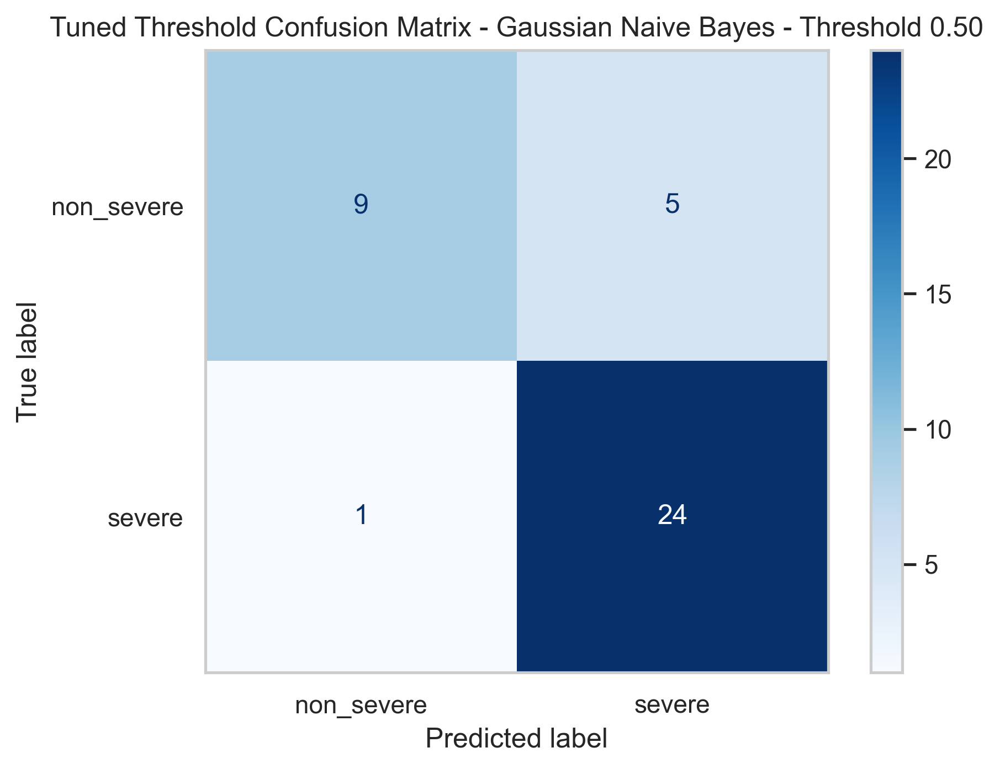
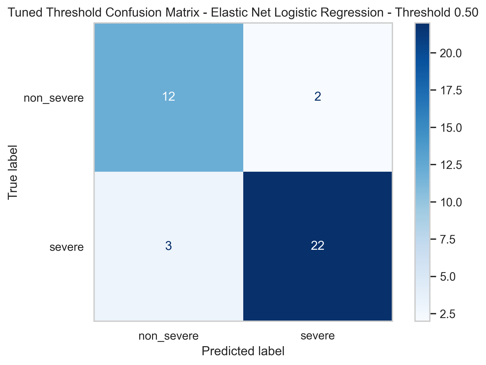
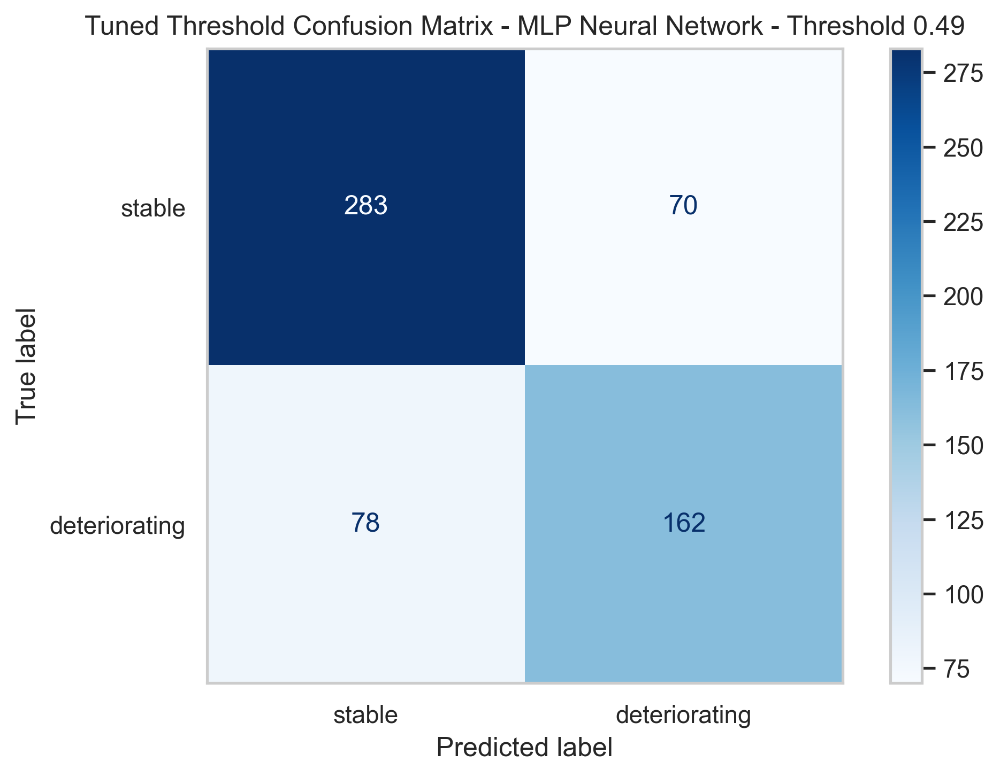

---
format:
  html:
    theme: none
    toc: false
    self-contained: true
page-layout: full
---

```{=html}
<head>
<meta charset="UTF-8">
<meta name="viewport" content="width=device-width,initial-scale=1">
<title>Streamlining the Surge — ENGG2112</title>
<link href="https://fonts.googleapis.com/css2?family=EB+Garamond:ital,wght@0,400;0,500;1,400;1,500&family=Inter:wght@300;400;500;600&family=JetBrains+Mono:wght@400;500&display=swap" rel="stylesheet">
<style>
*,*::before,*::after{box-sizing:border-box;margin:0;padding:0}
:root{
  --navy:#1a2e4a;--blue:#2563eb;--blue-l:#dbeafe;--blue-m:#93c5fd;
  --white:#fff;--bg:#f8f9fb;--off:#f0f4f8;--border:#d1dce9;
  --text:#1a2e4a;--muted:#4a5d75;--dim:#7a90a8;
  --red:#c0392b;--green:#166534;--nav:56px;--pad:44px;
}
html,body{height:100%;background:var(--bg);color:var(--text);
  font-family:'Inter',sans-serif;overflow:hidden}
.deck{width:100vw;height:100vh;position:relative;overflow:hidden}

/* SLIDES */
.slide{position:absolute;top:0;left:0;right:0;bottom:var(--nav);
  display:flex;flex-direction:column;justify-content:center;gap:16px;
  padding:var(--pad) calc(var(--pad)*1.3);
  opacity:0;pointer-events:none;overflow:hidden;
  transition:opacity .35s ease,transform .35s ease;
  transform:translateX(28px)}
.slide.active{opacity:1;pointer-events:all;transform:translateX(0)}
.slide.out{opacity:0;transform:translateX(-20px)}
.nv{background:var(--navy)}
.nv .ey{color:var(--blue-m)}
.nv h2{color:var(--white)}
.nv h2 em{color:var(--blue-m)}
.nv .rule{background:var(--blue-m)}
.nv p{color:rgba(255,255,255,.65)}
.nv strong{color:var(--white)}

/* NAV */
.snav{position:fixed;bottom:0;left:0;right:0;height:var(--nav);
  background:var(--white);border-top:1px solid var(--border);
  display:flex;align-items:center;justify-content:center;
  gap:5px;z-index:200;padding:0 20px}
.sp{display:inline-flex;align-items:center;gap:5px;padding:5px 12px;
  border-radius:40px;border:1px solid var(--border);background:transparent;
  cursor:pointer;font-size:11.5px;font-weight:500;color:var(--muted);
  font-family:'Inter',sans-serif;transition:all .18s;white-space:nowrap}
.sp:hover{background:var(--off);color:var(--navy)}
.sp.on{background:var(--navy);color:var(--white);border-color:var(--navy)}
.sp .sn{font-family:'JetBrains Mono',monospace;font-size:8.5px;opacity:.6}
.narr{display:flex;gap:4px;margin-left:10px;padding-left:10px;border-left:1px solid var(--border)}
.nb{width:28px;height:28px;border-radius:50%;border:1px solid var(--border);
  background:var(--white);cursor:pointer;font-size:14px;color:var(--muted);
  display:flex;align-items:center;justify-content:center;transition:all .18s}
.nb:hover{background:var(--navy);color:var(--white);border-color:var(--navy)}
.pbar{position:fixed;top:0;left:0;height:3px;background:var(--blue);transition:width .35s;z-index:300}

/* HEADER (row 1 of grid) */
.hd{padding-bottom:10px;flex-shrink:0}
.ey{font-family:'JetBrains Mono',monospace;font-size:9.5px;letter-spacing:.18em;
  text-transform:uppercase;color:var(--blue);margin-bottom:8px}
h2{font-family:'EB Garamond',serif;font-size:clamp(2.4rem,4vw,3.6rem);
  font-weight:400;line-height:1.08;color:var(--navy);margin-bottom:0}
h2 em{font-style:italic;color:var(--blue)}
h2.xl{font-size:clamp(3.4rem,6vw,5.4rem)}
.rule{width:36px;height:3px;background:var(--blue);margin-top:10px}
h3{font-size:11px;font-weight:600;text-transform:uppercase;
  letter-spacing:.07em;color:var(--navy);margin-bottom:5px}
p,li{color:var(--muted);font-size:13.5px;line-height:1.65}
li{margin-left:14px}
strong{font-weight:600;color:var(--navy)}

/* BODY (row 2 — fills remaining space) */
.body{display:flex;flex-direction:column;gap:12px;flex-shrink:0}
#s2,#s3,#s4,#s5,#s6,#s7{justify-content:flex-start}
#s2 .body,#s3 .body,#s4 .body,#s5 .body,#s6 .body,#s7 .body{flex:1;min-height:0}
.row{display:flex;gap:12px;flex:1;min-height:0}
.col{flex:1;min-width:0;display:flex;flex-direction:column;gap:10px}
.col-r{flex:0 0 44%;min-width:0;display:flex;flex-direction:column;gap:10px}
/* CARDS */
.card{background:var(--white);border:1px solid var(--border);border-radius:7px;padding:16px 18px}
.bt{border-top:3px solid var(--blue)}.nt{border-top:3px solid var(--navy)}
.rt{border-top:3px solid var(--red)}.gt{border-top:3px solid var(--green)}
.bl{border-left:3px solid var(--blue);border-radius:0 7px 7px 0}
.rl{border-left:3px solid var(--red);border-radius:0 7px 7px 0}
.gl{border-left:3px solid var(--green);border-radius:0 7px 7px 0}

/* STAT CARDS */
.sg{display:grid;grid-template-columns:repeat(3,1fr);gap:12px}
.sc{background:var(--white);border:1px solid var(--border);border-radius:7px;
  padding:24px 22px}
.sc-big{font-family:'EB Garamond',serif;font-size:clamp(3.2rem,5.5vw,5rem);
  font-weight:400;line-height:1;margin-bottom:10px}
.sc-lbl{font-size:13px;color:var(--muted);line-height:1.55}

/* MODEL CARDS */
.mg{display:grid;grid-template-columns:repeat(3,1fr);gap:12px;flex:1;min-height:0}
.mc{background:var(--white);border:1px solid var(--border);border-radius:7px;
  padding:16px 18px;cursor:pointer;
  transition:border-color .18s,box-shadow .18s,transform .15s}
.mc:hover{border-color:var(--navy);box-shadow:0 3px 16px rgba(26,46,74,.09);transform:translateY(-2px)}
.mbadge{display:inline-flex;font-family:'JetBrains Mono',monospace;font-size:8.5px;
  letter-spacing:.1em;text-transform:uppercase;padding:3px 9px;border-radius:20px;
  margin-bottom:9px;background:var(--navy);color:var(--white)}
.mc-title{font-family:'EB Garamond',serif;font-size:1.4rem;font-weight:400;
  color:var(--navy);margin-bottom:3px;line-height:1.15}
.mc-sub{font-size:11px;color:var(--muted);margin-bottom:9px;line-height:1.5}
.mtags{display:flex;flex-wrap:wrap;gap:3px;margin-bottom:12px}
.mtag{font-family:'JetBrains Mono',monospace;font-size:8px;letter-spacing:.05em;
  text-transform:uppercase;padding:2px 6px;border-radius:20px;
  border:1px solid var(--border);color:var(--dim)}
.mst{display:grid;grid-template-columns:1fr 1fr;gap:5px}
.ms{background:var(--off);border-radius:5px;padding:7px 9px}
.ms-k{font-size:8.5px;color:var(--dim);font-family:'JetBrains Mono',monospace;margin-bottom:2px}
.ms-v{font-size:1.1rem;font-weight:600;color:var(--navy)}
.ms-v.hi{color:var(--blue)}
.see{display:flex;align-items:center;gap:4px;margin-top:12px;padding-top:10px;
  border-top:1px solid var(--border);font-size:10.5px;color:var(--blue);
  font-weight:600;font-family:'JetBrains Mono',monospace;transition:gap .18s}
.mc:hover .see{gap:7px}

/* METRIC STRIP */
.met4{display:grid;grid-template-columns:repeat(4,1fr);gap:8px;flex-shrink:0}
.met{background:var(--white);border:1px solid var(--border);border-radius:7px;
  padding:12px 14px;text-align:center}
.met.hi{border-top:3px solid var(--blue)}
.met-k{font-family:'JetBrains Mono',monospace;font-size:8px;color:var(--dim);margin-bottom:4px}
.met-v{font-family:'EB Garamond',serif;font-size:1.9rem;color:var(--navy);line-height:1}
.met-v.blue{color:var(--blue)}
.met-ok{font-size:8.5px;color:var(--blue);margin-top:2px}

/* BARS */
.bars-wrap{flex:1;min-height:0;overflow:hidden;display:flex;flex-direction:column;gap:0}
.bars-section{display:flex;flex-direction:column;gap:9px}
.bars-title{font-family:'JetBrains Mono',monospace;font-size:8.5px;letter-spacing:.1em;
  text-transform:uppercase;color:var(--dim);margin-bottom:4px}
.br{display:flex;align-items:center;gap:8px}
.bl2{font-size:9.5px;color:var(--muted);width:96px;text-align:right;
  flex-shrink:0;font-family:'JetBrains Mono',monospace}
.bt2{flex:1;height:18px;background:var(--off);border-radius:3px;overflow:hidden}
.bf{height:100%;border-radius:3px;transition:width 1.1s cubic-bezier(.16,1,.3,1)}
.bv{font-size:9.5px;font-family:'JetBrains Mono',monospace;color:var(--muted);width:34px;flex-shrink:0}
.bars-sep{height:10px;flex-shrink:0}

/* CONFUSION MATRIX */
.cm-wrap{flex:1;min-height:0;background:var(--white);border:1px solid var(--border);
  border-radius:7px;padding:10px;display:flex;flex-direction:column;gap:5px;overflow:hidden}
.cm-lbl{font-family:'JetBrains Mono',monospace;font-size:8.5px;
  letter-spacing:.09em;text-transform:uppercase;color:var(--dim);flex-shrink:0}
.cm-img{width:100%;flex:1;min-height:0;object-fit:contain}

/* TABBAR */
.cm-tabbar{display:flex;gap:5px;flex-shrink:0}
.cm-tab{font-family:'JetBrains Mono',monospace;font-size:9px;padding:5px 9px;
  border:1px solid var(--border);background:var(--white);cursor:pointer;border-radius:5px;
  color:var(--muted);transition:all .15s}
.cm-tab.active{background:var(--navy);color:var(--white);border-color:var(--navy)}
.cm-panel{display:none;flex:1;min-height:0;flex-direction:column}
.cm-panel.active{display:flex;flex:1}

/* ARCH */
.arch{display:flex;align-items:stretch;height:60px;flex-shrink:0}
.an{flex:1;background:var(--white);border:1px solid var(--border);border-radius:6px;
  padding:8px 6px;text-align:center;display:flex;flex-direction:column;justify-content:center;gap:3px}
.an.hl{border-color:var(--blue);border-top:3px solid var(--blue)}
.an h3{color:var(--dim);font-size:8.5px}.an.hl h3{color:var(--blue)}
.an p{font-size:9.5px;color:var(--dim)}
.arr2{color:var(--border);font-size:16px;display:flex;align-items:center;padding:0 2px;flex-shrink:0}

/* DISCUSSION */
.dg{display:grid;grid-template-columns:1fr 1fr;grid-template-rows:1fr 1fr;gap:10px;flex:1;min-height:0}
.dc{background:var(--white);border:1px solid var(--border);border-radius:7px;
  padding:14px 16px;display:flex;flex-direction:column;gap:7px}
.dc.gd{border-left:3px solid var(--green);border-radius:0 7px 7px 0}
.dc.wn{border-left:3px solid var(--red);border-radius:0 7px 7px 0}
.dc.gd h3{color:var(--green)}.dc.wn h3{color:var(--red)}

/* MVP */
.mvp-g{display:grid;grid-template-columns:1fr 1fr;grid-template-rows:1fr 1fr;gap:10px;flex:1;min-height:0}
.mvp-s{background:rgba(255,255,255,.07);border:1px solid rgba(255,255,255,.13);
  border-radius:7px;padding:18px 20px;display:flex;flex-direction:column;gap:8px}
.mvp-n{font-family:'EB Garamond',serif;font-size:2rem;color:var(--blue-m);line-height:1}
.mvp-s h3{color:var(--white);font-size:11.5px}
.mvp-s p{color:rgba(255,255,255,.6);font-size:12px}
.mvp-out{background:rgba(255,255,255,.06);border:1px solid rgba(255,255,255,.12);
  border-radius:7px;padding:14px 16px;display:flex;flex-direction:column;gap:6px}
.mvp-row{background:rgba(255,255,255,.07);border-radius:5px;
  padding:7px 11px;display:flex;justify-content:space-between;align-items:center}
.mvp-k{font-size:11.5px;color:rgba(255,255,255,.5)}
.mvp-v{font-family:'JetBrains Mono',monospace;font-size:11px;font-weight:500}

/* MODAL */
.mo{position:fixed;inset:0;background:rgba(248,249,251,.94);z-index:500;
  display:flex;align-items:center;justify-content:center;
  opacity:0;pointer-events:none;transition:opacity .22s}
.mo.open{opacity:1;pointer-events:all}
.modal{background:var(--white);border:1px solid var(--border);border-radius:10px;
  width:min(700px,90vw);max-height:82vh;overflow-y:auto;
  box-shadow:0 8px 48px rgba(26,46,74,.14);padding:28px 32px;position:relative}
.mx{position:absolute;top:12px;right:14px;background:none;border:none;
  font-size:20px;color:var(--dim);cursor:pointer}
.mx:hover{color:var(--navy)}
.m-ey{font-family:'JetBrains Mono',monospace;font-size:8.5px;letter-spacing:.13em;
  text-transform:uppercase;color:var(--blue);margin-bottom:5px}
.modal h3{font-family:'EB Garamond',serif;font-size:1.45rem;font-weight:400;
  color:var(--navy);margin-bottom:3px;text-transform:none;letter-spacing:0}
.m-sub{font-size:11.5px;color:var(--muted);margin-bottom:16px}
.mstep{display:flex;gap:12px;padding:11px 0;border-bottom:1px solid var(--border)}
.mstep:last-child{border-bottom:none}
.mstep-n{font-family:'JetBrains Mono',monospace;font-size:9px;color:var(--blue);
  font-weight:500;min-width:20px;padding-top:1px}
.mstep-t{font-size:11.5px;font-weight:600;color:var(--navy);margin-bottom:3px}
.mstep-b{font-size:11.5px;color:var(--muted);line-height:1.6}
.mstep-b strong{color:var(--navy);font-weight:600}
.m-sel{margin-top:12px;background:var(--blue-l);border:1px solid var(--blue-m);
  border-radius:7px;padding:11px 13px;font-size:11.5px;color:var(--muted)}
.m-sel strong{color:var(--navy)}

/* MISC */
.tag{display:inline-block;font-family:'JetBrains Mono',monospace;font-size:8px;
  letter-spacing:.06em;text-transform:uppercase;padding:2px 6px;border-radius:20px;
  border:1px solid var(--border);color:var(--dim);margin:0 3px 3px 0}
.anno{font-size:14px;color:var(--muted);line-height:1.65}
.anno strong{color:var(--navy)}

/* ANIMATIONS */
@keyframes fu{from{opacity:0;transform:translateY(12px)}to{opacity:1;transform:none}}
.slide.active .a1{animation:fu .4s .04s both}
.slide.active .a2{animation:fu .4s .13s both}
.slide.active .a3{animation:fu .4s .22s both}
.slide.active .a4{animation:fu .4s .31s both}
/* PREPROCESSING STEPPER */
.pp-dot{width:28px;height:4px;border-radius:2px;background:var(--border);cursor:pointer;transition:background .2s}
.pp-dot.active{background:var(--navy)}
.pp-step{position:absolute;inset:0;background:var(--white);border:1px solid var(--border);
  border-radius:8px;padding:22px 24px;display:flex;flex-direction:column;gap:10px;
  opacity:0;pointer-events:none;transform:translateX(16px);
  transition:opacity .3s ease,transform .3s ease}
.pp-step.active{opacity:1;pointer-events:all;transform:translateX(0)}
.pp-num{font-family:'JetBrains Mono',monospace;font-size:9px;color:var(--dim)}
.pp-title{font-family:'EB Garamond',serif;font-size:1.5rem;color:var(--navy);line-height:1.2}
.pp-body{font-size:13px;color:var(--muted);line-height:1.65;flex:1}
.pp-body strong{color:var(--navy)}
.pp-body em{font-style:italic}
.pp-body code{font-family:'JetBrains Mono',monospace;font-size:11px;background:var(--off);padding:1px 5px;border-radius:3px}
.pp-badge{display:inline-flex;align-self:flex-start;font-family:'JetBrains Mono',monospace;font-size:8.5px;
  letter-spacing:.06em;text-transform:uppercase;padding:3px 9px;border-radius:20px;
  border:1px solid var(--border);color:var(--dim);background:var(--off)}

</style>
</head>

<div class="pbar" id="pbar"></div>
<div class="deck">


<!-- ================================================================ SLIDE 1 · TITLE ================================================================ -->
<section class="slide nv active" id="s0">
  <div class="hd" style="flex:1;display:flex;flex-direction:column;justify-content:center;gap:18px">
    <div class="a1">
      <div class="ey">ENGG2112 · Multi-disciplinary Engineering · The University of Sydney · 2026</div>
      <h2 class="xl" style="color:var(--white)">Streamlining<br><em>the Surge.</em></h2>
      <p style="max-width:540px;font-size:14px;margin-top:12px;color:rgba(255,255,255,.7)">
        A machine learning pipeline converting metabolomic biomarkers into actionable ICU triage decisions under infectious disease surge conditions.
      </p>
    </div>
    <div class="a2" style="border-top:1px solid rgba(255,255,255,.15);padding-top:20px;display:flex;justify-content:space-between;align-items:flex-end">
      <div>
        <div style="font-family:'JetBrains Mono',monospace;font-size:8.5px;letter-spacing:.15em;color:rgba(255,255,255,.4);text-transform:uppercase;margin-bottom:7px">Team</div>
        <div style="font-family:'EB Garamond',serif;font-size:1.1rem;color:rgba(255,255,255,.8);letter-spacing:.02em">
          Alysha Whitehouse &nbsp;·&nbsp; Manna Berry &nbsp;·&nbsp; Theo Johns &nbsp;·&nbsp; Aayan Shukla
        </div>
      </div>
      <div style="text-align:right;font-family:'EB Garamond',serif;font-size:.95rem;color:rgba(255,255,255,.4);font-style:italic">
        ENGG2112 · 2026<br>The University of Sydney
      </div>
    </div>
  </div>
</section>

<!-- ================================================================ SLIDE 2 · INTRODUCTION ================================================================ -->
<section class="slide" id="s1">
  <div class="hd a1">
    <div class="ey">Introduction · Problem &amp; motivation</div>
    <h2>Introduction<em> (Theo or Aayan).</em></h2>
    <div class="rule"></div>
  </div>
</section>
<!-- ================================================================ SLIDE 3 · METHODS — DATASETS =================================== -->
<section class="slide" id="s2">
  <div class="hd a1">
    <div class="ey">Methods · Datasets &amp; preprocessing</div>
    <h2>Datasets and  <em> data preprocessintg.</em></h2>
    <div class="rule"></div>
  </div>
  <div class="body a2">
    <div class="row">
    <div class="col" style="justify-content:space-between;gap:6px">
<div class="card nt" style="flex:1;display:flex;flex-direction:column;padding:10px 12px">
  <div style="display:flex;justify-content:space-between;align-items:center;margin-bottom:6px">
  <div class="ey" style="color:var(--navy);margin-bottom:0">Dataset 1 · CBD · Severity model</div>
  <div class="see" style="font-size:10px" onclick="openModal('ds1')">See pipeline →</div>
</div>
<div style="font-family:'EB Garamond',serif;font-size:1.6rem;color:var(--navy);margin-bottom:10px;line-height:1.1">COVID Biomarker Dataset</div>
          <div style="margin-bottom:10px"><span class="tag">Mendeley Data</span><span class="tag">TMIC MEGA Assay</span><span class="tag">Mexico</span></div>
          <div style="display:grid;grid-template-columns:repeat(3,1fr);gap:8px;margin-bottom:8px">
            <div style="background:var(--off);border-radius:6px;padding:10px;text-align:center">
              <div style="font-family:'EB Garamond',serif;font-size:1.8rem;color:var(--navy);line-height:1">43</div>
              <div style="font-family:'JetBrains Mono',monospace;font-size:8px;color:var(--dim);margin-top:4px">patients</div>
            </div>
            <div style="background:var(--off);border-radius:6px;padding:10px;text-align:center">
              <div style="font-family:'EB Garamond',serif;font-size:1.8rem;color:var(--navy);line-height:1">529</div>
              <div style="font-family:'JetBrains Mono',monospace;font-size:8px;color:var(--dim);margin-top:4px">metabolites</div>
            </div>
            <div style="background:var(--off);border-radius:6px;padding:10px;text-align:center">
              <div style="font-family:'EB Garamond',serif;font-size:1.8rem;color:var(--navy);line-height:1">587</div>
              <div style="font-family:'JetBrains Mono',monospace;font-size:8px;color:var(--dim);margin-top:4px">total features</div>
            </div>
          </div>
          <div style="display:grid;grid-template-columns:1fr 1fr;gap:8px">
            <div style="background:#eff6ff;border:1px solid #bfdbfe;border-radius:6px;padding:10px;text-align:center">
              <div style="font-family:'EB Garamond',serif;font-size:1.8rem;color:var(--blue);line-height:1">14</div>
              <div style="font-family:'JetBrains Mono',monospace;font-size:8px;color:var(--blue);margin-top:4px;opacity:.8">non-severe</div>
            </div>
            <div style="background:#fef2f2;border:1px solid #fecaca;border-radius:6px;padding:10px;text-align:center">
              <div style="font-family:'EB Garamond',serif;font-size:1.8rem;color:var(--red);line-height:1">25</div>
              <div style="font-family:'JetBrains Mono',monospace;font-size:8px;color:var(--red);margin-top:4px;opacity:.8">severe+critical</div>
            </div>
          </div>
          <div style="margin-top:10px;padding:8px 10px;background:var(--off);border-radius:6px;font-size:11.5px;color:var(--muted)">
            <strong style="color:var(--navy)">Binarised:</strong> 3-class → binary — small sample made multi-class unreliable. Severe+critical collapsed to retain clinical differentiation.
          </div>
        </div>
<div class="card bt" style="flex:1;display:flex;flex-direction:column;padding:10px 12px">
<div style="display:flex;justify-content:space-between;align-items:center;margin-bottom:6px">
  <div class="ey" style="color:var(--blue);margin-bottom:0">Dataset 2 · CLD · Deterioration model</div>
  <div class="see" style="font-size:10px;color:var(--blue)" onclick="openModal('ds2')">See pipeline →</div>
</div>
<div style="font-family:'EB Garamond',serif;font-size:1.6rem;color:var(--navy);margin-bottom:10px;line-height:1.1">COVID Longitudinal Dataset</div>
          <div style="margin-bottom:10px"><span class="tag">Metabolomics Workbench</span><span class="tag">ST001849</span><span class="tag">Grouped 5-fold CV</span></div>
          <div style="display:grid;grid-template-columns:repeat(3,1fr);gap:8px;margin-bottom:8px">
            <div style="background:var(--off);border-radius:6px;padding:10px;text-align:center">
              <div style="font-family:'EB Garamond',serif;font-size:1.8rem;color:var(--navy);line-height:1">339</div>
              <div style="font-family:'JetBrains Mono',monospace;font-size:8px;color:var(--dim);margin-top:4px">patients</div>
            </div>
            <div style="background:var(--off);border-radius:6px;padding:10px;text-align:center">
              <div style="font-family:'EB Garamond',serif;font-size:1.8rem;color:var(--navy);line-height:1">6</div>
              <div style="font-family:'JetBrains Mono',monospace;font-size:8px;color:var(--dim);margin-top:4px">timepoints</div>
            </div>
            <div style="background:var(--off);border-radius:6px;padding:10px;text-align:center">
              <div style="font-family:'EB Garamond',serif;font-size:1.8rem;color:var(--navy);line-height:1">593</div>
              <div style="font-family:'JetBrains Mono',monospace;font-size:8px;color:var(--dim);margin-top:4px">observations</div>
            </div>
          </div>
          <div style="display:grid;grid-template-columns:1fr 1fr;gap:8px">
            <div style="background:#eff6ff;border:1px solid #bfdbfe;border-radius:6px;padding:10px;text-align:center">
              <div style="font-family:'EB Garamond',serif;font-size:1.8rem;color:var(--blue);line-height:1">369</div>
              <div style="font-family:'JetBrains Mono',monospace;font-size:8px;color:var(--blue);margin-top:4px;opacity:.8">stable</div>
            </div>
            <div style="background:#fef2f2;border:1px solid #fecaca;border-radius:6px;padding:10px;text-align:center">
              <div style="font-family:'EB Garamond',serif;font-size:1.8rem;color:var(--red);line-height:1">192</div>
              <div style="font-family:'JetBrains Mono',monospace;font-size:8px;color:var(--red);margin-top:4px;opacity:.8">deteriorating</div>
            </div>
          </div>
          <div style="margin-top:10px;padding:8px 10px;background:var(--off);border-radius:6px;font-size:11.5px;color:var(--muted)">
            <strong style="color:var(--navy)">Binarised:</strong> 3-class → binary — overlapping biological signals in middle class. Stable vs deteriorating (ICU admission or death ≤30 days).
          </div>
        </div>
      </div>
      <div class="col">
        <div style="font-family:'JetBrains Mono',monospace;font-size:8.5px;letter-spacing:.12em;text-transform:uppercase;color:var(--dim);margin-bottom:8px">Preprocessing pipeline</div>
        <div style="display:flex;gap:4px;margin-bottom:12px;flex-shrink:0" id="pp-dots">
          <div class="pp-dot active" onclick="ppGo(0)"></div>
          <div class="pp-dot" onclick="ppGo(1)"></div>
          <div class="pp-dot" onclick="ppGo(2)"></div>
          <div class="pp-dot" onclick="ppGo(3)"></div>
          <div class="pp-dot" onclick="ppGo(4)"></div>
        </div>
        <div style="flex:1;min-height:0;position:relative">
          <div class="pp-step active" id="pp0">
            <div class="pp-num">01 / 05</div>
            <div class="pp-title">Missing value standardisation</div>
            <div class="pp-body">Placeholder entries converted to <code>NaN</code> before any processing begins. Ensures consistent handling across both CBD and CLD datasets.
              <div style="background:var(--navy);border-radius:6px;padding:12px 14px;margin-top:10px;font-family:'JetBrains Mono',monospace;font-size:11px;color:#93c5fd;line-height:1.7">
                <span style="color:#64748b"># standardise missing markers</span><br>
                df.replace(<span style="color:#fca5a5">["NA","None","-",""]</span>, np.nan, inplace=<span style="color:#86efac">True</span>)
              </div>
            </div>
            <div class="pp-badge">CBD + CLD</div>
          </div>
          <div class="pp-step" id="pp1">
            <div class="pp-num">02 / 05</div>
            <div class="pp-title">Feature filtering</div>
            <div class="pp-body">Predictors exceeding missingness thresholds removed — <strong>&gt;30%</strong> for CBD, <strong>&gt;50%</strong> for CLD.
              <div style="background:var(--navy);border-radius:6px;padding:12px 14px;margin-top:10px;font-family:'JetBrains Mono',monospace;font-size:11px;color:#93c5fd;line-height:1.7">
                <span style="color:#64748b"># drop high-missingness features</span><br>
                thresh = <span style="color:#fca5a5">0.30</span> <span style="color:#64748b"># 0.50 for CLD</span><br>
                df = df.loc[:, df.isnull().mean() &lt; thresh]
              </div>
            </div>
            <div class="pp-badge">CBD + CLD</div>
          </div>
          <div class="pp-step" id="pp2">
            <div class="pp-num">03 / 05</div>
            <div class="pp-title">Median imputation + z-score normalisation</div>
            <div class="pp-body">Training-fold medians imputed — no test leakage. Then z-score standardised for linear and kernel models.
              <div style="background:var(--navy);border-radius:6px;padding:12px 14px;margin-top:10px;font-family:'JetBrains Mono',monospace;font-size:11px;color:#93c5fd;line-height:1.7">
                <span style="color:#64748b"># inside CV fold — fit on train only</span><br>
                imputer = SimpleImputer(strategy=<span style="color:#fca5a5">"median"</span>)<br>
                scaler  = StandardScaler()<br>
                X_train = scaler.fit_transform(imputer.fit_transform(X_train))<br>
                X_test  = scaler.transform(imputer.transform(X_test))
              </div>
            </div>
            <div class="pp-badge">CBD + CLD</div>
          </div>
          <div class="pp-step" id="pp3">
            <div class="pp-num">04 / 05</div>
            <div class="pp-title">ExtraTrees + SelectFromModel</div>
            <div class="pp-body"><strong>ExtraTreesClassifier</strong> scores feature importance inside training folds. <strong>SelectFromModel</strong> retains top <em>k</em> — tuned via GridSearchCV (k=30 for M1, k=100 for M2).
              <div style="background:var(--navy);border-radius:6px;padding:12px 14px;margin-top:10px;font-family:'JetBrains Mono',monospace;font-size:11px;color:#93c5fd;line-height:1.7">
                <span style="color:#64748b"># feature selection inside fold</span><br>
                et  = ExtraTreesClassifier(n_estimators=<span style="color:#fca5a5">250</span>)<br>
                sel = SelectFromModel(et, max_features=<span style="color:#fca5a5">30</span>)<br>
                X_train = sel.fit_transform(X_train, y_train)<br>
                X_test  = sel.transform(X_test)
              </div>
            </div>
            <div class="pp-badge" style="background:var(--blue-l);color:var(--blue);border-color:var(--blue-m)">both · key step</div>
          </div>
          <div class="pp-step" id="pp4">
            <div class="pp-num">05 / 05</div>
            <div class="pp-title">Grouped 5-fold CV</div>
            <div class="pp-body">All samples from one patient stay in the same fold — prevents learning patient-specific patterns instead of generalisable deterioration signals.
              <div style="background:var(--navy);border-radius:6px;padding:12px 14px;margin-top:10px;font-family:'JetBrains Mono',monospace;font-size:11px;color:#93c5fd;line-height:1.7">
                <span style="color:#64748b"># group by patient ID, not row</span><br>
                cv = GroupKFold(n_splits=<span style="color:#fca5a5">5</span>)<br>
                for train, test in cv.split(X, y, groups=patient_ids):<br>
                &nbsp;&nbsp;model.fit(X[train], y[train])
              </div>
            </div>
            <div class="pp-badge" style="background:#e8f0f8;color:var(--navy);border-color:var(--navy)">CLD only</div>
          </div>
        </div>
        <div style="display:flex;justify-content:space-between;align-items:center;margin-top:10px;flex-shrink:0">
          <button onclick="ppGo(ppCur-1)" style="font-family:'JetBrains Mono',monospace;font-size:10px;padding:6px 14px;border:1px solid var(--border);border-radius:20px;background:var(--white);color:var(--muted);cursor:pointer">← prev</button>
          <div style="font-family:'JetBrains Mono',monospace;font-size:9px;color:var(--dim)" id="pp-hint">click to advance</div>
          <button onclick="ppGo(ppCur+1)" style="font-family:'JetBrains Mono',monospace;font-size:10px;padding:6px 14px;border:1px solid var(--border);border-radius:20px;background:var(--navy);color:var(--white);cursor:pointer">next →</button>
        </div>
      </div>
    </div>
  </div>
</section>

<div class="mo" id="modal-ds1" onclick="coOut(event,'modal-ds1')">
  <div class="modal">
    <button class="mx" onclick="closeModal('modal-ds1')">×</button>
    <div class="m-ey">Dataset 1 · CBD · Severity model</div>
    <h3>From raw metabolomics to severity classification.</h3>
    <div class="m-sub">How 587 raw features become a binary severity prediction.</div>
    <div>
      <div class="mstep"><div class="mstep-n">01</div><div><div class="mstep-t">Raw data · 587 features</div><div class="mstep-b">43 hospitalised COVID-19 patients · 529 metabolites + 58 clinical variables from the TMIC MEGA Assay. Three severity labels binarised → <strong>non-severe (n=14) vs severe+critical (n=25)</strong>.</div></div></div>
      <div class="mstep"><div class="mstep-n">02</div><div><div class="mstep-t">Missing value handling</div><div class="mstep-b">Placeholder entries standardised to NaN. Features exceeding <strong>30% missingness</strong> removed. Remaining values imputed with training-fold medians — no test leakage. Continuous features z-score normalised.</div></div></div>
      <div class="mstep"><div class="mstep-n">03</div><div><div class="mstep-t">Feature selection · 568 → 30</div><div class="mstep-b">ExtraTreesClassifier fitted inside training folds generates importance scores. SelectFromModel retains top features. <strong>k evaluated:</strong> [5, 10, 20, 30, 50, 75, 100]. <strong>Final: 30 features</strong> selected from 568 candidates.</div></div></div>
      <div class="mstep"><div class="mstep-n">04</div><div><div class="mstep-t">Model training · stratified 5-fold CV</div><div class="mstep-b">Six candidates trained — Elastic Net, Extra Trees, XGBoost, SVM (RBF), Gaussian NB, MLP. GridSearchCV tunes hyperparameters inside training folds only. <strong>Primary metric: macro F1</strong> to handle class imbalance.</div></div></div>
      <div class="mstep"><div class="mstep-n">05</div><div><div class="mstep-t">Threshold tuning · 0.05 → 0.95</div><div class="mstep-b">Classification threshold evaluated at step 0.01, optimising macro F1 on CV predictions. <strong>Default 0.50 confirmed optimal.</strong></div></div></div>
      <div class="mstep"><div class="mstep-n">06</div><div><div class="mstep-t">Output · binary severity prediction</div><div class="mstep-b">Gaussian NB selected — highest macro F1 (0.810) and precision (0.882). <strong>24 of 25</strong> severe patients correctly identified. Severity score + confidence fed into triage allocation framework.</div></div></div>
    </div>
<div class="m-sel"><strong>Class definition:</strong> Original 3-class labels (moderate, severe, critical) binarised → non-severe vs severe+critical. Small sample size (n=43) made reliable 3-class modelling infeasible — insufficient samples per class for cross-validation.</div>
  </div>
</div>

<div class="mo" id="modal-ds2" onclick="coOut(event,'modal-ds2')">
  <div class="modal">
    <button class="mx" onclick="closeModal('modal-ds2')">×</button>
    <div class="m-ey">Dataset 2 · CLD · Deterioration model</div>
    <h3>From longitudinal metabolomics to deterioration prediction.</h3>
    <div class="m-sub">How repeated patient measurements become a binary deterioration prediction.</div>
    <div>
      <div class="mstep"><div class="mstep-n">01</div><div><div class="mstep-t">Raw data · longitudinal structure</div><div class="mstep-b">339 patients · plasma metabolomics at day 0, 3, 7, 14, 28, 84 · Metabolomics Workbench ST001849. Each timepoint treated as an independent presentation — 593 total observations.</div></div></div>
      <div class="mstep"><div class="mstep-n">02</div><div><div class="mstep-t">Label construction · leakage prevention</div><div class="mstep-b"><strong>Deteriorating:</strong> ICU admission after sample OR death within 30 days. Samples post-ICU excluded. <strong>Grouped CV</strong> by patient ID — all samples from one patient stay in the same fold.</div></div></div>
      <div class="mstep"><div class="mstep-n">03</div><div><div class="mstep-t">Missing value handling</div><div class="mstep-b">Features exceeding <strong>50% missingness</strong> removed. Remaining values imputed with training-fold medians. Categorical variables encoded. All preprocessing inside CV folds — no test data seen during fitting.</div></div></div>
      <div class="mstep"><div class="mstep-n">04</div><div><div class="mstep-t">Feature selection · → 100 features</div><div class="mstep-b">ExtraTrees → SelectFromModel pipeline. <strong>k evaluated:</strong> [50, 75, 100]. <strong>Final: 100 features.</strong> C=0.05 further reduces effective dimensionality through sparse regularisation.</div></div></div>
      <div class="mstep"><div class="mstep-n">05</div><div><div class="mstep-t">Model training · grouped 5-fold CV</div><div class="mstep-b">Six candidates trained with patient-grouped CV. Elastic Net achieved AUROC 0.863, F1 0.778, bal-acc 0.784. Gaussian NB weakest — conditional independence assumption violated by correlated metabolomics.</div></div></div>
      <div class="mstep"><div class="mstep-n">06</div><div><div class="mstep-t">Output · binary deterioration prediction</div><div class="mstep-b">Threshold tuned to <strong>0.52</strong>. Final: 179 TP · 289 TN · 64 FP · 61 FN. Deterioration risk + confidence fed into surge simulation alongside severity score.</div></div></div>
    </div>
<div class="m-sel"><strong>Class definition:</strong> Deteriorating = ICU admission after sample collection OR death within 30 days. Stable = all other presentations. 3-class distribution binarised due to overlapping biological signals in the middle class and substantial class imbalance.</div>
</div>
</div>

<!-- ================================================================ SLIDE 4 · METHODS — ML MODELS ================================================================ -->
<section class="slide" id="s3">
  <div class="hd a1">
    <div class="ey">Methods · ML framework &amp; candidate models</div>
    <h2>Choses  <em>machine learning models</em></h2>
    <div class="rule"></div>
  </div>
  <div class="body a2">
    <div class="row">
      <!-- LEFT: candidate model list -->
      <div class="col">
        <div style="font-family:'JetBrains Mono',monospace;font-size:8.5px;letter-spacing:.12em;text-transform:uppercase;color:var(--dim);margin-bottom:8px">Candidate models</div>
        <div style="display:flex;flex-direction:column;gap:6px;flex:1">
          <div class="card" style="padding:12px 16px;display:flex;align-items:center;gap:16px;flex:1">
            <div style="font-family:'JetBrains Mono',monospace;font-size:11px;color:var(--white);font-weight:600;width:36px;height:36px;border-radius:50%;background:var(--navy);display:flex;align-items:center;justify-content:center;flex-shrink:0">EN</div>
            <div>
              <div style="font-size:14px;font-weight:600;color:var(--navy)">Elastic Net Logistic Regression</div>
              <div style="font-size:12px;color:var(--muted);margin-top:2px">Sparse linear · L1+L2 regularisation</div>
            </div>
          </div>
          <div class="card" style="padding:12px 16px;display:flex;align-items:center;gap:16px;flex:1">
            <div style="font-family:'JetBrains Mono',monospace;font-size:11px;color:var(--white);font-weight:600;width:36px;height:36px;border-radius:50%;background:var(--navy);display:flex;align-items:center;justify-content:center;flex-shrink:0">ET</div>
            <div>
              <div style="font-size:14px;font-weight:600;color:var(--navy)">Extra Trees</div>
              <div style="font-size:12px;color:var(--muted);margin-top:2px">Ensemble · randomised decision trees</div>
            </div>
          </div>
          <div class="card" style="padding:12px 16px;display:flex;align-items:center;gap:16px;flex:1">
            <div style="font-family:'JetBrains Mono',monospace;font-size:11px;color:var(--white);font-weight:600;width:36px;height:36px;border-radius:50%;background:var(--navy);display:flex;align-items:center;justify-content:center;flex-shrink:0">XG</div>
            <div>
              <div style="font-size:14px;font-weight:600;color:var(--navy)">XGBoost</div>
              <div style="font-size:12px;color:var(--muted);margin-top:2px">Gradient boosting · sequential tree learning</div>
            </div>
          </div>
          <div class="card" style="padding:12px 16px;display:flex;align-items:center;gap:16px;flex:1">
            <div style="font-family:'JetBrains Mono',monospace;font-size:11px;color:var(--white);font-weight:600;width:36px;height:36px;border-radius:50%;background:var(--navy);display:flex;align-items:center;justify-content:center;flex-shrink:0">SV</div>
            <div>
              <div style="font-size:14px;font-weight:600;color:var(--navy)">Support Vector Machine (RBF)</div>
              <div style="font-size:12px;color:var(--muted);margin-top:2px">Kernel-based · non-linear boundaries</div>
            </div>
          </div>
          <div class="card" style="padding:12px 16px;display:flex;align-items:center;gap:16px;flex:1">
            <div style="font-family:'JetBrains Mono',monospace;font-size:11px;color:var(--white);font-weight:600;width:36px;height:36px;border-radius:50%;background:var(--navy);display:flex;align-items:center;justify-content:center;flex-shrink:0">NB</div>
            <div>
              <div style="font-size:14px;font-weight:600;color:var(--navy)">Gaussian Naive Bayes</div>
              <div style="font-size:12px;color:var(--muted);margin-top:2px">Probabilistic baseline · computationally efficient</div>
            </div>
          </div>
          <div class="card" style="padding:12px 16px;display:flex;align-items:center;gap:16px;flex:1">
            <div style="font-family:'JetBrains Mono',monospace;font-size:11px;color:var(--white);font-weight:600;width:36px;height:36px;border-radius:50%;background:var(--navy);display:flex;align-items:center;justify-content:center;flex-shrink:0">ML</div>
            <div>
              <div style="font-size:14px;font-weight:600;color:var(--navy)">Multi-Layer Perceptron</div>
              <div style="font-size:12px;color:var(--muted);margin-top:2px">Neural network · non-linear feature interactions</div>
            </div>
          </div>
        </div>
      </div>

      <!-- RIGHT: evaluation framework -->
      <div class="col">
        <div style="font-family:'JetBrains Mono',monospace;font-size:8.5px;letter-spacing:.12em;text-transform:uppercase;color:var(--dim);margin-bottom:8px">Evaluation framework</div>
        <div class="card" style="padding:0;overflow:hidden;flex-shrink:0">
          <table style="width:100%;border-collapse:collapse;font-size:13px">
            <thead>
              <tr style="background:var(--navy)">
                <th style="padding:10px 14px;text-align:left;font-family:'JetBrains Mono',monospace;font-size:9px;font-weight:500;color:var(--blue-m);letter-spacing:.08em">Metric</th>
                <th style="padding:10px 14px;text-align:center;font-family:'JetBrains Mono',monospace;font-size:9px;font-weight:500;color:var(--blue-m);letter-spacing:.08em">Model 1</th>
                <th style="padding:10px 14px;text-align:center;font-family:'JetBrains Mono',monospace;font-size:9px;font-weight:500;color:var(--blue-m);letter-spacing:.08em">Model 2</th>
              </tr>
            </thead>
            <tbody>
              <tr style="border-bottom:1px solid var(--border)">
                <td style="padding:10px 14px;font-weight:600;color:var(--navy)">AUROC</td>
                <td style="padding:10px 14px;text-align:center;font-family:'JetBrains Mono',monospace;font-size:13px;color:var(--blue)">&gt; 0.85</td>
                <td style="padding:10px 14px;text-align:center;font-family:'JetBrains Mono',monospace;font-size:13px;color:var(--blue)">&gt; 0.80</td>
              </tr>
              <tr style="border-bottom:1px solid var(--border);background:var(--off)">
                <td style="padding:10px 14px;font-weight:600;color:var(--navy)">Macro F1</td>
                <td style="padding:10px 14px;text-align:center;font-family:'JetBrains Mono',monospace;font-size:13px;color:var(--blue)">&gt; 0.75</td>
                <td style="padding:10px 14px;text-align:center;font-family:'JetBrains Mono',monospace;font-size:13px;color:var(--blue)">&gt; 0.70</td>
              </tr>
              <tr style="border-bottom:1px solid var(--border)">
                <td style="padding:10px 14px;font-weight:600;color:var(--navy)">Precision</td>
                <td style="padding:10px 14px;text-align:center;font-family:'JetBrains Mono',monospace;font-size:13px;color:var(--muted)">&gt; 0.80</td>
                <td style="padding:10px 14px;text-align:center;font-family:'JetBrains Mono',monospace;font-size:13px;color:var(--muted)">&gt; 0.75</td>
              </tr>
              <tr>
                <td style="padding:10px 14px;font-weight:600;color:var(--navy)">Recall</td>
                <td style="padding:10px 14px;text-align:center;font-family:'JetBrains Mono',monospace;font-size:13px;color:var(--muted)">&gt; 0.85</td>
                <td style="padding:10px 14px;text-align:center;font-family:'JetBrains Mono',monospace;font-size:13px;color:var(--muted)">&gt; 0.85</td>
              </tr>
            </tbody>
          </table>
        </div>
        <div class="card bt" style="padding:16px 18px;flex:1;display:flex;flex-direction:column;justify-content:center">
          <div style="font-family:'JetBrains Mono',monospace;font-size:8px;color:var(--blue);margin-bottom:6px">Selection rule</div>
          <p style="font-size:14px;line-height:1.6">Best <strong>macro F1</strong> across CV folds. Ties by AUROC. Equally weights both classes — robust to class imbalance.</p>
        </div>
        <div class="card" style="padding:16px 18px;flex:1;display:flex;flex-direction:column;justify-content:center;cursor:pointer;transition:border-color .18s" onmouseenter="this.style.borderColor='var(--navy)'" onmouseleave="this.style.borderColor='var(--border)'" onclick="openModal('hptuning')">
          <div style="font-family:'JetBrains Mono',monospace;font-size:8px;color:var(--dim);margin-bottom:6px">Threshold + hyperparameter tuning</div>
          <p style="font-size:14px;line-height:1.6">GridSearchCV inside CV folds — <strong>training data only</strong>. Threshold swept <strong>0.05 → 0.95</strong>, optimising macro F1.</p>
          <div class="see" style="margin-top:10px;padding-top:10px;border-top:1px solid var(--border)">See parameters →</div>
        </div>
      </div>
    </div>
  </div>
</section>

<div class="mo" id="modal-hptuning" onclick="coOut(event,'modal-hptuning')">
  <div class="modal">
    <button class="mx" onclick="closeModal('modal-hptuning')">×</button>
    <div class="m-ey">Methods · Hyperparameter tuning</div>
    <h3>GridSearchCV parameter ranges evaluated.</h3>
    <div class="m-sub">All tuning performed inside CV training folds — no test data involved in selection.</div>
    <div>
      <div class="mstep"><div class="mstep-n">EN</div><div><div class="mstep-t">Elastic Net Logistic Regression</div><div class="mstep-b" style="font-family:'JetBrains Mono',monospace;font-size:11px;line-height:1.9">C = [0.05, 0.1, 0.5, 1.0]<br>l1_ratio = [0.25, 0.5, 0.75]</div></div></div>
      <div class="mstep"><div class="mstep-n">ET</div><div><div class="mstep-t">Extra Trees</div><div class="mstep-b" style="font-family:'JetBrains Mono',monospace;font-size:11px;line-height:1.9">n_estimators = [250, 400]<br>max_features = ['sqrt', 0.3]<br>max_depth = [None, 8]<br>min_samples_leaf = [2, 3]</div></div></div>
      <div class="mstep"><div class="mstep-n">XG</div><div><div class="mstep-t">XGBoost</div><div class="mstep-b" style="font-family:'JetBrains Mono',monospace;font-size:11px;line-height:1.9">learning_rate = [0.03, 0.05]<br>max_depth = [2, 3]<br>n_estimators = [150, 250]</div></div></div>
      <div class="mstep"><div class="mstep-n">SV</div><div><div class="mstep-t">Support Vector Machine (RBF)</div><div class="mstep-b" style="font-family:'JetBrains Mono',monospace;font-size:11px;line-height:1.9">C = [0.5, 1.0, 2.0]<br>gamma = ['scale', 0.01]</div></div></div>
      <div class="mstep"><div class="mstep-n">NB</div><div><div class="mstep-t">Gaussian Naive Bayes</div><div class="mstep-b" style="font-family:'JetBrains Mono',monospace;font-size:11px;line-height:1.9">var_smoothing = [1e-9, 1e-8, 1e-7, 1e-6]</div></div></div>
      <div class="mstep"><div class="mstep-n">ML</div><div><div class="mstep-t">Multi-Layer Perceptron</div><div class="mstep-b" style="font-family:'JetBrains Mono',monospace;font-size:11px;line-height:1.9">hidden_layer_sizes = [(16,), (32,), (32,16), (64,32), (64,32,16)]<br>alpha = [0.001, 0.01, 0.05, 0.1]<br>learning_rate_init = [0.001, 0.0005, 0.0001]</div></div></div>
      <div class="mstep"><div class="mstep-n">FS</div><div><div class="mstep-t">Feature Selection · max_features evaluated</div><div class="mstep-b" style="font-family:'JetBrains Mono',monospace;font-size:11px;line-height:1.9">M1.0: [5, 10, 20, 30, 50, 75, 100] → final: 30<br>M1.2: [5, 10, 20, 30, 40, 50, 60] → final: 18<br>M2.0: [50, 75, 100] → final: 100<br>M2.2: [10, 20, 30, 40] → final: 40</div></div></div>
    </div>
    <div class="m-sel">Threshold swept <strong>0.05 → 0.95</strong> (step 0.01) on CV predictions, optimising macro F1. Default 0.50 confirmed optimal for M1 · 0.52 optimal for M2.</div>
  </div>
</div>
<!-- ================================================================ SLIDE 5 · RESULTS — SEVERITY ======================================================= -->
<section class="slide" id="s4">
  <div class="hd a1">
    <div class="ey">Results · Severity classification · Model 1 &amp; 1.2</div>
    <h2>Gaussian NB:  <em>severity model.</em></h2>
    <div class="rule"></div>
  </div>
  <div class="body a2">
    <div class="row">
      <!-- LEFT -->
      <div class="col">
        <div class="met4">
          <div class="met hi"><div class="met-k">Macro F1</div><div class="met-v blue">0.810</div><div class="met-ok">✓ met</div></div>
          <div class="met"><div class="met-k">AUROC</div><div class="met-v">0.772</div></div>
          <div class="met hi"><div class="met-k">Precision</div><div class="met-v blue">0.882</div><div class="met-ok">✓ met</div></div>
          <div class="met hi"><div class="met-k">Severe recall</div><div class="met-v blue">0.960</div><div class="met-ok">✓ met</div></div>
        </div>
        <div class="bars-wrap">
          <div class="bars-section" id="b1_f1">
            <div class="bars-title">All candidates · Macro F1</div>
            <div class="br"><span class="bl2">Gaussian NB ★</span><div class="bt2"><div class="bf" style="width:0%;background:var(--navy)" data-w="81.0"></div></div><span class="bv">0.810</span></div>
            <div class="br"><span class="bl2">Extra Trees</span><div class="bt2"><div class="bf" style="width:0%;background:var(--blue)" data-w="79.2"></div></div><span class="bv">0.792</span></div>
            <div class="br"><span class="bl2">Elastic Net</span><div class="bt2"><div class="bf" style="width:0%;background:var(--blue)" data-w="77.9"></div></div><span class="bv">0.779</span></div>
            <div class="br"><span class="bl2">SVM (RBF)</span><div class="bt2"><div class="bf" style="width:0%;background:var(--blue)" data-w="73.8"></div></div><span class="bv">0.738</span></div>
            <div class="br"><span class="bl2">MLP</span><div class="bt2"><div class="bf" style="width:0%;background:var(--blue-m)" data-w="72.9"></div></div><span class="bv">0.729</span></div>
            <div class="br"><span class="bl2">XGBoost</span><div class="bt2"><div class="bf" style="width:0%;background:var(--blue-m)" data-w="55.8"></div></div><span class="bv">0.558</span></div>
          </div>
          <div class="bars-sep"></div>
          <div class="bars-section" id="b1_auroc">
            <div class="bars-title">All candidates · AUROC</div>
            <div class="br"><span class="bl2">SVM (RBF)</span><div class="bt2"><div class="bf" style="width:0%;background:var(--navy)" data-w="84.1"></div></div><span class="bv">0.841</span></div>
            <div class="br"><span class="bl2">Extra Trees</span><div class="bt2"><div class="bf" style="width:0%;background:var(--blue)" data-w="82.8"></div></div><span class="bv">0.828</span></div>
            <div class="br"><span class="bl2">Elastic Net</span><div class="bt2"><div class="bf" style="width:0%;background:var(--blue)" data-w="78.1"></div></div><span class="bv">0.781</span></div>
            <div class="br"><span class="bl2">Gaussian NB ★</span><div class="bt2"><div class="bf" style="width:0%;background:var(--blue)" data-w="77.2"></div></div><span class="bv">0.772</span></div>
            <div class="br"><span class="bl2">XGBoost</span><div class="bt2"><div class="bf" style="width:0%;background:var(--blue-m)" data-w="71.7"></div></div><span class="bv">0.717</span></div>
            <div class="br"><span class="bl2">MLP</span><div class="bt2"><div class="bf" style="width:0%;background:var(--blue-m)" data-w="68.8"></div></div><span class="bv">0.688</span></div>
          </div>
        </div>
        <div class="card bt" style="padding:18px 20px;flex-shrink:0">
          <p class="anno"><strong>24 of 25</strong> severe patients correctly identified (recall 0.96). Selected on macro F1 - SVM had higher AUROC but lower F1. High severe recall prioritised: a missed severe case carries greater clinical risk than unnecessary escalation.</p>
        </div>
      </div>
      <!-- RIGHT -->
      <div class="col-r">
        <div class="cm-tabbar">
          <button class="cm-tab active" onclick="showCM('cm1')">Model 1</button>
          <button class="cm-tab" onclick="showCM('cm12')">Model 1.2</button>
        </div>
        <div id="cm1" class="cm-panel active">
          <div class="cm-wrap">
            <div class="cm-lbl">Gaussian NB · Severity · Threshold 0.50</div>
            
          </div>
        </div>
        <div id="cm12" class="cm-panel">
          <div class="cm-wrap">
            <div class="cm-lbl">Elastic Net · Rapid-test · Threshold 0.50</div>
            
          </div>
        </div>
      </div>
    </div>
  </div>
</section>

<!-- ================================================================ SLIDE 6 · RESULTS — DETERIORATION ================================================= -->
<section class="slide" id="s5">
  <div class="hd a1">
    <div class="ey">Results · Deterioration prediction · Model 2 &amp; 2.2</div>
    <h2>Elastic Net: <em>deterioration model.</em></h2>
    <div class="rule"></div>
  </div>
  <div class="body a2">
    <div class="row">
      <!-- LEFT -->
      <div class="col">
        <div class="met4">
          <div class="met hi"><div class="met-k">Macro F1</div><div class="met-v blue">0.778</div><div class="met-ok">✓ met</div></div>
          <div class="met hi"><div class="met-k">AUROC</div><div class="met-v blue">0.863</div><div class="met-ok">✓ met</div></div>
          <div class="met"><div class="met-k">Precision</div><div class="met-v">0.722</div></div>
          <div class="met hi"><div class="met-k">Recall</div><div class="met-v blue">0.770</div><div class="met-ok">✓ met</div></div>
        </div>
        <div class="bars-wrap">
    <div class="bars-section" id="b2_f1">
  <div class="bars-title">All candidates · Macro F1</div>
  <div class="br"><span class="bl2">Elastic Net ★</span><div class="bt2"><div class="bf" style="width:0%;background:var(--navy)" data-w="77.8"></div></div><span class="bv">0.778</span></div>
  <div class="br"><span class="bl2">MLP</span><div class="bt2"><div class="bf" style="width:0%;background:var(--blue)" data-w="77.4"></div></div><span class="bv">0.774</span></div>
  <div class="br"><span class="bl2">Extra Trees</span><div class="bt2"><div class="bf" style="width:0%;background:var(--blue)" data-w="77.2"></div></div><span class="bv">0.772</span></div>
  <div class="br"><span class="bl2">XGBoost</span><div class="bt2"><div class="bf" style="width:0%;background:var(--blue)" data-w="76.3"></div></div><span class="bv">0.763</span></div>
  <div class="br"><span class="bl2">SVM (RBF)</span><div class="bt2"><div class="bf" style="width:0%;background:var(--blue-m)" data-w="76.2"></div></div><span class="bv">0.762</span></div>
  <div class="br"><span class="bl2">Gaussian NB</span><div class="bt2"><div class="bf" style="width:0%;background:var(--blue-m)" data-w="69.6"></div></div><span class="bv">0.696</span></div>
</div>
<div class="bars-sep"></div>
<div class="bars-section" id="b2_auroc">
  <div class="bars-title">All candidates · AUROC</div>
  <div class="br"><span class="bl2">Elastic Net ★</span><div class="bt2"><div class="bf" style="width:0%;background:var(--navy)" data-w="86.3"></div></div><span class="bv">0.863</span></div>
  <div class="br"><span class="bl2">Extra Trees</span><div class="bt2"><div class="bf" style="width:0%;background:var(--blue)" data-w="85.7"></div></div><span class="bv">0.857</span></div>
  <div class="br"><span class="bl2">XGBoost</span><div class="bt2"><div class="bf" style="width:0%;background:var(--blue)" data-w="84.5"></div></div><span class="bv">0.845</span></div>
  <div class="br"><span class="bl2">SVM (RBF)</span><div class="bt2"><div class="bf" style="width:0%;background:var(--blue)" data-w="84.4"></div></div><span class="bv">0.844</span></div>
  <div class="br"><span class="bl2">MLP</span><div class="bt2"><div class="bf" style="width:0%;background:var(--blue-m)" data-w="84.1"></div></div><span class="bv">0.841</span></div>
  <div class="br"><span class="bl2">Gaussian NB</span><div class="bt2"><div class="bf" style="width:0%;background:var(--blue-m)" data-w="79.4"></div></div><span class="bv">0.794</span></div>
</div>
</div>
        <div class="card bt" style="padding:18px 20px;flex-shrink:0">
          <p class="anno"><strong>179 of 240</strong> deteriorating patients correctly identified (recall 0.770). Selected on macro F1 — Elastic Net's sparse regularisation (C=0.05, L1 ratio=0.25) outperformed neural networks on patient-grouped CV. Threshold tuned to <strong>0.52</strong>: 179 TP · 289 TN · 64 FP · 61 FN.</p>
        </div>
      </div>
      <!-- RIGHT -->
      <div class="col-r">
        <div class="cm-tabbar">
          <button class="cm-tab active" onclick="showCM('cm2')">Model 2</button>
          <button class="cm-tab" onclick="showCM('cm22')">Model 2.2</button>
        </div>
        <div id="cm2" class="cm-panel active">
          <div class="cm-wrap">
            <div class="cm-lbl">Elastic Net · Deterioration · Threshold 0.52</div>
            
          </div>
        </div>
        <div id="cm22" class="cm-panel">
          <div class="cm-wrap">
            <div class="cm-lbl">MLP · Rapid-test · Threshold 0.49</div>
            
          </div>
        </div>
      </div>
    </div>
  </div>
</section>

<!-- ================================================================ SLIDE 7 · DISCUSSION ================================================================ -->
<section class="slide" id="s6">
  <div class="hd a1">
    <div class="ey">Discussion · Impact, limitations &amp; future work</div>
    <h2>Discussion <em>  (Theo or Aayan)</em></h2>
    <div class="rule"></div>
  </div>
</section>

<!-- ================================================================ SLIDE 8 · MVP ================================================================ -->
<section class="slide nv" id="s7">
  <div class="hd a1">
    <div class="ey">MVP · Live demonstration</div>
    <h2>Streamlining the Surge — <em>live decision support. (not complete)</em></h2>
    <div class="rule"></div>
  </div>
  <div class="body a2">
    <div class="mvp-g">
      <div class="mvp-s"><div class="mvp-n">01</div><h3>Upload</h3><p>Clinician uploads standardised CSV of biomarker + clinical measurements at admission</p></div>
      <div class="mvp-s"><div class="mvp-n">02</div><h3>Score</h3><p>Pipeline outputs severity risk, deterioration risk, confidence, and triage priority category</p></div>
      <div class="mvp-s"><div class="mvp-n">03</div><h3>Simulate</h3><p>Admin inputs ICU capacity + surge parameters → recommends optimal strategy minimising expected deaths</p></div>
      <div class="mvp-s"><div class="mvp-n">04</div><h3>Review</h3><p>&lt;80% confidence → additional clinical review. All outputs subject to clinician oversight</p></div>
    </div>
    <div style="display:grid;grid-template-columns:1fr auto;gap:10px;flex-shrink:0">
      <div class="mvp-out">
        <div style="font-family:'JetBrains Mono',monospace;font-size:8.5px;color:var(--blue-m);letter-spacing:.1em;text-transform:uppercase;margin-bottom:5px">Illustrative output</div>
        <div class="mvp-row"><span class="mvp-k">Severity</span><span class="mvp-v" style="color:#fca5a5">SEVERE</span></div>
        <div class="mvp-row"><span class="mvp-k">Deterioration risk</span><span class="mvp-v" style="color:#fca5a5">DETERIORATING</span></div>
        <div class="mvp-row"><span class="mvp-k">Triage priority</span><span class="mvp-v" style="color:var(--blue-m)">P4 · ESCALATE</span></div>
        <div class="mvp-row"><span class="mvp-k">Confidence</span><span class="mvp-v" style="color:var(--blue-m)">91.4%</span></div>
        <div class="mvp-row"><span class="mvp-k">Surge strategy</span><span class="mvp-v" style="color:var(--blue-m)">DETERIORATION-FIRST</span></div>
      </div>
      <div class="mvp-out" style="min-width:230px">
        <div style="font-family:'JetBrains Mono',monospace;font-size:8.5px;color:var(--blue-m);margin-bottom:6px">Deployment</div>
        <p style="font-size:12.5px">HTML/CSS/JS · Python Flask · Render</p>
        <div style="font-family:'JetBrains Mono',monospace;font-size:10.5px;color:var(--blue-m);margin-top:6px">engg2112-steamlining-the-surge.onrender.com</div>
      </div>
    </div>
  </div>
</section>

</div>

<!-- MODALS -->
<div class="mo" id="modal-m1" onclick="coOut(event,'modal-m1')">
  <div class="modal">
    <button class="mx" onclick="closeModal('modal-m1')">×</button>
    <div class="m-ey">Model 1 · Severity Classification</div>
    <h3>How we classify COVID-19 severity from metabolomics.</h3>
    <div class="m-sub">Six-stage walkthrough of the severity pipeline, end to end.</div>
    <div>
      <div class="mstep"><div class="mstep-n">01</div><div><div class="mstep-t">Dataset · CBD</div><div class="mstep-b">43 hospitalised patients · 529 metabolites + 58 clinical vars · Delta &amp; Omicron (Mexico). <strong>Source:</strong> Mendeley Data · TMIC MEGA Assay.</div></div></div>
      <div class="mstep"><div class="mstep-n">02</div><div><div class="mstep-t">Label binarisation</div><div class="mstep-b">3-class → binary: <strong>non-severe</strong> (n=14) vs <strong>severe+critical</strong> (n=25). Small per-class sample made 3-class modelling unreliable.</div></div></div>
      <div class="mstep"><div class="mstep-n">03</div><div><div class="mstep-t">Preprocessing</div><div class="mstep-b">Missing standardisation → feature filtering (&gt;30%) → constant removal → median imputation → z-score. All inside CV folds — no leakage.</div></div></div>
      <div class="mstep"><div class="mstep-n">04</div><div><div class="mstep-t">Feature selection</div><div class="mstep-b">ExtraTreesClassifier inside training folds → SelectFromModel. <strong>k evaluated:</strong> [5,10,20,30,50,75,100]. <strong>Final:</strong> 30 features from 568 candidates.</div></div></div>
      <div class="mstep"><div class="mstep-n">05</div><div><div class="mstep-t">Train six candidates</div><div class="mstep-b">Elastic Net · Extra Trees · XGBoost · SVM (RBF) · Gaussian NB · MLP — stratified 5-fold CV + GridSearchCV. <strong>Primary metric:</strong> macro F1.</div></div></div>
      <div class="mstep"><div class="mstep-n">06</div><div><div class="mstep-t">Threshold tuning</div><div class="mstep-b">Grid 0.05–0.95 (step 0.01), optimising macro F1. <strong>Default 0.50 confirmed optimal.</strong> Severe recall 0.96 — 24 of 25 severe patients correctly identified.</div></div></div>
    </div>
    <div class="m-sel"><strong>Selected: Gaussian Naive Bayes</strong> — highest macro F1 (0.810) and precision (0.882). Stable IQR across folds. Simpler and more efficient than ensemble/kernel methods — suitable for rapid clinical deployment.</div>
  </div>
</div>
<div class="mo" id="modal-m2" onclick="coOut(event,'modal-m2')">
  <div class="modal">
    <button class="mx" onclick="closeModal('modal-m2')">×</button>
    <div class="m-ey">Model 2 · Deterioration Prediction</div>
    <h3>How we predict patient deterioration trajectory.</h3>
    <div class="m-sub">Six-stage walkthrough with patient-grouped cross-validation.</div>
    <div>
      <div class="mstep"><div class="mstep-n">01</div><div><div class="mstep-t">Dataset · CLD</div><div class="mstep-b">339 patients · repeated plasma metabolomics at day 0,3,7,14,28,84. <strong>Source:</strong> Metabolomics Workbench ST001849 · Patti et al. (2021).</div></div></div>
      <div class="mstep"><div class="mstep-n">02</div><div><div class="mstep-t">Label construction &amp; leakage prevention</div><div class="mstep-b"><strong>Deteriorating:</strong> ICU admission after sample OR death within 30 days. <strong>Grouped CV</strong> by patient ID — all samples from one patient stay in the same fold.</div></div></div>
      <div class="mstep"><div class="mstep-n">03</div><div><div class="mstep-t">Preprocessing</div><div class="mstep-b">Feature filtering (&gt;50%) → constant removal → median imputation → z-score. Categorical encoding for demographics. All inside CV folds.</div></div></div>
      <div class="mstep"><div class="mstep-n">04</div><div><div class="mstep-t">Feature selection</div><div class="mstep-b">ExtraTrees → SelectFromModel. <strong>k evaluated:</strong> [50,75,100]. <strong>Final:</strong> 100 features. C=0.05 further reduces effective dimensionality.</div></div></div>
      <div class="mstep"><div class="mstep-n">05</div><div><div class="mstep-t">Train six candidates</div><div class="mstep-b">Elastic Net · Extra Trees · XGBoost · SVM · Gaussian NB · MLP — grouped 5-fold CV. Elastic Net: AUROC 0.863, F1 0.778, bal-acc 0.784. Gaussian NB weakest — conditional independence violated by correlated metabolomics.</div></div></div>
      <div class="mstep"><div class="mstep-n">06</div><div><div class="mstep-t">Threshold optimisation</div><div class="mstep-b">Grid 0.05–0.95 (step 0.01). <strong>Optimal: 0.52.</strong> Final: 179 TP · 289 TN · 64 FP · 61 FN.</div></div></div>
    </div>
    <div class="m-sel"><strong>Selected: Elastic Net Logistic Regression</strong> — strongest across AUROC, F1, and balanced accuracy on grouped CV. Sparse regularisation (C=0.05, L1 ratio=0.25) effective for high-dimensional metabolomic prediction.</div>
  </div>
</div>
<div class="mo" id="modal-m3" onclick="coOut(event,'modal-m3')">
  <div class="modal">
    <button class="mx" onclick="closeModal('modal-m3')">×</button>
    <div class="m-ey">Models 1.2 &amp; 2.2 · Rapid-test variants</div>
    <h3>Clinically feasible predictions without full metabolomic profiling.</h3>
    <div class="m-sub">Restricted feature sets for deployment across hospitals with differing lab capabilities.</div>
    <div>
      <div class="mstep"><div class="mstep-n">01</div><div><div class="mstep-t">Motivation</div><div class="mstep-b">Full metabolomic profiling unavailable in many emergency settings. Rapid-test variants use only features <strong>common to both CBD and CLD</strong> with &lt;24h turnaround — obtainable at admission.</div></div></div>
      <div class="mstep"><div class="mstep-n">02</div><div><div class="mstep-t">Feature panel</div><div class="mstep-b">CBD ∩ CLD intersection → no-lab variables + metabolites with &lt;24h turnaround. <strong>Result:</strong> 57 features for M1.2 · 42 features for M2.2.</div></div></div>
      <div class="mstep"><div class="mstep-n">03</div><div><div class="mstep-t">Model 1.2 · Elastic Net · 18 features</div><div class="mstep-b">AUROC 0.890 · F1 0.863 · bal-acc 0.890. <strong>Better than full-feature Model 1.0</strong> — reduced noise from high-dimensional space improves generalisation on small sample (n=39).</div></div></div>
      <div class="mstep"><div class="mstep-n">04</div><div><div class="mstep-t">Why rapid-test outperforms?</div><div class="mstep-b">529 CBD metabolites introduced redundancy. Restricted panel forces selection of the most generalisable signals, reducing overfitting.</div></div></div>
      <div class="mstep"><div class="mstep-n">05</div><div><div class="mstep-t">Model 2.2 · MLP · threshold 0.49</div><div class="mstep-b">AUROC 0.789 · F1 0.740 · bal-acc 0.727. Confusion matrix: 162 TP · 283 TN · 70 FP · 78 FN.</div></div></div>
      <div class="mstep"><div class="mstep-n">06</div><div><div class="mstep-t">Clinical deployment</div><div class="mstep-b">Select full or rapid-test model based on available lab infrastructure. Same preprocessing pipeline for both variants.</div></div></div>
    </div>
    <div class="m-sel"><strong>Key finding:</strong> M1.2 AUROC 0.890 vs full-feature 0.772 — 18 clinically accessible features capture the most informative severity signals.</div>
  </div>
</div>

<div class="snav">
  <button class="sp" data-slides="0" onclick="go(0)"><span class="sn">01</span> Title</button>
  <button class="sp" data-slides="1" onclick="go(1)"><span class="sn">02</span> Introduction</button>
  <button class="sp" data-slides="2,3" onclick="go(2)"><span class="sn">03–04</span> Methods</button>
  <button class="sp" data-slides="4,5" onclick="go(4)"><span class="sn">05–06</span> Results</button>
  <button class="sp" data-slides="6" onclick="go(6)"><span class="sn">07</span> Discussion</button>
  <button class="sp" data-slides="7" onclick="go(7)"><span class="sn">08</span> MVP</button>
  <div class="narr">
    <button class="nb" id="pv">‹</button>
    <button class="nb" id="nx">›</button>
  </div>
</div>

<script>
const slides=document.querySelectorAll('.slide');
const total=slides.length;
let cur=0,anim=false;
const pbar=document.getElementById('pbar');

function upd(){
  pbar.style.width=((cur+1)/total*100)+'%';
  document.querySelectorAll('.sp').forEach(p=>{
    const sl=p.dataset.slides.split(',').map(Number);
    p.classList.toggle('on',sl.includes(cur));
  });
}

function animBars(i){
  const map={
    4:['b1_f1','b1_auroc'],
    5:['b2_f1','b2_auroc']
  };
  if(map[i]) map[i].forEach(id=>{
    document.querySelectorAll('#'+id+' .bf').forEach(b=>{
      b.style.width='0%';
      setTimeout(()=>{b.style.width=b.dataset.w+'%';},80);
    });
  });
}

function go(n){
  if(anim||n===cur||n<0||n>=total)return;
  anim=true;
  slides[cur].classList.add('out');slides[cur].classList.remove('active');
  setTimeout(()=>{
    slides[cur].classList.remove('out');cur=n;
    slides[cur].classList.add('active');upd();animBars(cur);anim=false;
  },340);
}

document.getElementById('nx').onclick=()=>go(cur+1);
document.getElementById('pv').onclick=()=>go(cur-1);
document.addEventListener('keydown',e=>{
  if(e.key==='ArrowRight'||e.key===' '){e.preventDefault();go(cur+1);}
  if(e.key==='ArrowLeft'){e.preventDefault();go(cur-1);}
  if(e.key==='Escape')document.querySelectorAll('.mo.open').forEach(m=>m.classList.remove('open'));
});
let tx=0;
document.addEventListener('touchstart',e=>{tx=e.touches[0].clientX;});
document.addEventListener('touchend',e=>{const d=e.changedTouches[0].clientX-tx;if(Math.abs(d)>50){d<0?go(cur+1):go(cur-1);}});

upd();

function openModal(id){document.getElementById('modal-'+id).classList.add('open');}
function closeModal(id){document.getElementById(id).classList.remove('open');}
function coOut(e,id){if(e.target===document.getElementById(id))closeModal(id);}

function showCM(id){
  const panel = document.getElementById(id);
  if(!panel) return;
  const allPanels = panel.closest('.col-r').querySelectorAll('.cm-panel');
  const allTabs = panel.closest('.col-r').querySelectorAll('.cm-tab');
  allPanels.forEach(p=>p.classList.remove('active'));
  allTabs.forEach(t=>t.classList.remove('active'));
  panel.classList.add('active');
  const idx = Array.from(allPanels).indexOf(panel);
  if(allTabs[idx]) allTabs[idx].classList.add('active');
}
let ppCur=0;
function ppGo(n){
  if(n<0||n>4)return;
  document.getElementById('pp'+ppCur).classList.remove('active');
  document.querySelectorAll('.pp-dot')[ppCur].classList.remove('active');
  ppCur=n;
  document.getElementById('pp'+ppCur).classList.add('active');
  document.querySelectorAll('.pp-dot')[ppCur].classList.add('active');
  document.getElementById('pp-hint').textContent=ppCur===4?'all done':'click to advance';
}
</script>
```
